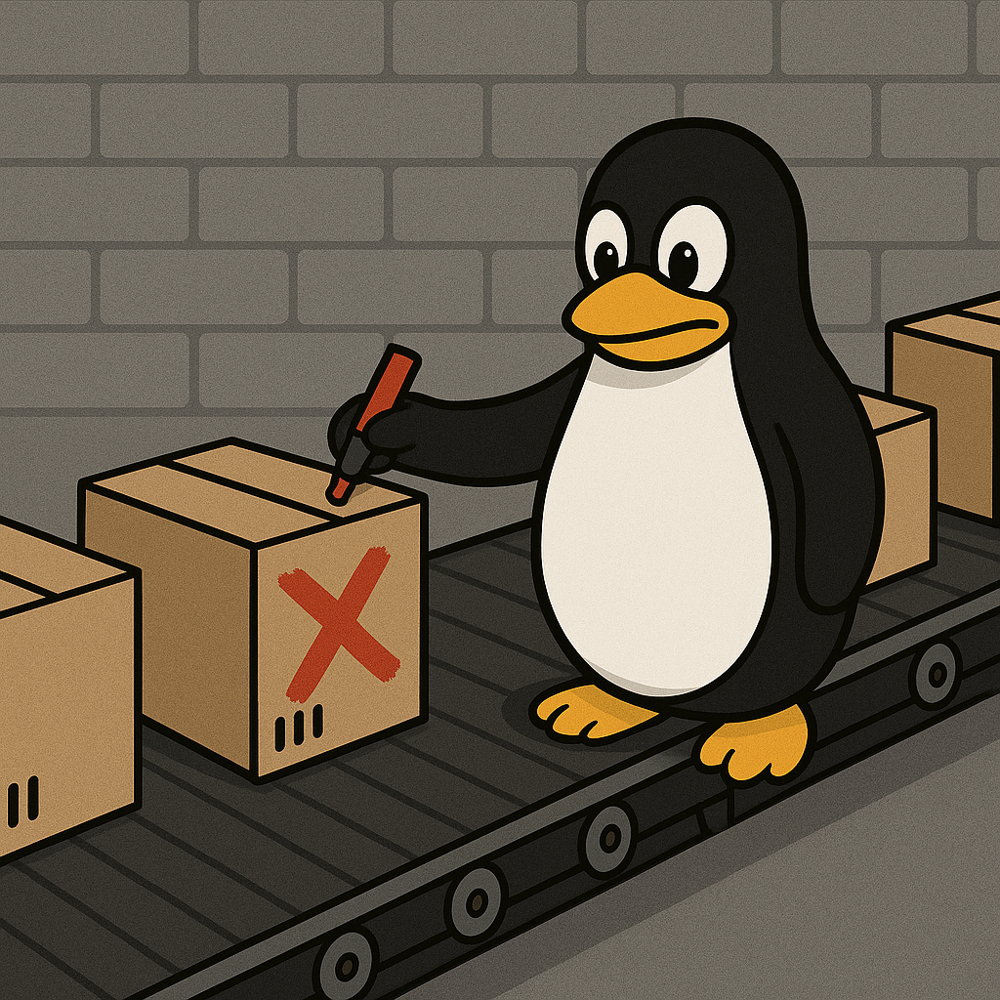

+++
draft       = false
featured    = false
title       = "C++ Iterator Invalidation"
slug        = "the-title-of-the-post"
description = "Iterator invalidation is one of C++’s most unforgiving pitfalls."
ogImage     = "./c++-iterator-invalidation.png"
pubDatetime = 2025-02-19T16:00:00Z
author      = "Carlos Reyes"
tags        = [
    "C++",
    "Iterator Invalidation",
    "Containers",
    "Undefined Behavior",
    "C++23",
    "Performance",
    "Memory Safety",
    "Ranges",
    "Game Development",
    "Best Practices",
]
+++



## Table of Contents

---

## Introduction

I’ll never forget the day I spent eight hours chasing down a crash in our game engine. We were adding new entities to a `std::vector<Entity>` mid-frame, and—because I’d naively held onto an iterator across that insertion—the very next draw call would sometimes read garbage and explode the renderer. That taught me the hard way why **iterator invalidation** is one of C++’s most unforgiving pitfalls. In this article, I’ll walk you through why C++ enforces these rules, how to recognize dangerous operations, and what patterns you can adopt to write both **high-performance** and **safe** code.

---

## What Is Iterator Invalidation?

Put simply, when a container operation (like inserting or erasing elements) might move, destroy, or otherwise change its elements’ memory layout, **all existing iterators and references that the standard says “may be invalidated” must be assumed dead**. There is no way to test whether a given iterator still “works”—even if, by luck, it still refers to valid memory, using it is **undefined behavior**.

> **❗ Caveat:** C++ does not (and cannot) provide a built-in “is\_valid(it)” check. If the Standard says an operation *may* invalidate, you must treat *all* iterators as invalid, no exceptions.

### Authoritative Wording (ISO/IEC 14882:2020 §24.2.2 \[container.requirements.general])

> **Unless otherwise specified, an insertion or deletion operation on a container invalidates all iterators and references to the container.**

---

## Why Does C++ Make This Rule?

C++ is all about **zero-overhead abstractions**. If every `push_back` or `erase` had to check every outstanding iterator at runtime, our containers would be orders of magnitude slower. Instead, C++ shifts the responsibility onto the programmer:

| Reason                          | Explanation                                                                                                                                  |
| ------------------------------- | -------------------------------------------------------------------------------------------------------------------------------------------- |
| **Zero-cost abstraction**       | No hidden runtime checks—iterators are just pointers (or pointer-like objects).                                                              |
| **Simplicity of specification** | The Standard can say “*all iterators invalid*” without long caveats. Library implementers implement exactly that.                            |
| **Efficiency**                  | Checking every iterator for validity would ruin the performance advantage that `std::vector` et al. provide.                                 |
| **Allows optimizations**        | Knowing that old iterators can never be used again, implementers can relocate storage, pool memory, or do other fast tricks without caution. |

---

## Common Invalidation Rules for Standard Containers

Different containers follow different invalidation guarantees. Here’s a quick reference:

| Container            | Insertion                             | Erasure                                   | Special Guarantees                                  |
| -------------------- | ------------------------------------- | ----------------------------------------- | --------------------------------------------------- |
| `std::vector<T>`     | *All* iterators (no `reserve`)        | Iterators at and after the erased element | `reserve(n)` prevents invalidation for `< n` insertion calls. |
| `std::deque<T>`      | Iterators only if reallocation occurs | Iterators to erased elements              | Insert at front/back may invalidate some iterators. |
| `std::list<T>`       | **None**                              | Only iterators to erased elements         | Doubly-linked: all other iterators remain valid.    |
| `std::map<Key,T>`    | **None**                              | Only iterators to erased keys             | Tree-based: insert doesn’t rebalance invalidation.  |
| `std::unordered_map` | May invalidate on rehash              | Iterators to erased elements              | `reserve`/`rehash` affect buckets.                  |

> **💡 Note:** Always check the container’s documentation or [`cppreference.com`](https://en.cppreference.com/w/cpp/container#Iterator_invalidation) for the exact guarantees.

---

## Real-World Code Samples

### 1. Dangerous: Inserting into a `std::vector`

```cpp
#include <vector>
#include <iostream>

void crashDemo() {
    std::vector<int> v = {1, 2, 3};
    auto it = v.begin() + 1;  // points to the element '2'
    v.push_back(4);           // may reallocate and move elements!
    // OOPS: ‘it’ is now invalid—undefined behavior to dereference
    std::cout << *it << "\n"; // CRASH or garbage
}
```

> **Why?** Without a prior `reserve`, `push_back` can reallocate the internal buffer and move all elements—invalidating every iterator.

### 2. Safe Pattern: Reserve First

```cpp
void safeDemo() {
    std::vector<int> v;
    v.reserve(10);            // allocate enough space up front
    v.push_back(1);
    auto it = v.begin();
    v.push_back(2);           // doesn’t reallocate—'it' stays valid
    std::cout << *it << "\n"; // prints '1' reliably
}
```

### 3. Erasing in a Loop: The Erase-Remove Idiom

```cpp
#include <algorithm>

void removeEvens(std::vector<int>& v) {
    // Efficiently removes all even numbers while maintaining valid iterators
    v.erase(
        std::remove_if(v.begin(), v.end(),
                       [](int x){ return x % 2 == 0; }),
        v.end());
}
```

---

## Domain Anecdotes

1. **Game Development:**
   In our indie-game ECS (Entity-Component System), we stored components in `std::vector`. A teammate forgot to `reserve` and then iterated old iterators during updates—leading to bizarre physics glitches only reproducible on certain hardware. We switched to storing indices (and swapping dead elements to the end) to avoid iterator pitfalls entirely.

2. **Finance Systems:**
   A trading system used `std::deque<Order>` for an order book. On market open, loading thousands of orders at the front invalidated client code that held iterators into that deque—causing `std::bad_alloc` followed by portfolio miscalculations. After refactoring to use a linked list for stable iterators, accuracy returned.

3. **Systems Programming:**
   On a custom packet buffer (`std::vector<Packet>`), calling `erase` to drop processed packets invalidated iterators in the receive loop—resulting in memory corruption. The fix was switching to `std::list<Packet>` for O(1) removals without invalidation, trading off cache locality for stability.

---

## C++23 and Invalidation Guarantees

While C++23 didn’t overhaul container invalidation rules, it did introduce more **range adaptors** and **views** (e.g., `std::ranges::views::filter`) which operate on ranges rather than raw iterators—helping you avoid manual iterator juggling. **Tip:** When you use range-based algorithms, you express intent (“apply this view and then that algorithm”) without explicitly holding onto iterator positions.

> **Note on Portability:**
> Debug-build implementations (like MSVC’s STL in debug mode) may insert iterator checks and throw exceptions on invalid usage. Release builds won’t—so don’t rely on debug-mode errors as a safety net.

---

## Best Practices to Avoid Invalidation Bugs

1. **Reserve Early:**
   For `std::vector` or `std::deque`, call `reserve`/`rehash` if you know your size.

2. **Prefer Stable Containers:**
   Use `std::list` or `std::map` when you need absolute iterator stability—at the cost of performance.

3. **Use Indices or Handles:**
   Store integer indices (or your own handle type) instead of iterators across mutations.

4. **Adopt Range-Based Code:**
   Leverage `<algorithm>` and `<ranges>` to express transformations and avoid persisting iterators.

5. **Always Update Your Iterators After Erase:**
   If you must erase in a loop, write:

   ```cpp
   for (auto it = c.begin(); it != c.end(); /*no increment*/) {
       if (shouldErase(*it))
           it = c.erase(it);  // erase returns the next valid iterator
       else
           ++it;
   }
   ```

6. **Document Assumptions:**
   If a function holds iterators across calls, clearly state in comments which operations are safe.

---

## Caveats & Gotchas

> **⚠️ You Cannot Test Iterator Validity**
> There is *no* portable way to ask “is this iterator still valid?” Don’t write hacks like comparing against `container.end()`—it’s still UB if the iterator itself is invalid.

> **⚠️ Debug vs. Release Divergence**
> Debug builds may catch invalid iterators; release builds won’t—leading to silent data corruption or crashes.

> **⚠️ Container-Specific Exceptions**
> Some containers (e.g., `std::forward_list`) have one-element-list erasure quirks; always read the fine print.

> **⚠️ Performance Trade-Offs**
> Choosing stable containers (linked lists, node-based maps) costs you cache locality and throughput. Profile before refactoring!

---

## Wrapping Up

Iterator invalidation is a cornerstone of C++’s design trade-offs: you get **blindingly fast** containers, but you must pay attention to lifetime and validity rules. Whenever you see container operations in your code:

* **Stop** and ask: “Could this invalidate my iterator/reference?”
* **Check** the container’s guarantees on [cppreference](https://en.cppreference.com) or in your vendor’s latest docs.
* **Refactor** to safer patterns (reserve, erase-remove, indices, ranges) before shipping.

C++23’s richer ranges library gives us better abstractions to work *around* raw iterator management, but the core invalidation principles remain the same. By internalizing these rules—and using stable patterns—you can keep your software both **high-performance** and **correct**, whether you’re writing cutting-edge financial engines, next-gen game loops, or rock-solid systems code.

Happy coding!
