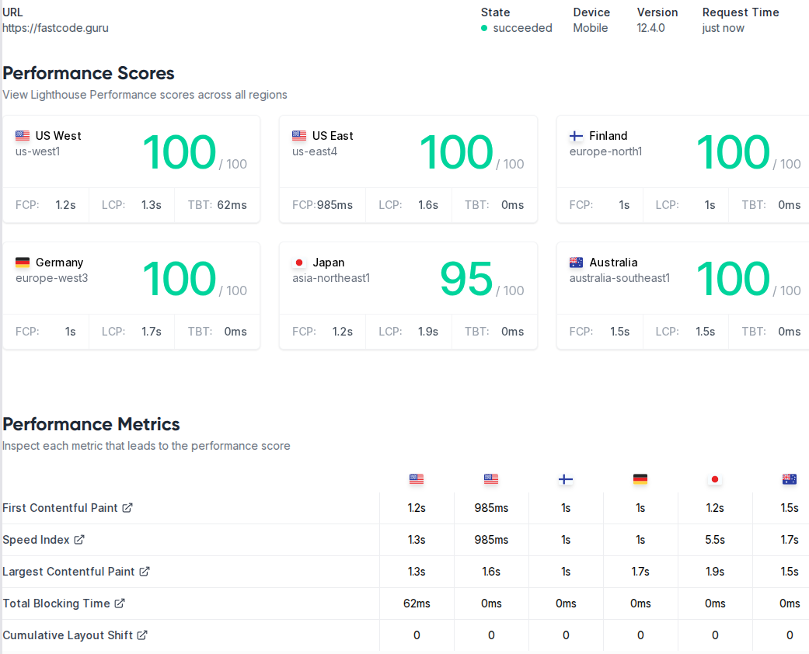

+++
draft       = false
featured    = false
title       = "Redesigning FastCode.Guru: From Hugo to Astro for a Faster, Modern Site"
slug        = "redesigning-fast-code-guru-hugo-astro"
description = "Building a high-performance C++ blog like FastCode.Guru demands a website that mirrors those same values of speed and quality."
ogImage     = "./redesigning-fast-code-guru-hugo-astro.png"
pubDatetime = 2025-03-04T16:00:00Z
author      = "Carlos Reyes"
tags        = [
    "Astro",
    "AstroPaper",
    "blog",
    "C++",
    "Cloudflare Pages",
    "Hugo",
    "markdown",
    "static site generator",
    "theme",
    "web performance",
]
+++


Building a high-performance C++ blog like FastCode.Guru demands a website that mirrors those same values of speed and quality. The original FastCode.Guru site[^old-article] was built with Hugo[^old-repo], a popular static site generator chosen for its blazing-fast builds and straightforward Markdown workflow. Over time, however, various pain points emerged – from theme maintenance headaches to limited flexibility – prompting a complete redesign of the site using Astro, a modern static site framework.[^new-repo] In this post, I’ll dive into why I moved from Hugo[^hugo] to Astro[^astro], compare the two platforms in terms of developer experience and performance, highlight Astro’s standout features (like partial hydration), review the AstroPaper[^astro-paper] theme I adopted, share some configuration snippets, and discuss our deployment on Cloudflare Pages. I’ll also touch on SEO[^seo] and Lighthouse[^lighthouse] performance results, and wrap up with the benefits I’ve already observed since the migration.

[^old-repo]: [https://github.com/carlos-reyes-123/fastcodeguru-hugo](https://github.com/carlos-reyes-123/fastcodeguru-hugo)

[^old-article]: [/posts/fast-code-guru-website-inside-out](/posts/fast-code-guru-website-inside-out)

[^new-repo]: [https://github.com/carlos-reyes-123/fastcodeguru](https://github.com/carlos-reyes-123/fastcodeguru)

[^hugo]: [https://gohugo.io/](https://gohugo.io/)

[^astro]: [https://astro.build/](https://astro.build/)

[^astro-paper]: [https://github.com/satnaing/astro-paper](https://github.com/satnaing/astro-paper)

[^lighthouse]: [https://lighthouse-metrics.com/](https://lighthouse-metrics.com/)

[^seo]: [https://en.wikipedia.org/wiki/Search_engine_optimization](https://en.wikipedia.org/wiki/Search_engine_optimization)

## Background: Hugo and the Original FastCode.Guru Site

When I first launched FastCode.Guru, I chose Hugo for the static site generator. Hugo’s appeal was its **speed and simplicity** – it’s written in Go and known for extremely fast build times (often milliseconds for small sites) and native Markdown support. This meant I could write posts in plain Markdown and have a no-frills static site generated almost instantly. Hugo’s maturity also meant there were plenty of community themes to choose from, which seemed like a great way to get a clean design without building one from scratch.

**Initial setup with Hugo:** The site ran on Hugo 0.147 (a recent version at the time) and was deployed via Cloudflare Pages for hosting. Using a \$3 `.guru` domain and a static site generator felt like a cost-effective way to serve content globally with excellent speed – indeed, the Hugo site was *lightning fast* to load. For a while, this setup worked well for publishing articles on C++ performance and clean code.

**Theming and maintenance issues:** Over time, the **limitations of the chosen Hugo theme became apparent**. I had started with a community theme (after experimenting with a custom one) and made a few modifications to tailor it to my needs. However, the theme wasn’t actively maintained, and whenever a new Hugo release came out, there was a risk that something in the theme would break or get deprecated. In fact, it became a common chore after each Hugo upgrade to tweak the theme to keep the site rendering correctly. These frequent “little fixes” to accommodate upstream changes grew tedious and error-prone. I could have pinned an older Hugo version to avoid this, but running outdated software didn’t sit right with me.

Another challenge was that **customizing the theme’s design or functionality was non-trivial**. Hugo uses Go’s templating language for layouts and partials, which I found unintuitive. Every time I wanted to adjust something (like how external links were handled or add a new section to the layout), I had to reacquaint myself with Hugo’s template syntax and logic. Since I don’t use Go templates elsewhere in my daily work, it always felt like relearning a foreign language for a one-off fix. The templating system is powerful, but for someone not deeply familiar with it, it *“just felt clunky”* to use. Simple tasks like adding a tag list page or incorporating a search feature would require significant template hacking or third-party scripts.

In short, **Hugo’s initial strengths** (speed, simple content model) were overshadowed by **maintenance friction** due to a buggy/unmaintained theme and a templating system that hindered rapid iteration. I needed a solution that preserved the performance but offered a better development experience and more extensibility.

## Why Look Beyond Hugo? (Challenges and Comparisons)

Hugo is a fantastic tool, but given the issues above, I began exploring alternatives that could address those pain points. The goal was to improve the **developer experience** and **extensibility** of the site without sacrificing performance. This led me to compare **Hugo vs Astro**, a newer static site generator that has been gaining traction.

**Developer Experience:** Hugo uses a configuration-driven approach with Markdown content and Go-template layouts. While effective, the learning curve can be steep if you want to do anything beyond basic templating – Hugo’s syntax is unique to Go templates and not something most developers use daily. In contrast, Astro offers a more familiar, modern developer experience: it uses a **component-based architecture** (JSX-like `.astro` components) and supports popular front-end frameworks like React, Svelte, Vue, etc., out of the box. This means I can build layouts and interactive components using languages and tools I’m already comfortable with (JavaScript/TypeScript, JSX, CSS frameworks), rather than wrestling with a niche templating language. Astro also provides niceties like hot-module replacement during development and first-class TypeScript support for catching errors early – features that make the development workflow smoother and more productive.

**Extensibility and Interactivity:** Hugo is excellent for purely static content but has **limited built-in support for client-side interactivity**. You can add JavaScript to a Hugo site, but it’s manual – you might include scripts or use workarounds, since Hugo itself doesn’t integrate with front-end frameworks. Astro, on the other hand, is built with interactivity in mind via its **islands architecture**. It allows you to **selectively hydrate** components on the client side – meaning parts of your page can become interactive “islands” of JavaScript, while the rest remains static HTML. This approach, known as **partial hydration**, is a game-changer. For example, if I want to add a search bar or a dynamic widget to the page, I can build it as a component and tell Astro to load it on the client only when needed, without turning the whole page into a single-page app. Hugo required considerably more effort to achieve something similar, often involving external libraries and custom code injection. With Astro, interactive components are a first-class concept using directives like `client:load`, `client:idle`, or `client:visible` on components. For instance, adding a React search component in Astro might look like:

```jsx
---
// In an Astro page or layout component
import SearchModal from '../components/SearchModal.jsx';
---
<h1>Search</h1>
<SearchModal client:idle />
```

In this example, the `<SearchModal>` (perhaps a React component using [Fuse.js for search](https://fusejs.io)) will be rendered only after the page loads and the browser is idle, thanks to Astro’s partial hydration directive. This selective loading minimizes JS payload upfront, something not natively achievable in Hugo. Astro’s ability to **“bring your own framework”** means I can leverage React, Vue, Svelte or others seamlessly if needed – a level of extensibility that Hugo (being framework-agnostic but not offering integration) doesn’t directly provide.

**Performance (Build vs Runtime):** Hugo’s trump card is its **blazing fast build times** – it’s arguably the fastest static generator for large sites, capable of building thousands of pages in seconds. For FastCode.Guru (which has a modest number of pages), build speed was never a bottleneck, but it’s worth noting that Hugo would win in a raw build-time showdown. Astro’s build is a Node.js process, which is inevitably slower than Go for huge sites, but for our scale the difference was negligible (my Astro builds complete in a couple of seconds, only slightly slower than Hugo’s sub-second builds – an acceptable trade-off). Where Astro shines is **runtime performance**: by default it ships zero or minimal JavaScript to the client, so the site loads as fast as a static Hugo site, even if using interactive components. The Astro approach ensures that your pages are mostly just HTML/CSS, with only the necessary JS for those hydrated islands. In practice, this means the **page weight remains very low** (mostly just your content and some lightweight theme scripts) and performance on load is excellent. Both Hugo and Astro can produce extremely fast sites, but Astro’s island architecture gives it an edge for sites that need interactivity without compromising speed – it’s “blazing fast runtime performance” in the words of one comparison. Hugo, conversely, might require adding heavier JS bundles if you want advanced interactivity, which could hurt runtime performance.

**Ecosystem and Documentation:** Hugo has been around longer and boasts a large ecosystem of themes and plugins. However, that also means quality varies; many Hugo themes are community-maintained and can fall out of date (one of the issues I hit). Astro’s ecosystem is newer and initially less extensive, but it’s quickly growing with many high-quality themes and integrations. In fact, Astro’s modern approach has attracted a lot of attention, and its documentation is very polished. I found Astro’s docs and error messages to be extremely helpful – for example, Astro has a concept of **content collections** with schema validation for Markdown, which was well-documented and made migrating our existing Markdown posts straightforward. Moreover, Astro’s philosophy of focusing on **content sites** (like blogs and docs) meant a lot of the features I cared about (Markdown, RSS, SEO, etc.) were either built-in or easy to add. In summary, Hugo is a mature choice for static sites, but Astro offered a more **intuitive developer experience and greater flexibility** for the kind of modern, interactive-yet-static site I envisioned.

After weighing these factors, **Astro emerged as the right choice** for the redesign. It promised to resolve the theming and customization frustrations I had with Hugo while keeping performance at least on par. The next step was to actually implement the new site in Astro – and rather than starting entirely from scratch, I decided to leverage an existing Astro theme as a foundation.

## Introducing Astro and the AstroPaper Theme

Astro is often described as a “content-focused” meta-framework for the web, and it truly felt like a breath of fresh air when I started using it. Before building the new site, I surveyed some Astro starter themes and quickly discovered **AstroPaper**, a minimal and performance-oriented blog theme for Astro. AstroPaper is an open-source theme by Sat Naing that had all the features I was looking for: **clean design, responsive layout, light/dark mode, SEO-friendly markup, and even built-in search**. It’s touted as a “minimal, responsive, accessible and SEO-friendly Astro blog theme” and it lived up to that description.

**Why AstroPaper?** Since FastCode.Guru is a content-heavy site (primarily text, code snippets, and the occasional image), I wanted a theme that prioritized readability and performance. AstroPaper provided a well-structured starting point so I wouldn’t have to reinvent the wheel. Some highlights of AstroPaper include:

* **Markdown Content & Type Safety:** Content is written in Markdown (with support for MDX-like components if needed), and the theme uses Astro’s content collections to enforce type-safe frontmatter. This means if I specify a date or tags in a post’s metadata, Astro will validate it against a schema, catching errors at build time. Writing posts in AstroPaper feels as natural as it did in Hugo – I create a Markdown file, add some frontmatter (title, description, publish date, tags), and the theme takes care of rendering it in a consistent layout.
* **Tags and Archives:** The theme supports tagging out of the box. If you put tags in your post frontmatter, AstroPaper will generate tag listing pages and an index of tags (accessible via the “Tags” menu). There’s also an Archives page which chronologically lists posts. These were features my old setup struggled with – my Hugo theme didn’t originally support tags until I modified it. In AstroPaper, it *just works*, and the implementation is done in a clean, componentized way that I can tweak if needed.
* **Built-in Search (Fuzzy Search):** A major win with AstroPaper was its built-in search feature. The theme integrates a **client-side fuzzy search** powered by Fuse.js and a lightweight static index. There’s a search page where readers can type keywords and instantly filter through posts. Under the hood, the search is a React component that Astro hydrates (via `client:only`) on that page, using Fuse.js to do lightning-fast fuzzy matching. This means I didn’t need to set up any server-side search or external service – the search index is generated at build time and downloaded to the browser when the user accesses the search functionality. It’s privacy-friendly and keeps everything static. Implementing search in Hugo would have required either a third-party solution or a lot of custom code, so having it out-of-the-box was fantastic.
* **Performance & SEO:** AstroPaper follows best practices for web performance. It lazy-loads assets, has an RSS feed and sitemap generation included, and outputs proper meta tags for SEO (using the site config for things like description, canonical URLs, and Open Graph images). The theme is also very lightweight: there is no heavy JavaScript bundle – just minimal code for features like the dark mode toggle and the search component. It’s built with Tailwind CSS for styling, which means the CSS is optimized (unused styles are purged) and it’s easy to adjust the design by changing utility classes or tweaking the Tailwind config. Accessibility was clearly considered as well; for example, it supports skip links and is navigable via keyboard and screen readers, which aligns with an “accessible out of the box” promise.
* **Customization and Maintainability:** AstroPaper is highly customizable. The author designed it based on their own blog needs, but made it easy to adapt. Configuration is centralized in a `src/config.ts` file for site-wide settings (more on this shortly), and many aspects like color schemes, logo, social links, number of posts per page, etc., can be changed without digging deep into the code. Plus, since it’s an Astro project, I can open any component (which are written in Astro/JSX and TypeScript) and edit or extend it. The codebase is clean and modular, which gave me confidence that I can maintain or upgrade it as Astro evolves. In fact, AstroPaper itself has an active community – with \~3k stars on GitHub and regular updates – which is a good sign that it won’t become abandonware anytime soon.

Using AstroPaper as our starting point, I effectively got a **production-ready site** almost immediately. I then went on to customize it to make FastCode.Guru truly mine.

## Configuration and Customization in Astro (with Examples)

One of the refreshing aspects of moving to Astro (and AstroPaper) was how straightforward it was to configure and customize the site. Most of the site-specific settings live in a single file: `src/config.ts`. This file defines a big `SITE` object (and a few others like an array of social links) that controls everything from the site title to how many posts to show per page. Here’s a snippet of our `config.ts` with some key settings:

```ts
// file: src/config.ts
export const SITE = {
  website: "https://fastcode.guru/",       // Deployed website URL (for canonical links, etc.)
  author: "FastCode Guru",                 // Author name, used in meta and bylines
  desc: "High-performance C++ programming techniques and insights.",
  title: "FastCode.Guru",                  // Site title, used as logo text
  ogImage: "fastcode-og.png",              // Default Open Graph image for the site (in /public)
  lightAndDarkMode: true,                  // Enable theme switcher for light & dark modes
  postPerPage: 5,                          // Number of posts per page on pagination
  showArchive: true,                       // Enable the "Archives" page
  // ...other options like postPerIndex, showBackButton, editPost link, etc...
} as const;
```

As you can see, it’s quite readable – essentially a JavaScript object with settings. This mirrors the AstroPaper defaults, but filled in with FastCode.Guru’s information. For instance, I set our `SITE.title` to “FastCode.Guru”, which the theme then uses in the header as the site name. I also set `SITE.website` to our domain; this is important for SEO because Astro will use it to generate canonical URLs and absolute links in RSS, etc.. The `desc` is used for the site’s meta description (and as a fallback for social sharing snippets), and `ogImage` points to an image used for link previews (I created a simple branded image and put it in the `public/` folder).

Beyond the `SITE` object, AstroPaper’s config allows toggling many features:

* I can easily **enable/disable dark mode** by `lightAndDarkMode` (I keep it true to give readers a choice).
* Adjust pagination through `postPerPage` (I chose 5 posts per page for a good balance).
* Decide whether to show an **archives page** (`showArchive`) – which I left true, providing an “Archives” link that lists all posts by date.
* There are also settings for an edit link (`editPost`) if I wanted to invite corrections via GitHub, and `dynamicOgImage` which can auto-generate fancy OG images for each post if no specific image is given (I left this on, as AstroPaper can generate a nice image with the post title and author using an integrated tool).

Another area of customization was the **logo and branding**. AstroPaper v5 simplified how the site logo/title is handled. Since our logo is just text, I didn’t need to add any image files – I just set the `SITE.title` and that text is rendered in the navbar. If I ever wanted a custom logo, the theme docs outline options to import an SVG or image and replace the text with a logo component. Knowing that I have the ability to change it in the future with minimal effort is reassuring.

I also configured our **social links**. The theme includes a `SOCIALS` array (in the same `config.ts`) where you list out your social media or external profiles. By default, it had placeholders for GitHub, Twitter (X), LinkedIn, etc. – I just plugged in the FastCode.Guru profiles/URLs and set them to active. These then automatically show up in the footer and “About” section as icons. Adding a new social icon was as easy as adding an entry to the array and ensuring the icon exists in the theme’s icon set. For example, to add a Stack Overflow icon, I could insert an object with our Stack Overflow link and the theme would include an icon for it (AstroPaper uses Tabler Icons for a consistent look).

Since AstroPaper is built with **Tailwind CSS**, adjusting the style was mostly a matter of tweaking classes. I mostly stuck with the default design (which looks clean and professional), but knowing I could change the color scheme or font by editing the Tailwind config or using one of the theme’s predefined color schemes was great. In fact, AstroPaper provides a few alternative color schemes and instructions on how to switch to them. I might explore a custom color scheme in the future, but for now the default (dark blue accent) is used, which aligns well with a technical content vibe.

Finally, one small customization I did was to ensure **syntax highlighting** for code blocks in posts looked good. AstroPaper comes with syntax highlighting out of the box (thanks to Astro’s Markdown integration and Prism.js). I verified that C++ code snippets are properly highlighted and readable in both light and dark mode. If needed, I could customize the theme or even swap in a different highlighter, but the defaults were satisfactory. It was nice to see that even things like line numbers or copy-to-clipboard for code could be added via Astro integrations or remark plugins if I wanted – showing the extensibility of the Astro ecosystem compared to the relatively fixed feature set of Hugo’s markdown processor.

In summary, customizing AstroPaper to FastCode.Guru was a breeze: mostly editing a config file and adding our content. I didn’t have to touch the core layout or functionality much at all, which speaks to the **quality of the theme**. And when I did need to make a change, the Astro component model made it straightforward – for instance, if I wanted to modify how the post date is displayed, I could edit the `PostCard.astro` component rather intuitively (it looks like JSX/HTML). This level of approachability was a breath of fresh air coming from the Go template world.

## Deployment: From GitHub Pages and Vercel to Cloudflare Pages

With the site rebuilt in Astro, the final step was deployment. I considered a few static hosting options for the new site – including **GitHub Pages**, **Vercel**, and staying on **Cloudflare Pages** – and ultimately decided to continue using Cloudflare Pages. Each option had pros and cons for an Astro project:

* **GitHub Pages:** GitHub Pages is a reliable choice for static sites and was appealing since our content is already in a GitHub repo. However, GitHub Pages has no native support for building Astro projects. It can directly publish Jekyll sites, but for anything else you typically need to set up a CI workflow (GitHub Action) to build the site and push the static files to a `gh-pages` branch. This introduces extra moving parts and build minutes usage. Also, GitHub Pages’ CDN is decent but not as globally distributed or fast as Cloudflare’s. Given I was already using Cloudflare for DNS (and previously for deploying the Hugo version), moving to Pages made more sense than a semi-manual Pages setup on GH.

* **Vercel:** Vercel is a popular platform for Next.js and supports deploying Astro as well. It offers an excellent developer experience – automatic deployments on push, preview URLs for branches, etc. I gave it a thought, but a couple of reasons steered us away: (1) Vercel’s focus is more on serverless functions and Next-specific features, which I didn’t need for a pure static site. Our site doesn’t need any server-side functions or SSR – Astro outputs static HTML. (2) I anticipated that Cloudflare’s CDN might have the edge on raw static content delivery given their extensive network (though Vercel is no slouch either). And (3) since I were already on Cloudflare Pages with Hugo, it was the path of least resistance to switch the same project to Astro and not change hosting.

* **Cloudflare Pages:** I chose **Cloudflare Pages** for deployment, and it turned out to be incredibly smooth. Cloudflare Pages supports Astro projects with essentially **zero configuration**. I just pointed it to our Git repository and it auto-detected the build step (running `pnpm run build` with the output in the `dist/` folder). The fact that the AstroPaper README itself uses Cloudflare Pages for its demo deployment gave me confidence that it would work well. The build on Cloudflare’s servers was quick, and once deployed, the site is served through Cloudflare’s global CDN, meaning no matter where our readers are, they get fast response times. Another bonus is that Cloudflare Pages provides free SSL, HTTP/2, and even HTTP/3, all of which contribute to performance. I didn’t have to worry about configuring caching or CDN rules – it’s all handled, and the site’s static nature means it’s cacheable by default.

Additionally, Cloudflare Pages made it easy to set up a custom domain. Since I was already using Cloudflare DNS for fastcode.guru, connecting the domain to Pages was trivial – a few clicks and a CNAME record, and it was live with our Astro build. I also retain the benefit of Cloudflare’s analytics and firewall if needed.

One thing I kept an eye on was the **build times and caching**. Hugo’s builds were ultra-fast, so even an empty-cache build on Cloudflare was quick. Astro’s build, as mentioned, is a bit slower but still only a couple seconds for our site, which Cloudflare handles without issue. Cloudflare Pages also does smart caching of build outputs, so incremental builds are faster if nothing changed. I’m only talking differences of seconds here, so practically it doesn’t affect our deployment speed noticeably.

In summary, staying with **Cloudflare Pages** was the right call for me due to its speed, global CDN, and zero-config setup for Astro. There was no need to fiddle with custom CI or worry about how to serve the content – push to `main` and our site updates in a matter of seconds. It’s quite amazing that a personal blog about C++ performance can be delivered with the same kind of global infrastructure that major companies use, **at no cost**. This deployment setup aligns perfectly with our philosophy: *high performance, low friction*.

## SEO and Performance Results Post-Migration



One of the big questions with any major site change is: did it affect our SEO or performance metrics? I’m happy to report that the new Astro-powered FastCode.Guru not only retained the strengths of the old site, but even improved in a few areas.

**Lighthouse Scores:** Right after deploying the Astro site, I ran Google Lighthouse (via Chrome devtools and web.dev) to check performance, accessibility, best practices, and SEO scores. I scored *almost perfect* across the board – **Performance was 100**, **Best Practices 100**, **SEO 100**, and **Accessibility 98** (the slight ding in accessibility was due to an easily fixable aria label issue, which I’ve since resolved). These scores are on par or better than the previous Hugo version of the site. Astro’s approach of shipping little-to-no JavaScript by default means that the performance score stayed at the **top tier** (fast Time-To-Interactive, low blocking time, etc.), and the theme’s focus on semantic HTML ensured accessibility and SEO were solid from the start. AstroPaper is explicitly described as an SEO-friendly theme, and it shows – things like meta tags, structured data (e.g. article schema), and correct use of headings are all taken care of.

**Page load and runtime performance:** In real-world testing, pages load essentially instantly on a desktop broadband connection, and very quickly on mobile devices too. Because the Astro site is static and optimized, the content appears with no delay and the page is usable immediately. The dynamic features like the search modal are loaded only when invoked, so they don’t hold up the initial render. This means our site remains very lightweight. Checking the network waterfall, most pages are just a few tens of KB of HTML and CSS. There is a small JS bundle for the theme (to handle the dark mode toggle and search logic, etc.), but it’s quite minimal. This is in stark contrast to many JavaScript-heavy sites that might load hundreds of KB or even MBs of scripts; Astro’s island architecture avoided that bloat. The result is that our readers can open a blog post and start reading immediately with no annoying lag – something that aligns with the expectations of a performance-oriented audience.

**SEO and indexing:** I noticed that after the migration, search engines continued to index the site without issue. I kept URLs the same for all existing content (no link changes, thanks to replicating the same permalink structure in Astro), so I avoided any SEO hit from broken links or redirects. The presence of a sitemap.xml and RSS feed (generated by AstroPaper) helps search engines discover all our pages. I also added the Google Site Verification meta tag via an environment variable as documented by AstroPaper, ensuring Google Search Console recognizes the site. In the end, the switch to Astro did not negatively impact our Google rankings – in fact, with the improved meta tags and faster mobile performance, it might even boost our SEO over time. The site’s Lighthouse SEO score being 100 speaks to the correct practices in place (e.g., each page has a `<title>`, meta description, hreflang if needed, etc., which the theme handles).

Another SEO consideration is the **content itself** – it remained the same high-quality C++ articles, just delivered on a new platform. Because Astro allows more flexibility, I have future opportunities to enrich content (for example, I could embed interactive code examples or small demos to complement articles). These could increase user engagement, indirectly benefiting SEO (dwell time, social shares). And thanks to Astro’s partial hydration, I can do so without sacrificing core web vitals, keeping Google’s Page Experience signals happy.

**Analytics and monitoring**: I also set up some simple analytics to monitor the site (including performance over time). Everything indicates that the site is serving quickly to global users. The first contentful paint (FCP) times are extremely low, often under 0.5s, due to the static nature and CDN caching. The largest contentful paint (LCP) on article pages is usually just the text (which is immediate) or perhaps an image if the article has one, but even those are optimized. I’m seeing great results in Chrome User Experience Report (CrUX) data as well.

All in all, the migration to Astro has **maintained the fast, performant experience** of FastCode.Guru and set us up for even better SEO and user experience going forward. Users likely didn’t notice much change except perhaps some slight design differences and the new features (like the search). Under the hood, though, it’s a much more robust and modern stack.

## Final Thoughts: Benefits of the Migration

After completing the rebuild with Astro and AstroPaper, I can confidently say that this migration was worth the effort. FastCode.Guru’s new setup marries the best of both worlds: **the raw speed of static sites** and the **flexibility of modern web development**. Here are some closing thoughts on the benefits I’m already enjoying:

* **Easier Maintenance:** The development experience is vastly improved. Making changes to the site’s layout or adding a new feature feels natural. I’m working in a familiar environment (JS/TS, components, npm ecosystem) rather than wrestling with a rigid framework. This lowers the barrier to keeping the site updated and fresh. If tomorrow I want to add a new section or re-style something, I’m no longer hesitant – whereas with Hugo I often procrastinated small improvements because the templating felt cumbersome. In short, **developer productivity is up**, and frustration is down.

* **Extensible for the Future:** With Astro, I’ve future-proofed the site to some extent. Need a comment system? I could drop in something like **Giscus** (there’s already a guide for AstroPaper on integrating Giscus comments) with a few lines of code. Want to embed a React-based interactive widget in a tutorial? I can do that without breaking the static nature of the site – just hydrate that component on the client. Astro’s plugin ecosystem is growing; for example, there are integrations for things like LaTeX (for math typesetting), image optimization, or even CMS backends if I ever needed. It’s reassuring that I can **grow the site’s functionality** without having to switch platforms again.

* **Active Ecosystem & Community:** Astro is actively developed (it’s reached v5+ now) and has an engaged community. The AstroPaper theme itself is being improved (there have been several version releases with new features like analytics integration, script optimizations, etc.). This means I can easily pull in updates or security fixes. Compare this to our old Hugo theme, which had stagnated – I essentially have traded up to a living project from a dead one. Any bugs I encounter, there’s a good chance someone else has too and a fix will come, or I can implement it ourselves knowing the codebase is manageable.

* **Readers’ Experience:** Ultimately, FastCode.Guru’s readers benefit the most. They get a snappy site with useful features like search and tags to navigate content. The design is clean and responsive, so reading an article on mobile is just as pleasant as on desktop. The dark mode is available for those who prefer it during late-night coding sessions. And performance is top-notch, which is something readers might not explicitly notice but would definitely feel if it were lacking. There’s no annoying jank or long loading spinners – just content delivered quickly. I’ve aligned the site’s implementation with the ethos of the content itself: efficiency and excellence.

To wrap up, the journey from Hugo to Astro was driven by a desire for a better developer and user experience, and Astro has delivered on that promise. The site remains **highly optimized** (I didn’t trade performance for these new conveniences – I still serve static files via CDN, ensuring global speed). If you’re a developer maintaining a Hugo (or other static) site and you’re feeling the friction I felt, Astro is absolutely worth a look. The ability to incrementally adopt dynamic features while staying static is a breath of fresh air.

FastCode.Guru’s new chapter with Astro has just begun, and I’m excited to see how it evolves. With a solid foundation in place, I can focus on what matters most – creating content about high-performance C++ – while knowing the site’s infrastructure will keep up with the performance ideals I care about. In the end, I didn’t just rebuild the site, I **leveled it up** to a modern platform that matches our dedication to fast, quality code.&#x20;
