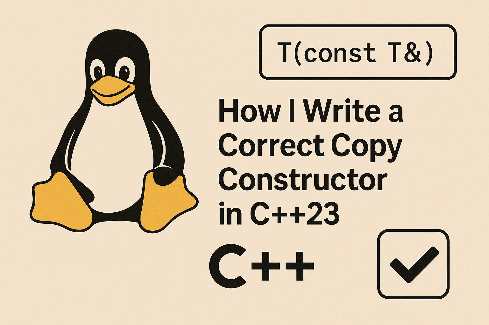

+++
draft       = false
featured    = false
title       = "How I Write a Correct Copy Constructor in C++23"
slug        = "correct-c++23-copy-constructor"
description = "Writing a copy constructor is one of the fundamental tasks in C++ class design, yet it’s surprisingly easy to get wrong or inefficient."
ogImage     = "./correct-c++23-copy-constructor.png"
pubDatetime = 2025-03-12T16:00:00Z
author      = "Carlos Reyes"
tags        = [
    "C++23",
    "Copy Constructor",
    "Modern C++",
    "Exception Safety",
    "Const Correctness",
    "C++ Templates",
    "Universal References",
    "noexcept",
    "C++ Performance",
    "Best Practices",
]
+++



## Table of Contents

---

# How I Write a Correct Copy Constructor in C++23

Writing a copy constructor is one of the *fundamental* tasks in C++ class design, yet it’s surprisingly easy to get wrong or inefficient. In this post I’ll take you through everything I’ve learned about copy constructors in C++ (with an eye on modern C++23 practice). I’ll explain why the signature **must** be `const T&` for correctness, how to handle templates and *universal references* safely, and how to make your copy constructor as efficient and exception-safe as possible. Along the way, we’ll look at C++11 through C++23 changes, use of `noexcept`, `constexpr`, concepts, and give real-world examples (from games, finance, systems programming) to illustrate the points. By the end you should have a *thorough*, battle-tested understanding of copy constructors in modern C++.

## Understanding the Copy Constructor

A **copy constructor** for class `T` is traditionally declared as:

```cpp
T(const T& other);
```

Its job is to initialize a new object by copying the contents of `other`. C++ will generate an *implicit* copy constructor if you don’t provide one, copying each base and member in order. For many classes that have only plain data members (like `int`, `double`, or even `std::string`), the compiler-generated copy constructor does exactly the right thing (a *memberwise copy*). For example:

```cpp
struct Vec3 {
    float x,y,z;
    // Implicit copy constructor is TriviallyCopyable.
    // Copying is basically a memcpy of the floats.
};
```

Because trivial/pod types can be copied with `std::memmove` under the hood, these implicitly-generated copy constructors are **very fast**. In fact, if your class is *trivially copyable* (no virtuals, no base classes, all members trivially copyable), the compiler might elide the copy entirely or do an optimized memcpy.

By default (since C++11), the implicitly-declared copy constructor has an *exception specification* based on the members, and since C++23 it is a `constexpr` function if possible. In other words, in C++23 an implicitly-defined copy ctor is automatically `constexpr` whenever it can be (as long as all sub-objects’ copy ctors are also `constexpr`), which lets you use it in constant expressions.

However, there are a few **gotchas** to be aware of:

* **Implicit deletion**: If you declare a move constructor or move-assignment operator, the compiler *does not* generate a default copy constructor for you – the copy ctor is implicitly defined as *deleted*. This often surprises people when they add a move and suddenly cannot copy their object anymore. If you need both move and copy, you must explicitly declare/`=default` the copy constructor.

* **Rvalue reference members**: If your class has a data member of rvalue-reference type (e.g. `T&& x;`), the implicit copy constructor is *deleted*. You’d have to write a copy constructor by hand in that case. (Luckily this is rare in well-designed classes, since owning raw rvalue references is unusual.)

* **Trivial vs non-trivial**: If your class is trivial (no user-defined copy-dtor, no virtual functions/bases, etc.), the implicit copy is *trivial* and extremely efficient. But if you add a non-trivial member (like a custom destructor), then the copy ctor becomes non-trivial. In C++23, note that defining a destructor or copy-assignment operator will actually **deprecate** the implicit generation of the copy constructor, indicating you should probably explicitly handle copying yourself in that case.

Finally, **const correctness**: The standard copy constructor signature is `T(const T&)`. **Never** omit the `const`. If you declare `T(T&)` instead, you will not be able to copy from const or temporary objects. For example:

```cpp
class ABC {
public:
    ABC(ABC& other);      // BAD: non-const parameter
    // ...
};
ABC a;
ABC b = a;      // error if signature is ABC(ABC&)
```

This fails because `a+a` (or a `const` object) cannot bind to a non-const reference. In contrast, `ABC(const ABC& other)` will bind to any `ABC`, const or not, temporary or not. In short, a copy ctor should take its parameter by **const reference** to allow copying from all kinds of expressions.

> **Quick Tip:** Always declare your copy constructor as `T(const T&)` (possibly with `noexcept` as needed). This ensures it can bind to temporaries and `const` objects. A non-const copy ctor is almost never what you want.

## Const Correctness in Copying

Let’s emphasize **why** the copy constructor’s parameter must be `const T&`. There are both semantic and practical reasons:

* **Semantic:** A copy constructor should *not modify* the source object. By taking `const T&`, you guarantee that you won’t accidentally change `other` during the copy process. This matches the intuition that copying is “read-only” on the source.

* **Binding to temporaries:** In C++, only a `const T&` can bind to a temporary or rvalue. For example, if a function returns a `T` by value, writing `T x = foo();` involves copying from a temporary. A non-const copy constructor (taking `T&`) *cannot* bind to that temporary, so the code won’t compile. Using `const T&` fixes this.

Here’s a small illustration:

```cpp
struct Example {
    Example(const Example& other) { /* copy fields */ }
    // Example(Example& other); // the wrong (non-const) signature
};

Example makeExample();
Example e = makeExample(); // OK if copy ctor is const&, error otherwise:contentReference[oaicite:11]{index=11}
```

In practice I always write my copy constructor explicitly (often `= default` if it’s simple) with the `const T&` signature. That way I never have to wonder about binding rules or unexpected `deleted` errors.

## Universal (Forwarding) References in Constructors

Modern C++ often uses *template* constructors that take `T&&` (a *forwarding reference*, also called a *universal reference*) to implement generic initialization. For example:

```cpp
template<typename U>
class Wrapper {
public:
    U value;

    // Copy constructor
    Wrapper(const Wrapper& other) = default;

    // Templated forwarding constructor
    template<typename X>
    Wrapper(X&& x) : value(std::forward<X>(x)) {}
};
```

The idea is that `Wrapper` can be constructed from any type convertible to `U`. This is very powerful, but it can **subtly conflict with the copy constructor**. The template constructor `Wrapper(X&&)` can bind to *anything*, including an lvalue of type `Wrapper<U>`. When you write:

```cpp
Wrapper<std::string> a("hello");
Wrapper<std::string> b = a;
```

you might expect `b` to be copy-constructed from `a`. However, overload resolution sees two candidates:

1. The implicit copy constructor `Wrapper(const Wrapper&)`.
2. The template `Wrapper(X&&)` with `X` deduced as `Wrapper<std::string>&` (an lvalue reference).

In fact, the template is a *better match* here, because it exactly matches an lvalue via `X = Wrapper<std::string>&`. As Eric Niebler explains, even though templates *never generate a copy constructor*, a forwarding template **can be chosen by overload resolution** over the implicit copy ctor. In our example, the template constructor would be selected, forwarding `a` into the `value` member as if it were a `std::string`. This usually **fails** or does the wrong thing (since `a` isn’t a `std::string` at all).

In short: **A forwarding constructor can inadvertently masquerade as a copy constructor.**

To avoid this pitfall, one must constrain or disable the template when the argument is the same class type. For example, a common technique is SFINAE or C++20 concepts to *exclude* the case where `X` is (or derives from) `Wrapper`. For instance:

```cpp
template<typename U>
struct Wrapper {
    U value;
    Wrapper(const Wrapper& other) = default;

    // Constrain so X is not Wrapper (or not convertible to Wrapper<U>)
    template<
        typename X,
        typename = std::enable_if_t<!std::is_same_v<Wrapper, std::remove_cvref_t<X>>>>
    Wrapper(X&& x) : value(std::forward<X>(x)) {}
};
```

This way, the templated constructor is *disabled* when `X` is actually `Wrapper` itself. (In C++20 you could use `requires` or `std::convertible_to<X, U>` for more clarity.) The net effect is that `Wrapper b = a;` will correctly call the copy constructor, not the template. Without such a guard, overload resolution would pick the template, as Niebler’s example shows.

> **Pro Tip:** When writing a templated “forwarding” constructor in a class, always exclude your own class type from that template. This prevents the forwarding constructor from hijacking copy-construction.

In C++23, you can even use concepts to make this cleaner. For example, using `<concepts>`:

```cpp
template<typename X>
Wrapper(X&& x)
    requires (!std::is_same_v<std::remove_cvref_t<X>, Wrapper>)
    : value(std::forward<X>(x)) {}
```

This `requires` clause enforces at compile time that `X` is not `Wrapper<T>`, so you won’t accidentally forward your own type.

**Example – Templated copy in practice:**

Suppose you have a generic `Tensor<T>` class in a finance library. You might be tempted to write:

```cpp
template<typename T>
struct Tensor {
    std::vector<T> data;
    Tensor(const Tensor& other) = default;

    // Forwarding constructor to take any compatible container
    template<typename U>
    Tensor(const U& container) : data(container.begin(), container.end()) {}
};
```

If `U` can be deduced as `Tensor<T>`, this template would try to act as a copy constructor. Instead, explicitly delete or disable the template when `U` is `Tensor<T>`, ensuring the real copy constructor is used.

In practice, this has come up in code reviews: an overlooked forwarding template can break copying. I always double-check that my perfect-forwarding constructors have the right constraints, or I simply use *pass-by-value-then-move* as a simpler workaround. For example, a *pass-by-value* constructor (`Wrapper(T value)`) avoids these overload issues entirely, at the cost of an extra move (which is usually negligible).

## Exception Safety: Strong vs Basic Guarantees

Exception safety is crucial in copy constructors, because if an exception is thrown during copying, you want your program to remain in a valid state. There are standard **guarantees** we aim for:

* **Strong guarantee:** If an exception occurs, *no side effects* happen – the original (source) object and any target objects remain unchanged. Copy-and-swap is a classic way to get this guarantee: first make a full copy in a temporary, then swap with `this`. If the copy throws, the original is untouched. Stroustrup’s example demonstrates this clearly:

  ```cpp
  template<class T, class A>
  vector<T,A>& operator=(const vector& a) {
      vector temp(a);       // copy elements (may throw)
      swap(*this, temp);    // no-throw swap
      return *this;
  }
  ```

  Here `vector temp(a)` invokes the copy constructor on a fresh vector. Only if that succeeds do we swap into `*this`. If `vector(temp)` throws, `*this` was never modified. This implements the strong guarantee.

* **Basic guarantee:** Even if you don’t achieve the strong guarantee, you should at least ensure **no resource leaks** and a valid state. In a copy constructor itself, the “original” object isn’t modified anyway (we’re constructing a *new* object), so the basic guarantee mostly means “if copying a member throws, make sure already-constructed members of `this` are cleaned up properly”. This typically happens naturally via member destructors, but it’s worth considering the order of initialization and exception handling.

* **No guarantee:** This is what we *don’t want*. It means an exception could leave objects in an invalid state or leak memory.

In copy constructors, we usually get the basic guarantee by default (if the copy fails, `*this` fails to construct, and its already-constructed members are destroyed). To go further (strong guarantee), we often use copy-and-swap *in assignment operators*, as above. For the copy constructor itself, you normally just do member-wise construction, which is already “strong” with respect to the source (since you’re only reading from `other`).

A practical concern: **std::vector reallocation.** Many beginners are surprised that `vector` may *copy* elements when growing its capacity, even if they wrote moves. In fact, the C++ standard dictates that to preserve the strong guarantee, `std::vector::reserve` will choose to use copy construction unless it can be sure a move won’t throw. As Jerry Coffin explains, if `T` is copyable, `vector` will simply use the copy constructor (which gives strong exception safety) unless it *“deduces (by unspecified means) that move construction will never throw.”*. If `T` isn’t copyable, it will use move, and then rely on the noexcept property of `T`’s move to determine safety. In short, to give containers a *strong guarantee*, C++ will often prefer copy if move might throw.

On the other hand, if you **know** your copy constructor won’t throw, you should mark it `noexcept`. This allows containers to use it in more optimizations and ensures a stronger safety level. For example, vector might use copy instead of move, but if both are `noexcept`, either way the strong guarantee holds. In C++20 and beyond, the standard library even conditionally marks certain special functions `noexcept` based on the element type. Sandor Dargo notes that *copy constructors (and assignment) can be declared `noexcept` conditionally* (just like moves) based on their members. We’ll see an example of that shortly.

**Implementation strategy (copy-and-swap):** If you’re writing a copy constructor for a class with raw resources, the safest pattern is often *copy first, then swap*. For example:

```cpp
class Buffer {
    size_t size;
    char* data;
public:
    // Copy constructor
    Buffer(const Buffer& other)
        : size(other.size), data(new char[other.size])
    {
        std::copy(other.data, other.data + size, data);
    }
    // Destructor
    ~Buffer() { delete[] data; }
    // Copy-and-swap idiom for assignment might also be used...
};
```

Here if `new` or the `std::copy` throws, the partially-constructed `Buffer` will have its own destructor called, cleaning up `data`. The original `other` is untouched. This gives the basic guarantee; if you needed a *strong* guarantee for assignment, you could swap with a temp as shown above.

**Trade-offs:** The strong guarantee (copy-then-swap) is robust but can be slightly slower (double work). The basic guarantee (in-place assignment with careful ordering) can be faster but more complex. For most copy constructors, the inherent strong guarantee (original not mutated) is enough. For copy *assignment*, I often opt for copy-and-swap if simplicity is more important than the last bit of performance.

## Avoiding Unnecessary Copies (Performance)

Copy constructors *copying data* can be costly, especially for large objects or in hot loops. Here are some tips to minimize unnecessary copies:

* **Use `noexcept` to enable moves:** If your copy constructor is expensive, consider whether you can use `std::move` instead in calling code. Containers like `std::vector` will use a type’s move constructor instead of copy **if** the move is `noexcept`. If your class has both a move and a copy, make sure the move is marked `noexcept`. Then during reallocation, `vector` will move elements rather than copy them, greatly improving performance (especially if copies do deep allocations).

* **Reserve space early:** For containers like `std::vector`, calling `reserve(n)` once (when you know or estimate `n`) avoids repeated reallocations. Each reallocation copies or moves all existing elements; minimizing reallocations avoids repeated copies.

* **Prefer `push_back`/`emplace_back` to incremental `resize`:** If you grow a vector element-by-element, use `push_back` or `emplace_back`. Calling `v.resize(v.size()+1)` in a loop is often less efficient: in some implementations it may do a copy at each step (unless you smartly reuse capacity). In fact, GCC’s libstdc++ fortunately implements `resize()` via `push_back`, but the standard doesn’t guarantee that. To be safe and clear, I always use `reserve` + `push_back` or `emplace_back`.

* **Avoid passing big objects by value:** For functions taking large objects, prefer passing by `const&` or move than by value. A by-value parameter will invoke the copy constructor. This is especially relevant in performance-critical code like games or real-time systems. (In-game engines, copying a `Mesh` with thousands of vertices is very expensive.)

* **Use `std::move` and perfect forwarding when appropriate:** When you *do* want to transfer ownership or create a copy that you’re going to modify, use `std::move` and write a proper move constructor (outside our copy-focused topic). But the key is: if you need a copy, copy it. If you just need a reference, don’t copy at all.

Consider a concrete scenario in **game development**: You have a class `Mesh` that contains a `std::vector<Vertex>`. Copying a `Mesh` will copy every vertex. If `Vertex` is large, this is costly. In performance-critical game loops, you might avoid copying the whole mesh – maybe by storing `std::shared_ptr<MeshData>` inside the mesh, or by carefully using move semantics. At the very least, ensure that the mesh’s copy constructor is `noexcept` if possible, so that container operations (like sorting or vector growth) won’t degrade to slower behaviors.

In a **financial application**, imagine a `BigDecimal` or `TransactionRecord` class that holds a large string or arbitrary-precision number. Copying it for each arithmetic operation can kill performance. Techniques like RVO (return value optimization) and copying with `std::move` become important. Note that starting with C++17, compilers *guarantee* copy elision on prvalues, so returning a big object by value often avoids any copy ctor call at all. That’s something to keep in mind: since C++17, in many expressions a copy constructor won’t actually run thanks to *guaranteed elision*. But when it does run (like explicit copies), you want it to be efficient.

Here’s a brief table summarizing some **performance considerations**:

| Strategy                       | Benefit                                      | Example Use                         |
| ------------------------------ | -------------------------------------------- | ----------------------------------- |
| Use `reserve()` for containers | Minimize reallocations and element copies    | `v.reserve(1000);` before loop      |
| Use `emplace_back`             | Construct elements in-place, avoiding copies | `v.emplace_back(arg1, arg2);`       |
| Move, don’t copy               | Prefer move ctor if copy is expensive        | `T a = std::move(b);`               |
| RVO/NRVO (C++17+)              | Rely on compilers to eliminate copies        | `return T(); // no copy from C++17` |
| Pass by `const&`               | Avoid copies when only reading data          | `void f(const MyClass& x) {}`       |

> **Example (vector growth):** If you do `for(int i=0; i<1000; ++i) v.push_back(elem);` versus `for(int i=0; i<1000; ++i) v.resize(v.size()+1);`, the first may use a doubling strategy (amortized O(1) copies), whereas the second *could* reallocate each time (O(n²) behavior). Always prefer push/emplace plus `reserve`.

## Exception Specifications and `noexcept`

In modern C++ we often mark special member functions with `noexcept` when they won’t throw. For a copy constructor, you can write:

```cpp
class MyVec {
    std::vector<int> data;
public:
    MyVec(const MyVec& other)
      noexcept(std::is_nothrow_copy_constructible_v<decltype(data)>)
      : data(other.data) {}
};
```

Here the `noexcept(...)` uses a trait to check if copying the `data` member is itself non-throwing. In practice, you’d often simplify this to `noexcept(std::is_nothrow_copy_constructible_v<T>)` if all members are type `T`, or just `noexcept` if you know it can’t fail.

Why bother? Because when `noexcept(true)`, more optimizations and guarantees become available. For instance, `std::vector` will more eagerly use moves (see above), and `std::swap` operations won’t need to guard against exceptions.

Starting in C++20, the language implicitly adds *conditional* `noexcept` to many operations, including defaulted special members. In fact, cppreference notes that the implicitly-declared copy constructor will have an exception specification following the `noexcept` operator (since C++17). And Sandor Dargo points out that *by standard design*, copy constructors (and assignments) are on the list of functions that can be marked `noexcept` conditionally. In other words, the standard library is allowed (and does) make `std::copy_ctor` `noexcept(std::is_nothrow_copy_constructible<T>::value)`.

So, as a rule: **if your copy constructor really does not throw, mark it `noexcept`.** It usually has no downside (and can improve performance). For example, copying a `std::vector` will never throw as long as the element type’s copy is non-throwing. You might write:

```cpp
MyClass(const MyClass& other)
    noexcept(std::is_nothrow_copy_constructible_v<std::vector<int>>)
    : data(other.data) {}
```

Even just `noexcept` (unconditionally) is often safe if you know there is no throwing.

> **Note:** If you ever catch an exception in your copy constructor, that generally means you’re not providing the strong guarantee anyway (you probably should let the exception propagate and destroy the partly-constructed object). Handling exceptions inside a copy ctor is unusual; better to rely on RAII.

## Evolution: C++11 through C++23

Copy constructors have evolved with each C++ standard. Here are the highlights:

* **C++11:** Introduced move semantics. If you declare a move constructor or move assignment (`T(T&&)`, `T& operator=(T&&)`), then the copy constructor is *implicitly deleted*. Also, C++11 lets you use `=default` and `=delete` on special members. The implicit copy (if generated) can’t bind to `volatile`.

* **C++14:** Mostly incremental; not many changes to copy semantics beyond bug fixes.

* **C++17:** Added *guaranteed copy elision*: now certain prvalues are constructed directly into the target, bypassing the copy ctor entirely. This means in many return-by-value or initialization scenarios, your copy constructor might not be called at all, even if you didn’t mark it `constexpr`. Also since C++17, implicit exception specifications of special members switched from the old dynamic throw-spec to `noexcept` expressions.

* **C++20:** Most rules stayed the same, but the language allowed even more functions to be `constexpr` and `noexcept` by default. The standard library began marking more special functions with conditional `noexcept`.

* **C++23:** Big news here is *`constexpr` copy constructors by default*. As cppreference states, in C++23 an implicitly-defined copy constructor is considered a `constexpr` function if it would satisfy the constexpr requirements. In effect, this means many more copy ctors are `constexpr` without you writing it. Another C++23 change: the implicit generation of the copy constructor is *deprecated* if you have a user-defined destructor or copy-assignment, nudging you toward explicitly defining copy in that case (or better, following the Rule of Zero). The `noexcept` rules largely carry over, allowing conditional noexcept as before.

Here’s a quick table summarizing some of these changes:

| Feature                           | C++11          | C++17                                     | C++23                                  |
| --------------------------------- | -------------- | ----------------------------------------- | -------------------------------------- |
| Default `constexpr` copy ctor     | No             | No                                        | Yes, if meets constexpr requirements   |
| Default exception spec            | Dynamic/none   | Conditional `noexcept` (std::is\_nothrow) | Same (conditional)                     |
| Guaranteed copy elision (RVO)     | Optional       | Guaranteed for prvalues                   | (Expanded RVO proposals in discussion) |
| Implicit copy generation rules    | Default/delete | Same; if move declared, copy deleted      | Deprecated if user dtor or c-assign    |
| Templates/forwarding interference | As before      | As before                                 | As before                              |

> **Pro Tip:** Always check your compiler’s C++ version mode. To get the C++23 benefits (like implicit `constexpr` copy ctor), you need to compile in C++23 mode. In older modes, you’d have to add `constexpr` manually if you need it.

## Conceptual Example: Lvalues vs Rvalues

C++20 concepts let us write very precise overloads. For instance, suppose we want to write a constructor that does something different for lvalues vs. rvalues (not a copy constructor per se, but to illustrate using a concept with references). We could do:

```cpp
template<typename T>
concept LValueRef = std::is_lvalue_reference_v<T>;

template<typename U>
class Data {
public:
    // Constructor for lvalues
    Data(U&& u) requires LValueRef<U> {
        std::cout << "Constructing from lvalue\n";
        // handle as copy...
    }
    // Constructor for rvalues
    Data(U&& u) requires (!LValueRef<U>) {
        std::cout << "Constructing from rvalue\n";
        // handle as move...
    }
};
```

Then:

```cpp
int x = 42;
Data<int&> d1(x);  // prints "Constructing from lvalue"
Data<int> d2(42);  // prints "Constructing from rvalue"
```

This uses a `requires` clause to distinguish lvalue and rvalue references. In practice for copy constructors you usually don’t need this pattern (the normal `T(const T&)` vs `T(T&&)` covers it), but it shows how concepts can make overloads explicit.

Similarly, you might constrain a forwarding constructor so it doesn’t bind to your class type (as we mentioned with `std::remove_cvref_t`). Using concepts like `std::convertible_to` (from `<concepts>`) can simplify the SFINAE in our forwarding constructor example:

```cpp
template<typename X>
Wrapper(X&& x)
    requires std::convertible_to<X, U>
    : value(std::forward<X>(x)) {}
```

This ensures the constructor only participates when `X` can convert to `U`, which by extension avoids binding to `Wrapper` itself.

## Code Examples

Let’s see some code that ties these ideas together.

### Templated Class with Forwarding and Copy

```cpp
template<typename T>
struct Holder {
    T value;

    // Correct copy constructor
    Holder(const Holder& other) = default;

    // Forwarding constructor, disabled if U is Holder<T>
    template<typename U,
             typename = std::enable_if_t<!std::is_same_v<Holder, std::remove_cvref_t<U>>>>
    Holder(U&& u) : value(std::forward<U>(u))
    {
        // Initializes 'value' from 'u' (perfect-forwarding)
    }
};
```

Now:

```cpp
Holder<std::string> a("hello");   // uses forwarding ctor, value = "hello"
Holder<std::string> b = a;        // uses copy ctor, copying the string
```

Without the `enable_if`, the second line would have called the template constructor instead of the copy ctor.

### Copy Constructor with `noexcept`

```cpp
struct MyBuffer {
    std::vector<char> data;
    MyBuffer(const MyBuffer& other)
      noexcept(std::is_nothrow_copy_constructible_v<std::vector<char>>)
      : data(other.data)
    {
        // Deep-copies the bytes
    }
};
```

Here `noexcept(...)` checks if copying the `std::vector` can throw. If `char`’s copy is noexcept (which it is), then the whole expression is `true` and this copy ctor is `noexcept`. This can help code that relies on it being non-throwing (e.g., some locking or swap operations).

### Custom Resource Copy

```cpp
// Example from systems programming: a buffer class
struct Buffer {
    size_t size;
    char* bytes;

    Buffer(size_t n) : size(n), bytes(new char[n]) {}

    // Custom copy constructor for deep copy
    Buffer(const Buffer& other)
      : size(other.size), bytes(new char[other.size])
    {
        std::copy(other.bytes, other.bytes + size, bytes);
    }

    ~Buffer() { delete[] bytes; }
};
```

In this `Buffer`, the default copy would have just copied the pointer, leading to double-free bugs. Instead we allocate new memory and copy the contents. This copy ctor follows the strong/balanced approach: if `new` or `std::copy` throws (unlikely for POD but anyway), the destructor will clean up. We could mark it `noexcept` if we knew everything was non-throwing.

## Known Gotchas and Tips

* **Avoid shadowing the copy constructor:** We already saw that a template constructor can be chosen over the copy ctor. Similarly, adding parameters (like default args) to your copy ctor can create overload confusion. Stick to `T(const T&)` (plus maybe a `T(T&)` for non-const copies, or better, `T(T&&)` for moves if needed) and no extra parameters.

* **Multiple copy ctors:** C++ allows both `T(T&)` and `T(const T&)` to coexist, but this is rarely needed. Generally just do the `const T&` version.

* **Volatile copies:** If your class is `volatile` or has volatile members, the compiler-generated copy ctor might not bind. This is a corner case: most code doesn’t use `volatile T` so we can mostly ignore it. (By standard, an implicitly-declared copy ctor cannot bind to `volatile T&`.)

* **Deleting the copy ctor:** Remember you can disable copying by `= delete`. But then your class isn’t copyable at all. That’s outside the scope here, but just note: if you don’t want copying, delete it explicitly.

* **Compiler portability:** Most modern compilers support C++23 features. However, if you need to run on older compilers, you may need to avoid concepts or `if constexpr` in compile-time expressions. For example, if you use `std::is_convertible` in `enable_if`, that works in C++11 onward, but using `std::convertible_to` requires C++20 support. Always wrap new features in `#ifdef` checks or rely on feature-test macros if portability is a concern.

* **Validation:** Always test your copy constructor! A good unit test is to copy an object, mutate the copy, and verify the original stays the same (deep copy) or vice versa. Also test with rvalues (temporaries) to ensure your signature binds correctly.

## Conclusion

The copy constructor is deceptively simple to declare but subtle to get *exactly* right, especially in a modern C++ context. In summary, here are the key takeaways:

* **Use `T(const T&)`** as the signature (unless you have a special reason). This is the conventional form that works in all cases.
* If you define other constructors (especially template ones), **ensure they don’t hijack the copy**. Disable or constrain forwarding constructors so that copying still calls your intended copy ctor.
* **Remember exception safety.** By default, constructing a copy doesn’t modify the source (so the strong guarantee is “free”). Consider `noexcept` where possible to help callers.
* **Minimize unnecessary copies.** Use `reserve`, `emplace_back`, moves, and understand when copy elision applies (guaranteed by C++17) to avoid performance pitfalls.
* **Stay up-to-date with the standard.** C++23 will make many copy constructors implicitly `constexpr` and continues the trend of well-defined `noexcept`. But keep an eye on compiler support if you mix C++20/23 features.

By following these guidelines, you’ll write copy constructors that are **correct**, **efficient**, and leverage modern C++ features safely. Happy copying – and happy avoiding copies when you can!

**References:** The C++ standard and cppreference cover the formal rules (e.g. implicit constexpr in C++23, implicit noexcept specs, deletion rules), and experts like Eric Niebler and Sandor Dargo have explained common pitfalls (template constructors vs copy ctor, `noexcept` semantics). I’ve woven those authoritative insights into this article to keep us on solid ground.
