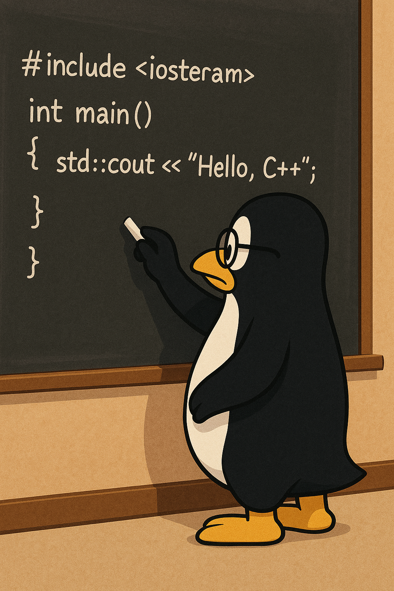

+++
draft       = false
featured    = true
title       = "The Complete Beginner's Guide to Learning C++ in 2025"
slug        = "learning-c++"
description = "In this guide, I'll walk you through starting your C++ journey from scratch, with a focus on free resources, practical learning paths, and the tools that will make your experience smoother."
ogImage     = "./learning-c++.png"
pubDatetime = 2025-04-08T16:00:00Z
author      = "Carlos Reyes"
tags        = [
    "C++",
    "Modern C++",
    "Beginner Programming",
    "C++ Curriculum",
    "Memory Management",
    "Object Oriented Programming",
    "Template Programming",
    "Standard Library Usage",
    "Smart Pointers",
    "Move Semantics",
    "Systems Programming",
    "Game Development",
    "Financial Systems Development",
    "Embedded Systems Programming",
    "Compiler Toolchains",
    "CMake Build System",
    "Software Debugging",
    "Cross Platform Development",
    "Deep Dive Tutorial",
    "Programming Education",
]
+++



## Table of Contents

---

## Introduction

As a C++ developer with years of experience across game development, financial systems, and low-level programming, I've witnessed firsthand how this powerful language continues to be relevant despite being over four decades old. In this guide, I'll walk you through starting your C++ journey from scratch, with a focus on free resources, practical learning paths, and the tools that will make your experience smoother.

## The Birth and Evolution of C++: A Brief History

C++ began its life in 1979 when Bjarne Stroustrup started working on "C with Classes" at Bell Labs. His goal was simple yet ambitious: create a language that combined the efficiency of C with support for object-oriented programming.

The language has evolved dramatically since its standardization in 1998:

| Version | Year | Key Features Added |
|---------|------|-------------------|
| C++98/03 | 1998/2003 | First standardization, STL, templates, exceptions |
| C++11 | 2011 | Auto type deduction, lambda expressions, move semantics, smart pointers |
| C++14 | 2014 | Generic lambdas, improved constexpr |
| C++17 | 2017 | Filesystem library, structured bindings, if constexpr |
| C++20 | 2020 | Concepts, ranges, coroutines, modules |
| C++23 | 2023 | Improved modules, executors, stacktrace library |

> **Personal Note**: I still remember the excitement when C++11 was released. It felt like getting a brand new language with features that solved so many pain points. The jump from C++03 to C++11 was probably the most significant transformation in the language's history.

## Why Learn C++ in 2025?

With so many newer, seemingly easier languages available, you might wonder: "Is C++ still worth learning?" The answer is a resounding yes, for several compelling reasons:

### 1. Unmatched Performance

C++ gives you direct control over memory and hardware resources. When milliseconds matter—whether in game engines, high-frequency trading, or embedded systems—C++ delivers efficiency that higher-level languages simply can't match.

### 2. Widespread Industry Adoption

Despite being "old" by programming language standards, C++ powers:
- Game engines (Unreal, Unity)
- Financial trading systems
- Operating systems and drivers
- Database engines
- Graphics-intensive applications
- High-performance computing

### 3. Transferable Fundamental Knowledge

Learning C++ teaches you computing concepts at a deeper level:
- Memory management
- Pointers and references
- Object lifetime and RAII (Resource Acquisition Is Initialization)
- Template metaprogramming
- Low-level optimizations

This knowledge makes learning other languages significantly easier. After mastering C++, languages like Java, C#, and Python often feel straightforward by comparison.

### 4. Career Opportunities

C++ developers command some of the highest salaries in the industry. According to recent surveys, C++ consistently ranks among the top-paying programming skills, particularly in finance, gaming, and systems programming.

## Getting Started: Essential Tools

Let's set up your C++ development environment with modern, powerful, and free tools.

### Compilers

C++ code needs to be compiled into machine code before it can run. Here are the three major compilers you should know about:

| Compiler | Platform | Key Advantages | Best For |
|----------|----------|----------------|----------|
| **GCC** | Cross-platform | Excellent standards compliance | Linux/Unix development |
| **Clang** | Cross-platform | Superior error messages, fast compilation | macOS, cross-platform projects |
| **MSVC** | Windows | Best Windows integration | Windows-specific development |

> **Pro Tip**: When starting out, don't worry too much about which compiler to use. Pick the one that's easiest to set up on your system, and you can explore others later.

### Setting Up Visual Studio Code for C++

Visual Studio Code has become my IDE of choice for C++ development. Here's how to set it up:

1. Download and install [Visual Studio Code](https://code.visualstudio.com/)
2. Install the [C/C++ Extension Pack](https://marketplace.visualstudio.com/items?itemName=ms-vscode.cpptools-extension-pack)
3. Install a compiler:
   - **Windows**: [MSVC with Build Tools](https://visualstudio.microsoft.com/downloads/#build-tools-for-visual-studio-2022) or [MinGW](https://www.mingw-w64.org/downloads/)
   - **macOS**: `xcode-select --install` (for Clang)
   - **Linux**: `sudo apt install build-essential` (Ubuntu/Debian) or equivalent

### CMake: Your Build System Friend

CMake is a cross-platform build system generator that simplifies the build process across different platforms and compilers.

```cmake
# Example CMakeLists.txt for a simple project
cmake_minimum_required(VERSION 3.10)
project(MyFirstCppProject)

set(CMAKE_CXX_STANDARD 17)
set(CMAKE_CXX_STANDARD_REQUIRED ON)

add_executable(MyProgram main.cpp)
```

This simple CMakeLists.txt file tells CMake to create a project that:
- Uses C++17 standard
- Creates an executable called "MyProgram" from main.cpp

> **Warning**: Build systems like CMake have a learning curve, but the time investment pays off enormously as your projects grow in complexity. Don't skip this step!

## The Best Free C++ Learning Resources

I've curated a list of completely free resources that have helped countless developers (including myself) learn C++.

### Official Documentation and References

- [cppreference.com](https://en.cppreference.com/) - The most comprehensive and up-to-date C++ reference
- [C++ Core Guidelines](https://isocpp.github.io/CppCoreGuidelines/CppCoreGuidelines) - Best practices from the creators of C++

### Interactive Learning Platforms

- [learncpp.com](https://www.learncpp.com/) - Excellent structured tutorials for beginners
- [Compiler Explorer (Godbolt)](https://godbolt.org/) - See how your code compiles to assembly
- [C++ Insights](https://cppinsights.io/) - Understand what the compiler does with your code

### Video Tutorials

- [The Cherno's C++ Series](https://www.youtube.com/playlist?list=PLlrATfBNZ98dudnM48yfGUldqGD0S4FFb) - Beginner-friendly videos with practical examples
- [CppCon YouTube Channel](https://www.youtube.com/user/CppCon) - Conference talks from C++ experts

### Practice Platforms

- [Exercism C++ Track](https://exercism.org/tracks/cpp) - Guided exercises with mentorship
- [Codewars](https://www.codewars.com/?language=cpp) - Challenge-based learning

### Community Forums

- [r/cpp_questions](https://www.reddit.com/r/cpp_questions/) - Supportive community for beginners
- [Stack Overflow C++ Tag](https://stackoverflow.com/questions/tagged/c%2b%2b) - Vast knowledge base of Q&A

## A Step-by-Step Curriculum for C++ Beginners

Learning C++ can feel overwhelming without a structured path. Here's a curriculum I recommend, broken down into manageable milestones:

### Phase 1: Fundamentals (2-4 weeks)

**Goals:**
- Understand basic syntax and program structure
- Learn variables, data types, and operators
- Master control flow (if/else, loops)
- Create and use functions

**Sample Code: Hello World**
```cpp
#include <iostream>

int main() {
    std::cout << "Hello, C++ World!" << std::endl;

    // Variables and basic operations
    int age = 25;
    double height = 1.75;
    std::string name = "Alex";

    std::cout << "Name: " << name << std::endl;
    std::cout << "Age: " << age << std::endl;
    std::cout << "Height: " << height << " meters" << std::endl;

    // Simple calculation
    double weightKg = 70.5;
    double bmi = weightKg / (height * height);

    std::cout << "BMI: " << bmi << std::endl;

    return 0;
}
```

**Milestone Check:**
- Can you write a program that takes user input and processes it?
- Can you implement basic mathematical algorithms?
- Do you understand the concept of scope?

### Phase 2: Object-Oriented Programming (4-6 weeks)

**Goals:**
- Learn classes and objects
- Understand encapsulation, inheritance, and polymorphism
- Master constructor/destructor concepts
- Use operator overloading

**Sample Code: Simple Class**
```cpp
#include <iostream>
#include <string>

class Person {
private:
    std::string name;
    int age;

public:
    // Constructor
    Person(const std::string& n, int a) : name(n), age(a) {}

    // Member functions
    void introduce() const {
        std::cout << "Hi, I'm " << name << " and I'm "
                  << age << " years old." << std::endl;
    }

    void celebrateBirthday() {
        age++;
        std::cout << "Happy Birthday! " << name
                  << " is now " << age << "." << std::endl;
    }
};

int main() {
    Person alice("Alice", 25);
    Person bob("Bob", 30);

    alice.introduce();
    bob.introduce();

    alice.celebrateBirthday();

    return 0;
}
```

**Milestone Check:**
- Can you design a class hierarchy for a simple problem?
- Do you understand when to use public, private, and protected?
- Can you explain the difference between composition and inheritance?

### Phase 3: Memory Management and Modern C++ (4-6 weeks)

**Goals:**
- Understand pointers and references
- Learn about the heap and stack
- Master RAII and resource management
- Use smart pointers and move semantics

**Sample Code: Smart Pointers**
```cpp
#include <iostream>
#include <memory>
#include <vector>
#include <string>

class Resource {
private:
    std::string name;

public:
    Resource(const std::string& n) : name(n) {
        std::cout << "Resource '" << name << "' created." << std::endl;
    }

    ~Resource() {
        std::cout << "Resource '" << name << "' destroyed." << std::endl;
    }

    void use() {
        std::cout << "Using resource '" << name << "'." << std::endl;
    }
};

int main() {
    // Scope 1: unique_ptr demonstration
    {
        std::cout << "Entering scope 1..." << std::endl;
        std::unique_ptr<Resource> res1 = std::make_unique<Resource>("Database Connection");
        res1->use();
        // No need to delete - will be automatically destroyed
    }
    std::cout << "Exited scope 1." << std::endl;

    // Scope 2: shared_ptr demonstration
    {
        std::cout << "\nEntering scope 2..." << std::endl;
        std::shared_ptr<Resource> res2 = std::make_shared<Resource>("Config File");

        {
            std::cout << "Creating another reference..." << std::endl;
            std::shared_ptr<Resource> res2_copy = res2;  // Reference count = 2
            res2_copy->use();
        }
        std::cout << "Inner reference gone, but resource still alive." << std::endl;
        res2->use();
    }
    std::cout << "Exited scope 2." << std::endl;

    return 0;
}
```

**Milestone Check:**
- Can you explain the difference between stack and heap memory?
- Do you understand when to use unique_ptr vs. shared_ptr?
- Can you identify and fix a memory leak?

### Phase 4: Standard Library and Templates (4-6 weeks)

**Goals:**
- Master STL containers (vector, map, set, etc.)
- Use algorithms and iterators
- Understand function objects and lambdas
- Create simple template functions and classes

**Sample Code: STL Algorithms**
```cpp
#include <iostream>
#include <vector>
#include <algorithm>
#include <numeric>
#include <string>

struct Student {
    std::string name;
    int score;

    Student(const std::string& n, int s) : name(n), score(s) {}
};

int main() {
    std::vector<Student> students = {
        {"Alice", 85}, {"Bob", 92}, {"Charlie", 78},
        {"David", 95}, {"Eve", 88}
    };

    // Find the highest score
    auto highestScorer = std::max_element(students.begin(), students.end(),
        [](const Student& a, const Student& b) {
            return a.score < b.score;
        });

    std::cout << "Highest score: " << highestScorer->name << " with "
              << highestScorer->score << " points." << std::endl;

    // Calculate average score
    int totalScore = std::accumulate(students.begin(), students.end(), 0,
        [](int sum, const Student& s) {
            return sum + s.score;
        });

    double averageScore = static_cast<double>(totalScore) / students.size();
    std::cout << "Average score: " << averageScore << std::endl;

    // Sort by name
    std::sort(students.begin(), students.end(),
        [](const Student& a, const Student& b) {
            return a.name < b.name;
        });

    std::cout << "\nStudents sorted by name:" << std::endl;
    for (const auto& student : students) {
        std::cout << student.name << ": " << student.score << std::endl;
    }

    return 0;
}
```

**Milestone Check:**
- Can you use STL containers and algorithms effectively?
- Do you understand how to write and use lambda expressions?
- Can you implement a simple template function?

### Phase 5: Advanced Topics and Specialization (Ongoing)

Depending on your interests, you might explore:
- Multithreading and concurrency
- Network programming
- Game development with C++
- Financial systems
- Embedded programming

## Common Pitfalls and Gotchas

As someone who's taught many developers C++, I've seen the same stumbling blocks repeatedly. Here are some warnings to save you time and frustration:

> **🔥 Memory Management Minefield:** C++ gives you direct control over memory, which is powerful but dangerous. Until you're comfortable with memory management concepts, use smart pointers (unique_ptr, shared_ptr) rather than raw pointers and manual delete calls.

> **⚠️ Compiler Differences:** Your code might compile perfectly on one compiler but fail on another. Always check compiler documentation when using cutting-edge features, and consider using continuous integration with multiple compilers for important projects.

> **🌐 Platform Portability:** Code that works flawlessly on Windows might crash on Linux due to different assumptions about file paths, line endings, or system calls. Test your code on all target platforms early and often.

### Debugging Tale: The Mysterious Crash

I once spent three days tracking down a bug that only appeared in our release builds, never in debug mode. The culprit? Uninitialized memory. A variable that was coincidentally getting zero-initialized in debug mode (due to debug heap settings) contained random garbage in release mode. The lesson: always initialize your variables!

```cpp
// BAD - Uninitialized variable
int calculateTotal() {
    int sum;  // Uninitialized! Contains random garbage

    // Logic that sometimes updates sum, sometimes doesn't

    return sum;  // Might return garbage
}

// GOOD - Always initialize
int calculateTotal() {
    int sum = 0;  // Explicitly initialized

    // Logic that sometimes updates sum

    return sum;  // Always returns a valid value
}
```

## Real-World C++ Applications

Let me share some examples of how C++ powers different industries:

### Game Development

Most AAA game engines use C++ for their core systems. For example, in a game engine, the physics system might look something like this:

```cpp
// Simplified physics system from a game engine
class PhysicsEngine {
private:
    std::vector<RigidBody*> bodies;
    Vector3 gravity{0.0f, -9.81f, 0.0f};
    float timeStep = 1.0f / 60.0f;

public:
    void update() {
        for (auto& body : bodies) {
            if (!body->isStatic()) {
                // Apply gravity
                body->applyForce(gravity * body->getMass());

                // Update velocity
                body->setVelocity(body->getVelocity() +
                                  body->getAcceleration() * timeStep);

                // Update position
                body->setPosition(body->getPosition() +
                                  body->getVelocity() * timeStep);

                // Reset acceleration for next frame
                body->resetAcceleration();
            }
        }

        // Collision detection and resolution would go here
    }

    void addBody(RigidBody* body) {
        bodies.push_back(body);
    }
};
```

### Financial Systems

In the finance world, C++ powers high-frequency trading systems where microseconds matter:

```cpp
// Simplified market data processor for a trading system
class MarketDataProcessor {
private:
    std::unordered_map<std::string, SecurityPrice> latestPrices;
    std::vector<TradingStrategy*> strategies;
    std::mutex pricesMutex;

public:
    void onMarketData(const MarketDataEvent& event) {
        {
            std::lock_guard<std::mutex> lock(pricesMutex);
            latestPrices[event.symbol] = {event.bid, event.ask, event.timestamp};
        }

        // Notify all strategies of the new price
        for (auto& strategy : strategies) {
            strategy->evaluatePrice(event.symbol, event.bid, event.ask);
        }
    }

    // More methods for trade execution, etc.
};
```

### Systems Programming

C++ is ideal for systems close to the hardware, like this simplified device driver:

```cpp
// Simplified sensor driver
class TemperatureSensorDriver {
private:
    int deviceHandle;
    uint16_t deviceAddress;
    bool initialized;

public:
    TemperatureSensorDriver(uint16_t address) :
        deviceAddress(address), initialized(false) {}

    bool initialize() {
        deviceHandle = open("/dev/i2c-1", O_RDWR);
        if (deviceHandle < 0) {
            std::cerr << "Failed to open I2C bus: " << strerror(errno) << std::endl;
            return false;
        }

        if (ioctl(deviceHandle, I2C_SLAVE, deviceAddress) < 0) {
            std::cerr << "Failed to acquire bus access: " << strerror(errno) << std::endl;
            close(deviceHandle);
            return false;
        }

        initialized = true;
        return true;
    }

    std::optional<float> readTemperature() {
        if (!initialized) {
            return std::nullopt;
        }

        uint8_t registerAddr = 0x00;  // Temperature register
        if (write(deviceHandle, &registerAddr, 1) != 1) {
            std::cerr << "Error writing to device" << std::endl;
            return std::nullopt;
        }

        uint8_t data[2];
        if (read(deviceHandle, data, 2) != 2) {
            std::cerr << "Error reading from device" << std::endl;
            return std::nullopt;
        }

        // Convert the data to temperature
        int16_t raw = (data[0] << 8) | data[1];
        float temp = raw * 0.0625f;  // Scale factor for this sensor

        return temp;
    }

    ~TemperatureSensorDriver() {
        if (initialized) {
            close(deviceHandle);
        }
    }
};
```

## Essential Websites and Tools

Here are some websites and tools every C++ developer should bookmark:

### [Compiler Explorer (Godbolt)](https://godbolt.org/)

This incredible tool lets you see the assembly code generated by different compilers. It's invaluable for understanding optimization and comparing compiler behaviors.

### [cppreference.com](https://en.cppreference.com/)

The most comprehensive and up-to-date C++ reference available. I use this daily, even after years of C++ development.

### [Quick C++ Benchmark](https://quick-bench.com/)

Test the performance of different C++ code snippets to compare optimizations.

### [Wandbox](https://wandbox.org/)

An online compiler supporting multiple C++ versions, ideal for trying out code without setting up a local environment.

### [C++ Insights](https://cppinsights.io/)

Shows you what the compiler does behind the scenes with your code, especially useful for understanding templates and auto type deduction.

## Conclusion

Learning C++ is a journey that will challenge you, but the rewards are substantial. The deep understanding of computer systems you'll gain, combined with the ability to write high-performance code, will serve you well throughout your programming career.

As you embark on your C++ learning path, remember:
- Start small and build incrementally
- Practice consistently
- Don't get discouraged by early complexity
- Use the community resources when stuck

C++ has survived and thrived for over four decades because it continues to evolve while maintaining its core philosophy: providing powerful abstractions without sacrificing performance. Learning C++ in 2025 is still one of the best investments you can make in your programming career.

Now go write some code, and welcome to the C++ community!

---

*What aspects of C++ are you most excited to learn? Let me know in the comments below!*
