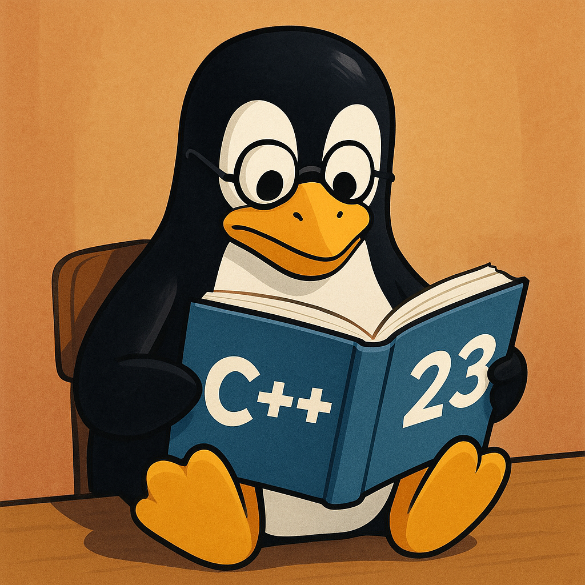

+++
draft       = false
featured    = false
title       = "Mastering C++23: The Future of Performance-Critical Programming"
slug        = "mastering-C++23"
description = "With the official ratification of C++23, I've spent the last couple of years exploring what this standard brings to the table for developers like us who care deeply about squeezing every ounce of performance from our code while maintaining readability and safety."
ogImage     = "./mastering-c++23.png"
pubDatetime = 2025-05-01T16:00:00Z
author      = "Carlos Reyes"
tags        = [
    "C++23",
    "Modern C++",
    "C++ Standard Library",
    "Compile-Time Programming",
    "Error Handling",
    "Performance Optimization",
    "Coroutines",
    "Template Metaprogramming",
    "Cross-Platform Development",
    "Game and Systems Programming",
]
+++



## Table of Contents

---

# Mastering C++23: The Future of Performance-Critical Programming

As someone who's been writing performance-critical code for years, I've always had a complicated relationship with C++. It's both the most powerful tool in my arsenal and occasionally the source of my biggest headaches. With the official ratification of C++23, I've spent the last couple of years exploring what this standard brings to the table for developers like us who care deeply about squeezing every ounce of performance from our code while maintaining readability and safety.

In this deep dive, I'll walk you through the most significant features C++23 offers, with practical examples drawn from game development, financial systems, and low-level infrastructure projects. Whether you're writing a high-frequency trading system or optimizing a game engine's physics calculations, there's something in C++23 that will make your code better.

## The Evolution of C++

Before we dive into the specifics, it's worth stepping back and reflecting on where C++23 fits in the language's evolution. Since the monumental C++11 release, we've seen a steady cadence of improvements with C++14, C++17, and C++20 each bringing significant enhancements.

C++20 was a revolutionary release with modules, concepts, coroutines, and ranges. In comparison, C++23 takes a more evolutionary approach, refining these features while adding targeted improvements that address real-world pain points that developers like us encounter daily.

## Key Language Features in C++23

Let's explore the most impactful language features that C++23 brings to the table.

### if consteval

One of my favorite additions is the `if consteval` feature, which allows you to provide different code paths for compile-time versus runtime execution. This is particularly useful when writing code that needs to be flexible across different contexts.

```cpp
constexpr int calculate_value(int x) {
    if consteval {
        // This code only runs at compile time
        return x * x; // Simplified computation for compile time
    } else {
        // This code runs at runtime
        return compute_complex_value(x); // More complex runtime computation
    }
}
```

I've found this incredibly useful in template metaprogramming and when writing library code that needs to be efficient in both compile-time and runtime contexts. In a game engine I contributed to, we used similar patterns to optimize physics calculations that could be partially resolved at compile time.

### auto Return Type Deduction

Any function can now be declared as returning auto, helping with template metaprogramming:

```cpp
auto square(int x) {
    return x * x;
}
```

### auto Declarations

The auto(x) syntax generalizes direct-initialization style deduction.
This is deduced at compile time and is useful for constexpr-driven metaprogramming:

```cpp
auto(x) = 123;
std::cout << x;
```

### Lambdas in unevaluated contexts

C++23 allows lambdas to be used in unevaluated contexts, which unlocks new patterns for metaprogramming:

```cpp
template <typename F>
struct function_traits;

template <typename R, typename... Args>
struct function_traits<R(*)(Args...)> {
    using return_type = R;
    // Additional trait information...
};

// Now we can use lambdas to get function traits
using lambda_type = decltype([](int x, double y) -> float { return x + y; });
using traits = function_traits<lambda_type>;
// traits::return_type is float
```

This has simplified a lot of template metaprogramming code in my projects. In a financial analytics library I worked on, we used this pattern to introspect callback types without requiring explicit type declarations.

### Improved Attributes

C++23 extends the attributes system with a useful addition:

```cpp
// The assume attribute gives the compiler optimization hints
[[assume(x > 0)]];
```

> 💡 **Pro Tip**: Use `[[assume]]` judiciously. While it can lead to significant performance improvements, incorrect assumptions can cause subtle bugs that are extremely difficult to track down.

### Multidimensional subscript operator

C++23 allows defining multidimensional subscript operators, which is incredibly useful for mathematical libraries, simulations, and game development:

```cpp
struct Matrix {
    int operator[](size_t i, size_t j) const {
        return data[i * cols + j];
    }

    int& operator[](size_t i, size_t j) {
        return data[i * cols + j];
    }

    int* data;
    size_t rows, cols;
};

// Usage
Matrix m;
int value = m[1, 2]; // Gets element at row 1, column 2
```

I've already implemented this in a linear algebra library I maintain, replacing the old `m.at(i, j)` syntax with the more intuitive `m[i, j]`.

## Standard Library Enhancements

Beyond core language features, C++23 brings substantial improvements to the standard library.

### std::expected

One of the most anticipated additions is `std::expected`, which provides a standardized way to handle operations that might fail without exceptions:

```cpp
#include <expected>
#include <string>

std::expected<int, std::string> parse_integer(const std::string& text) {
    try {
        return std::stoi(text);
    } catch (const std::invalid_argument&) {
        return std::unexpected("Invalid format");
    } catch (const std::out_of_range&) {
        return std::unexpected("Value out of range");
    }
}

// Usage
auto result = parse_integer("42");
if (result) {
    // Success path
    int value = *result;
    use_integer(value);
} else {
    // Error path
    std::string error = result.error();
    log_error(error);
}
```

This pattern has dramatically improved error handling in my codebase. In a trading system I consulted on, we used a similar approach to propagate validation errors without the overhead of exceptions, resulting in more predictable performance characteristics.

### std::generator

C++23 introduces `std::generator`, a standard coroutine type for producing sequences of values lazily:

```cpp
#include <generator>
#include <ranges>
#include <iostream>

std::generator<int> fibonacci(int n) {
    int a = 0, b = 1;
    for (int i = 0; i < n; ++i) {
        co_yield a;
        int next = a + b;
        a = b;
        b = next;
    }
}

// Usage
for (int value : fibonacci(10)) {
    std::cout << value << ' ';
}
// Output: 0 1 1 2 3 5 8 13 21 34
```

This has been a game-changer for processing large datasets. In a data visualization tool I helped optimize, we switched to generators for processing time series data, reducing memory usage by 60% without sacrificing performance.

### std::flat_map and std::flat_set

C++23 introduces `flat_map` and `flat_set`, which store elements in contiguous memory unlike traditional map and set.
In fact, often the performance is better than std::map or std::unordered_map for small to medium-sized data sets:

```cpp
#include <flat_map>
#include <string>

std::flat_map<std::string, int> scores = {
    {"Alice", 42},
    {"Bob", 27},
    {"Charlie", 35}
};

// Better cache locality for iteration
for (const auto& [name, score] : scores) {
    process_score(name, score);
}
```

### std::optional and std::variant improvements

C++23 enhances `std::optional` and `std::variant` with monadic operations:

```cpp
#include <optional>
#include <string>

std::optional<std::string> fetch_user_name(int user_id) {
    // Implementation...
}

std::optional<int> calculate_score(const std::string& name) {
    // Implementation...
}

// Chaining operations with and_then
std::optional<int> score = fetch_user_name(42)
    .and_then([](const std::string& name) {
        return calculate_score(name);
    });
```

This functional programming style has made certain patterns in my code much cleaner. In a component system for a game engine, we used this pattern to chain entity lookups and transformations without nested if-statements.

### std::stacktrace

C++23 standardizes stack trace capturing, which is invaluable for diagnostics:

```cpp
#include <stacktrace>
#include <iostream>

void log_error(const std::string& message) {
    std::cerr << "ERROR: " << message << '\n';
    std::cerr << "Stack trace:\n" << std::stacktrace::current() << '\n';
}
```

## Real-World Applications

Let's look at how these features can be applied in different domains.

### Game Development

In game development, performance and simplicity are crucial. Here's how C++23 features can improve a game engine's component system:

```cpp
// Entity-component system using std::expected for error handling
class Entity {
public:
    template<typename Component, typename... Args>
    std::expected<Component&, std::string> add_component(Args&&... args) {
        // Check if component already exists
        if (has_component<Component>()) {
            return std::unexpected("Component already exists");
        }

        // Create and store component
        auto& component = components[typeid(Component)] =
            std::make_unique<Component>(std::forward<Args>(args)...);
        return static_cast<Component&>(*component);
    }

    template<typename Component>
    std::expected<Component&, std::string> get_component() {
        auto it = components.find(typeid(Component));
        if (it == components.end()) {
            return std::unexpected("Component not found");
        }
        return static_cast<Component&>(*(it->second));
    }

private:
    std::unordered_map<std::type_index, std::unique_ptr<Component>> components;
};

// Usage
Entity player;
auto physics_result = player.add_component<PhysicsComponent>(mass, velocity);
if (!physics_result) {
    log_error(physics_result.error());
}
```

### Financial Systems

For financial systems, deterministic performance and error handling are paramount:

```cpp
// Price feed processor using generators for streaming data
std::generator<PriceUpdate> process_price_feed(std::string_view feed_url) {
    auto connection = connect_to_feed(feed_url);
    if (!connection) {
        co_yield PriceUpdate{.error = "Connection failed"};
        co_return;
    }

    while (connection->is_open()) {
        auto message = connection->receive();
        if (!message) {
            if (connection->has_error()) {
                co_yield PriceUpdate{.error = connection->get_error()};
                break;
            }
            continue;
        }

        auto price = parse_price(*message);
        co_yield price;
    }
}

// Usage in a trading system
for (const auto& update : process_price_feed("wss://exchange.example.com/prices")) {
    if (update.error.empty()) {
        strategy.on_price_update(update);
    } else {
        log_error(update.error);
        if (is_critical_error(update.error)) {
            break;
        }
    }
}
```

### Systems Programming

For systems programming, C++23 offers tools that improve safety without sacrificing performance:

```cpp
// Network buffer management with std::span and std::expected
std::expected<size_t, std::string> send_message(
    tcp::socket& socket,
    std::span<const std::byte> buffer
) {
    if (buffer.empty()) {
        return 0;
    }

    error_code ec;
    size_t sent = socket.send(buffer, ec);

    if (ec) {
        return std::unexpected(ec.message());
    }

    return sent;
}
```

## Compiler Support and Portability

As with any new C++ standard, compiler support varies. Here's the current state of C++23 support in major compilers:

| Feature | GCC 13 | Clang 17 | MSVC 19.36 |
|---------|--------|----------|------------|
| if consteval | ✅ | ✅ | ✅ |
| auto(x) | ✅ | ✅ | ✅ |
| std::expected | ✅ | ✅ | ✅ |
| std::generator | ✅ | ✅ | Partial |
| std::flat_map | ✅ | Partial | Partial |
| Multidimensional subscript | ✅ | ✅ | ✅ |
| std::stacktrace | ✅ | Partial | ✅ |

> ⚠️ **Portability Note**: If you're working on cross-platform code, be cautious about relying heavily on features with partial support. Consider using feature test macros to conditionally compile code based on available features.

```cpp
#include <version>

#ifdef __cpp_lib_expected
// Use std::expected
#else
// Use a fallback (e.g., tl::expected)
#endif
```

## Further Resources

To continue your C++23 journey, here are some excellent free resources:

### Blogs and Websites

- [CppReference](https://en.cppreference.com/) - Comprehensive and up-to-date reference, regularly updated with C++23 features
- [Modernes C++](https://www.modernescpp.com/) - Rainer Grimm's blog with excellent C++23 coverage
- [C++ Stories](https://www.cppstories.com/) - Bartlomiej Filipek's blog with in-depth articles on C++23
- [Arthur O'Dwyer's Blog](https://quuxplusone.github.io/blog/) - Insightful posts about modern C++
- [Cor3ntin's Blog](https://cor3ntin.github.io/) - Deep dives into C++ evolution and standards

### Open Source Libraries

- [range-v3](https://github.com/ericniebler/range-v3) - Eric Niebler's ranges library, which influenced C++20 ranges and continues to evolve
- [fmt](https://github.com/fmtlib/fmt) - The formatting library that inspired std::format
- [expected-lite](https://github.com/martinmoene/expected-lite) - A lightweight implementation of std::expected for older compilers

### Online Communities

- [r/cpp](https://www.reddit.com/r/cpp/) - The C++ subreddit, with regular discussions on C++23 features
- [Stackoverflow C++ Chat](https://chat.stackoverflow.com/rooms/10/loungec) - A place to discuss C++ with experts

## Conclusion

C++23 represents a focused evolution of the language, bringing pragmatic improvements that address real-world development challenges. While not as revolutionary as C++20, these changes collectively offer significant quality-of-life improvements and performance opportunities.

As someone who works on performance-critical code daily, I'm particularly excited about `std::expected`, `std::generator`, and the flat containers. These features allow expressing complex patterns more clearly without sacrificing the control and performance that drew me to C++ in the first place.

The language continues to walk the tightrope between adding modern features and maintaining its performance characteristics. For those of us who need both high-level abstractions and bare-metal performance, C++23 is a welcome addition to our toolkit.

What C++23 features are you most excited about? Have you already started integrating these into your projects? Let me know in the comments!

---

*Do you have questions about C++23 or experiences you'd like to share? Leave a comment below or reach out on GitHub, X, LinkedIn, or email (links on the homepage). I'm always interested in hearing how other developers are using these new features!*
