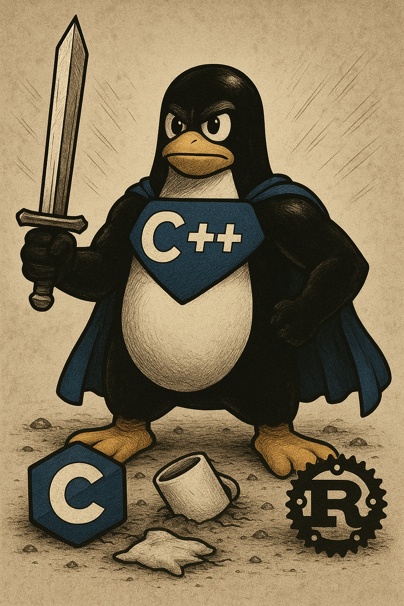

+++
draft       = false
featured    = true
title       = "What is C++? A Deep Dive into the Language That Powers Performance-Critical Software"
slug        = "what-is-c++"
description = "As a developer who has spent countless hours wrangling with compilers, debugging memory leaks, and optimizing hot paths, I've developed both a deep appreciation and healthy respect for C++."
ogImage     = "./what-is-c++.png"
pubDatetime = 2025-05-18T16:00:00Z
author      = "Carlos Reyes"
tags        = [
    "C++ History",
    "Object-Oriented Programming",
    "RAII Idiom",
    "Smart Pointers",
    "Move Semantics",
    "Template Metaprogramming",
    "C++ Standards Evolution",
    "C++20 Features",
    "Compile Time Tradeoffs",
    "Memory Safety",
    "C++ vs Java",
    "C++ vs Rust",
    "High-Frequency Trading",
    "Game Engine Development",
    "Systems Programming",
    "Scientific Computing",
    "Portability Challenges",
    "Compiler Differences",
    "Performance-Critical Code",
    "Deep Dive Tutorial",
]
+++



## Table of Contents

---

## Introduction

As a developer who has spent countless hours wrangling with compilers, debugging memory leaks, and optimizing hot paths, I've developed both a deep appreciation and healthy respect for C++. While I also work with TypeScript and Python, C++ remains my go-to language when performance truly matters. In this article, I'll take you through what C++ is, where it came from, and why it continues to thrive despite (or perhaps because of) its complexity.

## The Origins: From B to C++

To understand C++, we need to trace its lineage back to its ancestors. The family tree of C++ stretches back through several generations of programming languages:

| Language | Year | Key Developer(s) | Key Contribution |
|----------|------|------------------|------------------|
| BCPL     | 1966 | Martin Richards  | Influenced B, introduced `//` comments |
| B        | 1969 | Ken Thompson     | Simplified BCPL, used for early Unix |
| C        | 1972 | Dennis Ritchie   | Added types, foundation for Unix |
| C with Classes | 1979 | Bjarne Stroustrup | Added classes to C |
| C++      | 1983 | Bjarne Stroustrup | Named "C++", added more OOP features |

The story begins in the 1960s with BCPL (Basic Combined Programming Language), developed by Martin Richards at the University of Cambridge. BCPL influenced Ken Thompson's creation of B at Bell Labs, which was then refined by Dennis Ritchie into the C programming language we know today. C became the foundation of Unix and revolutionized systems programming.

In 1979, Bjarne Stroustrup began working on "C with Classes" at Bell Labs. His goal was to enhance C with features from Simula, the first object-oriented programming language. Stroustrup was trying to solve complex simulation problems that required both the efficiency of C and the abstraction capabilities of higher-level languages.

By 1983, "C with Classes" had evolved into a new language named C++ (the "++" operator in C increments a variable, symbolizing that C++ was an incremented version of C). The first C++ compiler, called Cfront, worked by translating C++ code into C, which could then be compiled by a standard C compiler.

> **Historical Note:** The name "C++" was coined by Rick Mascitti in 1983, though Stroustrup had previously used the name "C with Classes."

> **Historical Note:** I met Bjarne Stroustrup and Brian Kernighan, another C luminary, in 1987 while we were all at Bell Labs.

## The Influence of Smalltalk and Object-Oriented Programming

While Simula is often cited as the primary influence for C++'s object-oriented features, Smalltalk (which was at its prime in the 1980s) also played a significant role in shaping how object-orientation evolved in many languages, including C++.

Smalltalk, developed at Xerox PARC under the leadership of Alan Kay, introduced many concepts that would become fundamental to object-oriented programming:

- Everything is an object
- Objects communicate via messages
- Objects have their own memory
- Every object is an instance of a class
- Classes inherit from other classes

While C++ didn't adopt Smalltalk's pure object model (C++ allows procedural programming and direct memory manipulation), its class hierarchies, inheritance, and polymorphism concepts show clear inspiration from Smalltalk's approach. The difference was that C++ aimed to make these features available without sacrificing the performance that C programmers expected.

```cpp
// A simple example showing C++'s object-oriented capabilities
class Shape {
public:
    virtual double area() const = 0;  // Pure virtual function
    virtual ~Shape() {}               // Virtual destructor
};

class Circle : public Shape {
private:
    double radius;
public:
    Circle(double r) : radius(r) {}

    double area() const override {
        return 3.14159 * radius * radius;
    }
};

class Rectangle : public Shape {
private:
    double width, height;
public:
    Rectangle(double w, double h) : width(w), height(h) {}

    double area() const override {
        return width * height;
    }
};

// Using polymorphism
void printArea(const Shape& shape) {
    std::cout << "Area: " << shape.area() << std::endl;
}
```

This kind of polymorphic behavior, while commonplace today, was revolutionary for C programmers in the 1980s who were used to procedural programming.

## Evolving Design Goals: From C Compatibility to Modern C++

### The C Compatibility Era

When C++ was first developed, one of its primary design goals was compatibility with C. The intention was clear: make it easy for C programmers to transition to this new language. In fact, the early C++ compiler (Cfront) worked by translating C++ code to C.

This compatibility design choice was strategic. It meant:
1. C programmers could gradually adopt C++ features
2. Existing C codebases could be incrementally converted
3. C++ could leverage existing C libraries and tools

A colleague who worked at a telecom company in the early 1990s told me how they migrated a million-line C codebase to C++ over several years. They started by simply renaming `.c` files to `.cpp` and making minimal changes, then gradually introduced classes and other C++ features as developers became more comfortable with the language.

### Breaking Away from C

As C++ matured, the goal of being translatable to C was eventually abandoned. The language began to introduce features that couldn't be easily mapped to C constructs:

- Exceptions
- Templates
- Runtime type information (RTTI)
- Namespaces
- References

This allowed C++ to evolve more freely, though it still maintained source compatibility with most C code.

### The Java Challenge and Response

In the late 1990s and early 2000s, Java emerged as a serious competitor to C++. Java offered garbage collection, a simpler object model, built-in threading, and platform independence through its virtual machine. Many projects began migrating from C++ to Java, particularly in enterprise applications.

C++ responded to this challenge by expanding its standard library with the Standard Template Library (STL), which provided containers, algorithms, and iterators that made common programming tasks easier while maintaining C++'s performance advantages.

```cpp
// Modern C++ with STL makes code more concise and safer
#include <vector>
#include <algorithm>
#include <iostream>

int main() {
    std::vector<int> numbers = {5, 2, 8, 1, 9};

    // Sort the vector
    std::sort(numbers.begin(), numbers.end());

    // Find a value
    auto it = std::find(numbers.begin(), numbers.end(), 8);
    if (it != numbers.end()) {
        std::cout << "Found 8 at position: "
                  << (it - numbers.begin()) << std::endl;
    }

    return 0;
}
```

### The Modern Era: Competing with Rust

Today, Rust has emerged as perhaps the most significant challenger to C++, especially in systems programming. Rust's ownership model provides memory safety guarantees at compile time without garbage collection, directly addressing one of C++'s most significant pain points.

In response, recent C++ standards have introduced features focused on safety, expressiveness, and performance:

- Smart pointers (`std::unique_ptr`, `std::shared_ptr`)
- Move semantics
- Lambda expressions
- Ranges
- Modules
- Concepts

I find it somewhat amusing that people used to complain endlessly about C++ compile times before Rust came along. Now that developers have experienced Rust's significantly longer compile times, the complaints about C++ in this area have noticeably diminished! Competition benefits us all, as it pushes each language to improve.

## The C++ Standards Process: Controlled Evolution

One of C++'s strengths is its standardization process. The language is governed by the ISO C++ Committee (officially known as ISO/IEC JTC1/SC22/WG21), which includes representatives from major tech companies, compiler vendors, academia, and independent experts.

Since 1998, C++ has followed a regular release cycle, with new standards appearing approximately every three years:

- C++98/03: The first standardized versions
- C++11: A major update that modernized the language
- C++14: Minor refinements and bug fixes
- C++17: More library components and language features
- C++20: Concepts, ranges, modules, and coroutines
- C++23: The most recent standard

### The Reality of Compiler Support

Working with C++ in the real world means dealing with the reality that compiler support for the latest standards is always in flux. At any given time, what your compiler supports is typically:

1. Missing features from the last ratified standard
2. New features with edge cases that have not been ironed out or only contain the core implementation
3. A smattering of features from the upcoming standard

This creates a practical challenge for developers: deciding which features to use based on their target platforms and compiler versions.

> **Practical Tip:** Always check compiler support tables like those at [cppreference.com](https://en.cppreference.com/w/cpp/compiler_support) before relying on newer C++ features in production code.

For instance, when working on a cross-platform game engine last year, I had to carefully choose which C++20 features to use based on the minimum compiler versions our team had agreed to support across Windows, macOS, and various consoles.

## Memory Management: The Eternal Challenge

Memory errors continue to be one of the most significant sources of runtime bugs in C++ programs. According to a Microsoft study, about 70% of their security vulnerabilities were due to memory safety issues.

C++ has been adding features to make memory errors less likely while still maintaining its performance characteristics:

### RAII (Resource Acquisition Is Initialization)

This C++ idiom ensures that resources (like memory) are properly released by tying them to object lifetimes:

```cpp
void process_file() {
    // File will automatically close when function exits
    std::ifstream file("data.txt");

    // Process the file...
    // No need to explicitly close
}
```

### Smart Pointers

Modern C++ encourages the use of smart pointers instead of raw pointers:

```cpp
// Old approach with raw pointers - prone to leaks and errors
void old_way() {
    MyClass* obj = new MyClass();
    // ... do something ...
    if (condition) {
        return; // Oops, forgot to delete obj - memory leak!
    }
    delete obj;
}

// Modern approach with smart pointers
void modern_way() {
    auto obj = std::make_unique<MyClass>();
    // ... do something ...
    // No need to delete - memory will be automatically freed
}
```

### Move Semantics

C++11 introduced move semantics, which allows resources to be transferred between objects without expensive copying:

```cpp
#include <iostream>
#include <vector>
#include <utility>

int main() {
    std::vector<int> a = {1, 2, 3};
    std::vector<int> b = std::move(a); // Move a into b

    std::cout << "a.size() = " << a.size() << '\n'; // Likely 0
    std::cout << "b.size() = " << b.size() << '\n'; // 3

    return 0;
}
```

A friend who works in high-frequency trading told me how introducing move semantics in their codebase reduced latency by eliminating unnecessary copies of large market data structures, shaving precious microseconds off their trading system's response time.

## Real-World C++ Applications

C++ thrives in domains where performance, resource control, and efficiency are crucial:

### Game Development

Game engines like Unreal Engine, Unity (parts of it), and most AAA game engines are written in C++. The language provides the performance needed for physics simulations, rendering, and AI while allowing high-level abstractions for game logic.

Epic Games' Unreal Engine uses C++ extensively, with a custom preprocessor that adds garbage collection and reflection capabilities to standard C++.

### Finance

In the world of finance, C++ powers high-frequency trading systems where microseconds matter. Goldman Sachs, Jane Street, and many other financial institutions use C++ for their core trading infrastructure.

A developer at a major trading firm once shared with me that they switched a critical component from Java to C++ and saw their latency drop from milliseconds to microseconds - a competitive advantage in a field where being first matters enormously.

### Systems Programming

Operating systems, device drivers, and embedded systems frequently use C++. Parts of Windows, major browsers like Chrome (via the Chromium project), and many embedded devices run on C++ code.

Google's Chrome browser is built on C++ for its core components, allowing it to achieve the performance needed for modern web applications while maintaining memory efficiency.

### Scientific Computing

Scientific applications that require heavy computation often turn to C++. The Large Hadron Collider's data analysis software, parts of MATLAB, and many scientific simulation tools use C++.

I once worked on a computational fluid dynamics simulation that processed terabytes of sensor data. We initially prototyped in Python but had to port the performance-critical sections to C++ to achieve the throughput needed for real-time analysis.

## Portability Concerns and Compiler Differences

Despite standardization, C++ still suffers from portability challenges:

- Different compilers interpret edge cases differently
- Platform-specific features and libraries
- Undefined behavior that may work on one platform but fail on another

For instance, a seemingly innocent piece of code might work perfectly on Visual Studio but fail mysteriously on GCC due to different interpretations of the standard or different default compiler flags.

```cpp
// This might work differently across compilers due to undefined behavior
int main() {
    int a[5] = {1, 2, 3, 4, 5};
    int *p = a;
    p[5] = 6;  // Out of bounds access - undefined behavior

    return 0;
}
```

I learned this lesson the hard way when porting a simulation engine from Windows to Linux. Code that had run flawlessly for years suddenly exhibited subtle bugs due to different memory alignment requirements and compiler optimizations.

> **Tip:** Always compile with warnings enabled and treat them as errors. A clean build on multiple compilers significantly increases the chances your code is portable.

## The Future of C++

The evolution rate of C++ only seems to be accelerating. The language continues to add features that make it safer, more expressive, and more performant.

Some exciting developments on the horizon:

- **Improved compile times**: Modules in C++20 aim to address the notorious compilation overhead
- **Better concurrency support**: Executors and networking TSs (Technical Specifications)
- **Pattern matching**: Similar to features in functional languages
- **Reflection**: Allowing code to inspect and manipulate itself

I believe C++ has a bright future. While newer languages like Rust offer compelling alternatives, C++'s massive existing codebase, continuous evolution, and performance characteristics ensure it will remain relevant for decades to come.

## Conclusion

C++ is a language of contradictions. It's old yet modern, complex yet powerful, criticized yet irreplaceable. It gives you enough rope to hang yourself but also the tools to build incredibly efficient and elegant systems.

As Tony Hoare (creator of the null reference) famously said about programming languages: "There are two ways of constructing a software design: One way is to make it so simple that there are obviously no deficiencies, and the other way is to make it so complicated that there are no obvious deficiencies." C++ took the second path, but in doing so, it became the backbone of countless performance-critical systems around the world.

For those willing to climb its steep learning curve, C++ offers unparalleled control over hardware resources while providing high-level abstractions when needed. It's a language that rewards expertise and punishes carelessness - frustrating at times, but immensely satisfying when mastered.

Whether you're building the next AAA game, high-frequency trading system, or operating system kernel, C++ remains one of the most powerful tools in a programmer's arsenal. And with its continuing evolution, it shows no signs of relinquishing that position anytime soon.

---

*What's your experience with C++? Have you used it in production, and if so, in what context? Share your thoughts in the comments below!*
