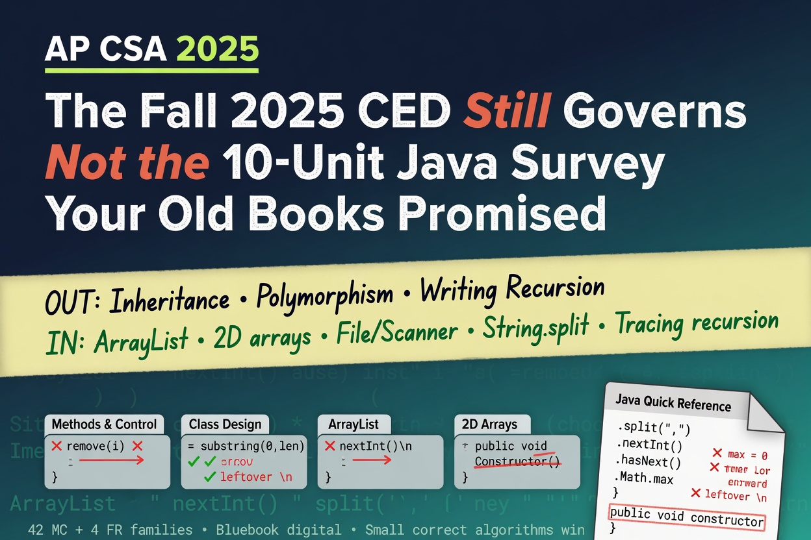

+++
draft       = false
featured    = false
title       = "AP Computer Science A After 2025: The Ideas That Matter and the Traps That Don’t"
slug        = "ap-csa-after-2025"
description = "If your AP Computer Science A prep still drills extends and “write a recursive method,” you are studying a course College Board already replaced."
ogImage     = "./ap-csa-after-2025.jpg"
pubDatetime = 2026-07-13T16:00:00Z
author      = "Carlos Reyes"
tags        = [
    "AP Computer Science A",
    "AP Java",
    "Data Collections",
    "Class Design",
    "Java ArrayList",
    "Recursion Tracing",
    "Free Response Questions",
    "2D Arrays",
    "Text File Input",
    "String Methods",
    "Binary Search",
    "Merge Sort",
    "Java Scanner",
    "Class Constructors",
    "Selection and Iteration",
    "Algorithms",
    "Exam Preparation",
    "Programming Correctness",
    "Computer Science Education",
    "Study Guide"
]
+++



## Table of Contents

---

# AP Computer Science A After 2025: The Ideas That Matter and the Traps That Don’t

Open a 2024 review book to the table of contents. There is still a unit called Inheritance. There is still a chapter that asks you to *write* a recursive method from scratch. If that is what you are drilling this semester, you are studying a course College Board already replaced.

The course is **AP Computer Science A**. Not “AP CS 1.” Not “Java AP.” The document that governs it is the [Course and Exam Description effective Fall 2025](https://apcentral.collegeboard.org/media/pdf/ap-computer-science-a-course-and-exam-description.pdf). It still governs the class. Ten units became four. `extends` left. `super` left. Polymorphism left. Writing recursive methods left with them.

What walked in: data sets, text files through `File` and `Scanner`, and *tracing* recursion — including recursive search and merge sort. The exam is digital, in Bluebook. Forty-two four-choice multiple-choice questions in 90 minutes (55%), then four free-response questions in 90 minutes (45%).

First job, before any algorithm: throw out prep that still drills subclass design or “write a recursive method.” Keep the [Java Quick Reference](https://apcentral.collegeboard.org/media/pdf/ap-computer-science-a-java-quick-reference.pdf) open. It now includes `String.split`, `Integer.parseInt`, `Double.parseDouble`, `File`, and `Scanner`. If a method is not on that sheet, do not build your answer around remembering it.

CSA, as it is actually tested, rewards tracing and small, correct algorithms on collections. Not OOP theater.

## The four-unit map, and the exam that sits on it

College Board’s multiple-choice weights are ranges, not promises. Treat them as a budget for your hours.

| Unit | Name | MCQ weight | What it actually feeds |
| --- | --- | --- | --- |
| 1 | Using Objects and Methods | 15–25% | Every question that touches a `String`, `Math`, a constructor call, or a return type. FRQ 1 Part B lives here. |
| 2 | Selection and Iteration | 25–35% | Every `if`/`else if` chain, every loop bound, every accumulator. FRQ 1 Part A is this with objects mixed in. |
| 3 | Class Creation | 10–18% | FRQ 2, whole. One class. Private fields. A real constructor. |
| 4 | Data Collections | 30–40% | FRQ 3 (`ArrayList`) and FRQ 4 (2D array), plus the search/sort/file/recursion MCQs. This is the center of gravity. |

The free-response side is not a mystery either. College Board publishes the four families:

1. **Methods and Control Structures** (7 points). You write two methods, or one constructor and one method, of a class they already described. Part A is iteration and selection, plus calls to methods of that class. Part B leans on `String`.
2. **Class Design** (7 points). You write a complete class from a scenario and a table of calls. Header, private instance variables, constructor, required method. They may hand you a *second* class as a type you use — composition, not `extends`.
3. **Data Analysis with `ArrayList`** (5 points). One method. Traverse, accumulate, maybe insert or remove.
4. **2D Array** (6 points). One method. Rows, columns, a nested loop that does a real job.

Ninety minutes, 25 FRQ points. A blank part is a zero. A wrong but earnest loop can still pick up the “declares the right local variables” crumb. Write something for every part.

> **Pro tip:** Put the Quick Reference on the desk for *every* practice problem, MCQ included. The exam gives it to you in Bluebook. Practicing without it trains a skill you will not need, and it hides the new methods (`split`, `parseInt`, `Scanner`) until they surprise you.

## Discard this. Keep that.

Some teachers still teach inheritance. That is real Java, and it helps CS 2. Fine — after the exam, or labeled enrichment. Do not let a family tree steal the hours that belong to `ArrayList` removal and 2D traversals. Writing recursion is a useful skill too. Tracing it is what this exam measures. Those are not the same muscle.

**Out of scope. Stop drilling these as exam skills.**

- `extends`, `super`, subclass constructors, method overriding, polymorphism, interfaces
- Writing a recursive method from a blank page
- `charAt`, `trim`, `toLowerCase`, `contains`, `replace` as things you must memorize — they are not on the Quick Reference. If you already know `charAt`, you will not be punished for using it, but the sheet gives you `substring(i, i + 1)` and that is the safe move.

**In scope, and under-practiced if you are using an old book.**

- `File` + `Scanner`, looping on `hasNext()`
- `String.split` and `Integer.parseInt` / `Double.parseDouble`
- Wrapper classes, because `ArrayList` holds objects, not `int`
- Linear search (you may write it), binary search (you trace it, on sorted data)
- Selection sort and insertion sort (trace, maybe write the idea), merge sort (trace only)
- Recursion as a call stack you walk one return at a time

Past paper FRQs are still useful for loops, strings, class design, arrays, and `ArrayList`. They are poison if the question is “write a subclass” or “write recursive `mystery`.” Skip those. Do the rest with a timer and a keyboard.

## Unit 1: The vocabulary everything else assumes

Unit 1 is not the easy 15%. It is the language the other 85% is written in. If integer division still surprises you, FRQ 1 Part B will too.

**Primitives vs references.** `int`, `double`, `boolean` store the value. A `String` variable, and every other object variable, stores a *reference*. Two references can point at the same object. `null` means “this variable currently points at nothing.” Calling a method on `null` is `NullPointerException`, not a cute “nothing happened.”

**Integer division and casting toward zero.** `7 / 2` is `3`. Not `3.5`. Java truncates toward zero, so `(int) 3.9` is `3` and `(int) -3.9` is `-3`, not `-4`. The placement of the cast changes the answer:

```java
(double) 7 / 2        // 3.5  — 7 becomes 7.0, then divide
(double) (7 / 2)      // 3.0  — integer divide first, then widen the 3
```

Students who learned Python first lose points here for weeks.

**Objects are created with `new`.** `new Rectangle(3, 4)` actually builds the object. `Rectangle r;` only names a box that can hold a reference. Until you assign, that box is empty (or, for a local variable, illegal to read).

**`String` methods, end-exclusive `substring`.** Index 0 is the first character. `substring(from, to)` includes `from` and *excludes* `to`. `"HELLO".substring(1, 4)` is `"ELL"`. The one-argument form `substring(from)` goes to the end. `indexOf` returns `-1` when the piece is missing — test for `-1`, do not assume a hit.

**`equals`, not `==`.** `==` on objects asks “same object in memory?” `equals` on `String` asks “same characters?” The exam will punish `==` on strings. `compareTo` is the ordering tool: negative, zero, or positive. You rarely need the exact number, only the sign.

**Concatenation is left to right.** `1 + 2 + "hi"` is `"3hi"`. `"hi" + 1 + 2` is `"hi12"`. The moment a `String` appears, later `+` becomes concatenation.

**`Math` is all static.** `Math.abs`, `Math.pow`, `Math.sqrt`, `Math.random`. `Math.random()` returns a `double` in `[0.0, 1.0)` — including 0, never including 1. The classic “integer from 1 through 10” is `(int) (Math.random() * 10) + 1`. Get the parentheses wrong and you mint zeros.

> **Gotcha:** `String` has `length()`. Arrays have `length` with no parentheses. `ArrayList` has `size()`. Mixing these three is the most common compile-error-that-is-really-a-memory-error I see. Say them out loud until they bore you: `arr.length`, `str.length()`, `list.size()`.

Work a Unit 1 question the way the MCQ will:

```java
String str1 = "LMNOP";
String str2 = str1.substring(3);      // "OP"
str2 += str1.substring(2, 3);         // "OP" + "N"
```

`str2` is `"OPN"`. End-exclusive `substring`, then concatenation. That shape is from College Board’s own sample. If you had to look at your fingers to count indices, you are not done with Unit 1.

## Unit 2: Control flow you will reuse on every FRQ

FRQ 1 is Unit 2 wearing a class’s methods. The algorithms are small and they repeat: count, sum, find max/min, find the first match, build a `String`, decide yes/no.

**`if` / `else if` order is a trap.** The first true condition wins. If you test `year >= 400` before `year >= 1400` without `else`, a 1500 gets labeled twice. If you use `else if` but put the wide net first, the narrow net never runs. Read the conditions from the top and ask, “can a later branch ever fire?”

**Short-circuit.** `&&` stops if the left side is false. `||` stops if the left side is true. That is why this is safe:

```java
if (str != null && str.length() > 0) {
    // ...
}
```

Flip the order — `str.length() > 0 && str != null` — and a `null` reference throws before the null check runs. The exam loves this.

**De Morgan.** `!(a && b)` is `!a || !b`. `!(a || b)` is `!a && !b`. When you negate a comparison, `>` becomes `<=`, not `<`. `!(x > 5)` is `x <= 5`. Missing the equal sign is a full wrong MCQ.

**`while` vs `for`.** Use `for` when you know how many times, or you are walking indices `0` through `length - 1`. Use `while` when the stopping condition is “we found it” or “the file still has tokens.” Off-by-one is almost always `<=` where you wanted `<`, or `i = 1` when index 0 had data.

**Nested loops.** The inner loop runs completely for every outer iteration. Informal run-time analysis in this course is “about $n$ work” versus “about $n^2$ work.” A nested loop over $n$ rows and $n$ columns is the $n^2$ shape. That is why selection sort and insertion sort are the slow pair, and why merge sort exists on the MCQ.

**The three patterns you should be able to write half-asleep.**

Accumulator:

```java
int sum = 0;
for (int i = 0; i < nums.length; i++) {
    sum += nums[i];
}
```

Counter:

```java
int count = 0;
for (int i = 0; i < nums.length; i++) {
    if (nums[i] < 0) {
        count++;
    }
}
```

Max — and this is where people donate points:

```java
int max = nums[0];                 // NOT 0
for (int i = 1; i < nums.length; i++) {
    if (nums[i] > max) {
        max = nums[i];
    }
}
```

If the data can be negative, initializing `max` to `0` is a silent wrong answer. `{-3, -1, -8}` should yield `-1`. A `0` initializer yields `0`. The contract was “largest value in the array,” not “largest value or zero, whichever is bigger.” Same story for min: start at `nums[0]`, not `Integer.MAX_VALUE` unless you have a reason and an empty-array precondition.

> **Pro tip:** On an FRQ, the prompt already gave you helper methods. Call them. Re-implementing `isValid` or `getId` because you “wanted to be sure” wastes time and introduces bugs the rubric will not forgive. The graders are looking for the call.

## Unit 3: Write one complete class, not a family tree

FRQ 2 is a complete class. Not a hierarchy. Not `implements`. A header, private fields, a constructor that is actually a constructor, accessors, maybe a mutator, maybe `this`, maybe a `static` counter.

The scoring language is blunt: instance variables on this question must be `private`. `public int balance;` is a gift you should not give away.

A constructor has **no return type**. Not `void`. Not the class name as a type. Nothing.

```java
public void ArcadeCard() { }   // a badly named method. Not a constructor.
public ArcadeCard() { }        // a constructor.
```

If you write the `void` version, Java does not treat it as construction. `new ArcadeCard()` will not run your initialization. You will lose the constructor point and every behavior that depended on it.

Here is a cousin of FRQ 2 — small enough to type, complete enough to compile. This is not a released question. It is the shape.

```java
// AP Java subset. Compile: javac ArcadeCard.java && java ArcadeCard

public class ArcadeCard {
    private String owner;
    private int tickets;
    private static int cardsIssued = 0;

    public ArcadeCard(String owner, int tickets) {
        this.owner = owner;       // this.field = parameter, names collide
        this.tickets = tickets;
        cardsIssued++;            // belongs to the class, not one card
    }

    public boolean play(int cost) {
        if (cost <= tickets) {
            tickets -= cost;
            return true;
        }
        return false;             // balance unchanged on failure
    }

    public void addTickets(int n) {
        if (n > 0) {
            tickets += n;
        }
    }

    public String getOwner() {
        return owner;
    }

    public int getTickets() {
        return tickets;
    }

    public static int getCardsIssued() {
        return cardsIssued;
    }

    public static void main(String[] args) {
        ArcadeCard a = new ArcadeCard("Rin", 20);
        System.out.println(a.play(7));               // true
        System.out.println(a.getTickets());          // 13
        System.out.println(a.play(20));              // false, still 13
        System.out.println(ArcadeCard.getCardsIssued()); // 1
    }
}
```

What to notice.

`this` is how you keep the parameter name readable without shadowing the field into a no-op. `owner = owner` assigns the parameter to itself and leaves the field at `null`. I have watched that compile. It is a void of a constructor.

`static` data is shared. `cardsIssued` ticks once per successful `new`. Instance methods may read static data. A static method may not touch `owner` or `tickets` without an object in hand. `getCardsIssued` is static because it answers a question about the class, not about Rin.

Accessors return the field. They are not `void`. Mutators change state; they often *are* `void`. `play` returns `boolean` because the caller needs to know whether the game started. That return type is part of the design, not decoration.

If FRQ 2 hands you a second class — say `Prize` — you store a `Prize` field or accept a `Prize` parameter. You do not subclass it. Has-a, not is-a.

## Unit 4: Collections, files, and tracing — where the exam lives

Unit 4 is a third to 40% of the multiple choice and both remaining FRQs. If your hours are limited, they go here.

### 1D arrays

Valid indices are `0` through `length - 1`. `arr[arr.length]` is `ArrayIndexOutOfBoundsException`. Arrays of primitives start at `0` / `0.0` / `false`. Arrays of objects start at `null`. Traversing with a standard `for` is the default because you need the index. The enhanced `for` is cleaner and more dangerous:

```java
int[] nums = {1, 2, 3};
for (int n : nums) {
    n = 0;        // n is a copy. nums is untouched.
}
```

The enhanced-for variable is a copy of the element. You can *read*. You cannot replace the slot. (If the element is an object, you can call mutators on that object — you still cannot put a *different* object in the array through the loop variable.)

### `ArrayList`: objects only

`ArrayList<Integer>` and `ArrayList<String>` and `ArrayList<ArcadeCard>`. Not `ArrayList<int>`. Wrappers exist so a primitive can live in a collection. Autoboxing will turn `list.add(3)` into an `Integer`. You still need to remember the method names from the sheet:

- `size()`, `add(obj)`, `add(index, obj)`, `get(index)`, `set(index, obj)`, `remove(index)`

`add` at an index shifts the tail right. `remove` at an index shifts the tail left. That shift is the whole game when you delete while iterating.

**Contract:** remove every even value from `scores`, in place. Return how many you removed.

**Failing input:** `[2, 4, 6, 7]`

**Wrong code, which compiles and “works” on `[1, 2, 3]`:**

```java
import java.util.ArrayList;

public class EvenRemover {
    public static int removeEvensWrong(ArrayList<Integer> scores) {
        int removed = 0;
        for (int i = 0; i < scores.size(); i++) {
            if (scores.get(i) % 2 == 0) {
                scores.remove(i);
                removed++;
            }
        }
        return removed;
    }

    public static int removeEvens(ArrayList<Integer> scores) {
        int removed = 0;
        for (int i = scores.size() - 1; i >= 0; i--) {
            if (scores.get(i) % 2 == 0) {
                scores.remove(i);
                removed++;
            }
        }
        return removed;
    }

    public static void main(String[] args) {
        ArrayList<Integer> wrong = new ArrayList<Integer>();
        wrong.add(2);
        wrong.add(4);
        wrong.add(6);
        wrong.add(7);

        ArrayList<Integer> right = new ArrayList<Integer>();
        right.add(2);
        right.add(4);
        right.add(6);
        right.add(7);

        System.out.println(removeEvensWrong(wrong) + " " + wrong);
        System.out.println(removeEvens(right) + " " + right);
    }
}
```

Compile with `javac EvenRemover.java` and run `java EvenRemover`.

The forward loop prints `2 [4, 7]`. Trace it. Index 0 holds `2`, even, remove. The list is now `[4, 6, 7]` and `i` becomes 1. Index 1 is `6`. You never looked at `4`. It survived. Two evens in a row is the failing neighborhood. The backward loop deletes `6`, then `4`, then `2`, and `[7]` remains.

> **Gotcha:** Forward `remove` plus `i++` skips the element that slid into the hole. Loop from `size() - 1` down to `0`, or do `i--` after a remove. Backward is the one I can type under a timer without thinking.

### 2D arrays — FRQ 4

`int[][] grid` is an array of rows. `grid.length` is the number of rows. `grid[0].length` is the number of columns *if the array is rectangular*, which the exam’s usually are. Prefer `grid[r].length` in the inner bound anyway. It still works for a ragged array and it makes the row you are in the source of truth.

Row-major walk, the default:

```java
for (int r = 0; r < grid.length; r++) {
    for (int c = 0; c < grid[r].length; c++) {
        // grid[r][c]
    }
}
```

The algorithms are the Unit 2 patterns on a rectangle: max in a row, sum of a column, count of a property, reverse a row, shift a column. Write the bounds before you write the body. Off-by-one here is a 6-point question dying for a `<` versus `<=`.

### Search and sort

Linear search: start at one end, compare each element, stop on a hit or when you run out. Works on unsorted data. You may be asked to write it.

Binary search: data **must be sorted**. Look at the middle, throw away half. The CED says you determine the result of each iteration. It also says the algorithm can be written iteratively or recursively — and writing recursive code is outside the scope of the course. So: they show you the code, you trace it. If the target is missing, you keep going until the window is empty. Students undercount that last failing call.

Selection sort: repeatedly find the min (or max) of the unsorted tail, swap it into place. After $k$ passes, $k$ elements are in their *final* positions.

Insertion sort: take the next unsorted element, shift the sorted head right until the hole is the right place, drop it in. After $k$ passes, $k + 1$ elements are sorted relative to each other, but not necessarily finally placed.

Merge sort: split until pieces of length 1, then merge sorted neighbors. Trace the splits and the merges. Do not write it on an FRQ.

A four-element picture, because pictures survive better than slogans:

`[5, 1, 8, 3]` splits to `[5, 1]` and `[8, 3]`, then to `[5] [1] [8] [3]`. Merge to `[1, 5]` and `[3, 8]`. Merge to `[1, 3, 5, 8]`. If an MCQ asks for the array after the first merge step, they mean those two-element sorted pairs, not the finished array.

### Files — `File` plus `Scanner`

Topic 4.6. New for this CED, and the Quick Reference now carries it. The pattern is short:

```java
import java.io.File;
import java.io.IOException;
import java.util.ArrayList;
import java.util.Scanner;

public class ScoreReader {
    public static ArrayList<Integer> readScores(String pathname)
            throws IOException {
        ArrayList<Integer> scores = new ArrayList<Integer>();
        Scanner input = new Scanner(new File(pathname));
        while (input.hasNext()) {
            scores.add(input.nextInt());
        }
        input.close();
        return scores;
    }
}
```

If the prompt’s method header already has `throws IOException`, leave it. You are not being tested on exception taxonomy.

The sheet lists `nextInt`, `nextDouble`, `nextBoolean`, `next`, `nextLine`, `hasNext`, `close`. It does **not** list `hasNextInt`. Do not invent methods the sheet omitted.

And then the sentence College Board printed on the Quick Reference, which I wish they would flash in neon:

`nextLine` “can return the empty string if called immediately after another Scanner method that is reading from the file or input source.”

`nextInt()` (and `next`, `nextDouble`, `nextBoolean`) consume the token, not the newline that followed it. The next `nextLine()` eats that leftover newline and gives you `""`. Your “first line of text” is empty, and the real line is sitting one call later.

> **Gotcha:** After `nextInt()` / `nextDouble()` / `next()`, do not assume `nextLine()` returns the rest of the file’s next interesting line. The Quick Reference tells you it might be empty. Either read with one style (`next` / `nextInt` in a `hasNext` loop) or burn the leftover newline on purpose. Mixed token-and-line reading is how file questions go sideways.

### `split` and `parseInt` — the new data-set pair

A line of scores is a `String`. `split` turns it into a `String[]`. `parseInt` turns each piece into an `int`. These are on the sheet now because data sets are in the course now.

```java
String line = "18,21,19";
String[] parts = line.split(",");
int sum = 0;
for (int i = 0; i < parts.length; i++) {
    sum += Integer.parseInt(parts[i]);
}
```

`split`’s argument is technically a regular expression. On this exam the delimiter will be a literal like `","` or `" "`. Do not volunteer `split(".")`. In regex, `.` means “any character,” and you will split the string into pieces you did not mean.

`Integer.parseInt` does not forgive spaces. `parseInt(" 21")` throws. If the prompt’s data is clean, keep the code clean. Do not reach for `trim`. It is not on the sheet.

### Recursion: trace, do not author

The CED’s exclusion statement is not subtle: writing recursive code is outside the scope of the course and exam. Topic 4.16 is “determine the result of calling recursive methods.” Topic 4.17 extends that to strings, collections, binary search, and merge sort.

I learned to program by writing 6502 assembly one instruction at a time. Recursion tracing is the same sport. You do not understand the whole tree. You understand the current call, then the return that feeds the caller.

They will give you the method. Your job is the base case, then substitution upward. Prefer `substring` over `charAt` so you stay on the sheet.

```java
public static int countA(String s) {
    if (s.length() == 0) {
        return 0;
    }
    if (s.substring(0, 1).equals("a")) {
        return 1 + countA(s.substring(1));
    }
    return countA(s.substring(1));
}
```

`countA("area")`:

| Call | What it does | Returns |
| --- | --- | --- |
| `countA("area")` | first char `"a"` | `1 + countA("rea")` |
| `countA("rea")` | `"r"` is not `"a"` | `countA("ea")` |
| `countA("ea")` | `"e"` is not `"a"` | `countA("a")` |
| `countA("a")` | `"a"` | `1 + countA("")` |
| `countA("")` | base case | `0` |

Substitute upward: `1 + 0` is `1`, then `1`, then `1`, then `1 + 1` is `2`. Two `"a"`s. If you try to see the whole tree at once, you will drop a call. Write the table.

Do not invent a recursive solution on an FRQ. If the problem is “count the negatives in this `ArrayList`,” write a loop. Recursion on a free-response is how you run out of time to prove you knew the loop.

## The gotchas that compile, look right, and still cost points

These are the ones that survive the happy-path test in your head.

**Syntax twins.** `arr.length` — field. `str.length()` — method. `list.size()` — method. `grid.length` is rows. `grid[r].length` is columns.

**Strings.** Concatenation is left to right. `substring(1, 4)` does not include index 4. `==` is the wrong test. `charAt` is not on the Quick Reference; `substring(i, i + 1)` is. `indexOf` missing is `-1`, and `-1` is a legal `int`, so forgetting to check it does not crash — it just poisons the next line.

**Memory.** A method call on `null` is `NullPointerException`. An enhanced-for variable is a copy. `Integer` in an `ArrayList` can itself be `null`; unboxing a `null` `Integer` is also `NullPointerException`.

**Collections.** Valid indices are `0` through `length - 1` (or `size() - 1`). Removing from an `ArrayList` while walking forward skips elements. `set` replaces; `add(index, obj)` inserts and shifts. Mixing them is a logic error that still compiles.

**Files.** `hasNext()` is the loop condition on the sheet. After a token read, `nextLine()` may be empty because the sheet says so. Close the `Scanner` when you are done.

**Class design.** `public void Dog()` is not a constructor. Instance variables on FRQ 2 must be `private`. Constructors initialize fields; if you leave a `String` field untouched it is `null`, and the first `equals` call on it dies. `static` cannot see instance fields.

**Max/min.** Never initialize max to `0` if the data can be negative. Never initialize min to `0` if the data can be positive-only with a floor above zero — start at the first element.

**Short-circuit vs De Morgan.** Null-check on the left. Negation flips `&&` to `||` and `>` to `<=`.

**Recursion.** Base case first. Each call has its own parameters. Substitute returns upward. Do not write a recursive method on the FRQ.

**Bluebook.** You type. Your IDE’s red underline is not in the room. Practice in the [Bluebook test preview](https://apstudents.collegeboard.org/courses/ap-computer-science-a/assessment) so the editor is not a new instrument on exam day. No calculator. No penalty for wrong multiple-choice answers, so do not leave them blank.

## What to do this week

Not a vibe. A list.

1. Download the Fall 2025 CED and the 2026 Java Quick Reference. Print the Quick Reference or keep it on a second screen. Use it until looking at it is boring.
2. Audit your materials. If a chapter wants `extends` or “write a recursive method,” skip it for exam prep. If a chapter skips `File`/`Scanner`, `split`, and `parseInt`, that chapter is incomplete.
3. Type, do not only read. One FRQ 2 class from a past question that is still in scope. One `ArrayList` method that removes under a condition, looping backward. One 2D nested loop that computes something you can check by hand.
4. Trace one recursive method on paper with a call table. Trace one binary search that *fails* to find the target. Trace one merge sort on a four-element array through split and merge.
5. Sit for 45 minutes in Bluebook-like conditions: typed Java, Quick Reference only, no autocomplete. One FRQ family. Write something for every part.
6. If you use a model, use it like a tutor, not a ghostwriter. Attempt first. Ask it to explain the *problem*. Write the code yourself. Then have it grill *your* code. Submitting output you cannot explain is cheating, and it leaves you unable to pass a Bluebook exam that will not run ChatGPT for you.

The ideas that matter are small: references versus values, a constructor that is a constructor, a loop that does not skip, a file loop that does not swallow a newline, a recursive return you substitute upward. The traps that do not matter are the ones an old book is still proud of. Inheritance was a lot of ceremony for an intro exam. You have collections to walk.
