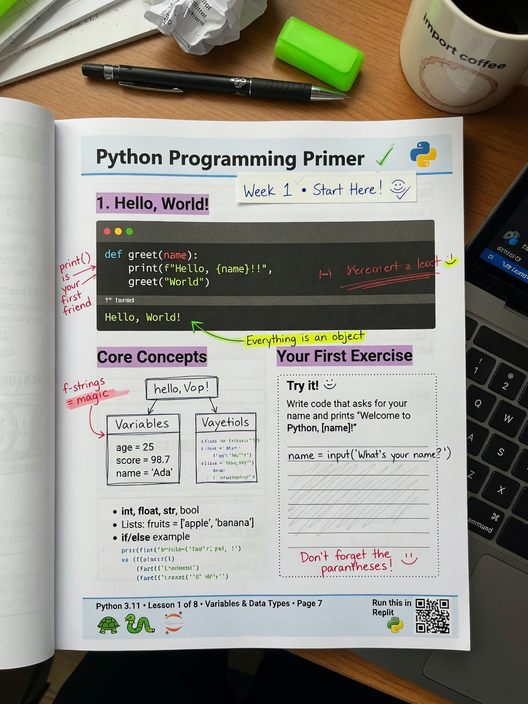

+++
draft       = false
featured    = false
title       = "Python Has No Variables: A First-Principles Primer for Working Programmers"
slug        = "python-primer"
description = "Once you understand why `[[0] * 3] * 3` aliases three rows to one list, you understand Python's object model, its assignment semantics, and half of its famous traps."
ogImage     = "./python-primer.jpg"
pubDatetime = 2026-07-20T16:00:00Z
author      = "Carlos Reyes"
tags        = [
]
+++



## Table of Contents

---

# Python Has No Variables: A First-Principles Primer for Working Programmers

## The bug that explains Python

A tools team at a game studio — composite story, but a very typical one — had a junior engineer building a level-editor script. He needed a grid of cells, so he did the obvious thing:

```python
>>> grid = [[0] * 3] * 3
>>> grid
[[0, 0, 0], [0, 0, 0], [0, 0, 0]]
>>> grid[0][0] = 1        # paint one cell
>>> grid
[[1, 0, 0], [1, 0, 0], [1, 0, 0]]
```

He set one cell and got an entire column. Two days of debugging later, someone senior glanced at the construction line and sighed.

That bug is not a quirk. It is the entire language in miniature. Once you understand *why* `[[0] * 3] * 3` aliases three rows to one list, you understand Python's object model, its assignment semantics, and half of its famous traps. So that's where we'll start, and we'll build everything else — the GIL, the data model, the performance story — on top of it.

All code targets CPython 3.12+; everything here also runs on 3.13 and 3.14, and I'll flag version-specific behavior as we go.

## Names are sticky notes, not boxes

Here's the first principle, and it's the one that C++ programmers resist hardest: **Python has no variables in the C++ sense.** It has *objects*, and it has *names* bound to objects. Assignment never copies and never "stores into" anything. It attaches a sticky note to an object.

```python
a = [1, 2, 3]
b = a          # b is a second sticky note on the SAME list
a.append(4)
print(b)       # [1, 2, 3, 4] — of course it is
```

Now the grid bug reads itself. `[0] * 3` builds one list of three zeros — fine, because integers are immutable, so sharing them is harmless. `[[0] * 3] * 3` then builds a list containing *three sticky notes on that one inner list*. Mutate through any of them and you mutate the shared object. The fix constructs a fresh inner list per row:

```python
grid = [[0] * 3 for _ in range(3)]   # three separate lists, three separate objects
```

The same principle explains a subtler pair of traps:

```python
a = [1, 2, 3]
b = a
a += [4]        # in-place: calls list.__iadd__, mutates the object b also names
print(b)        # [1, 2, 3, 4]

a = a + [5]     # creates a NEW list, rebinds the name a
print(b)        # [1, 2, 3, 4] — b still points at the old object
```

`+=` on a list mutates; `+` allocates. Same symbol family, opposite aliasing behavior. This is not arbitrary — `__iadd__` versus `__add__` are distinct methods in the data model — but it *feels* arbitrary until you internalize names-versus-objects.

> **Pro tip:** When you teach this (and you will — this is the number-one confusion in Python tutoring), have the student call `id(x)` before and after each line. `id()` returns the object's identity — its memory address in CPython, though that's an implementation detail. Watching the identity survive `b = a` and change after `a = a + [5]` lands the lesson faster than any diagram. Always make them *predict* the output before running the line.

### `is` versus `==`

Two names, two questions. `a is b` asks "same sticky note on the same object?" — identity. `a == b` asks "do these objects claim to be equal?" — which dispatches to `a.__eq__(b)`. A class can define `==` to compare contents while `is` stays false.

```python
x = [1, 2]; y = [1, 2]
x == y    # True  — same contents
x is y    # False — two objects
```

> **Gotcha:** In CPython, `x = 256; y = 256; x is y` is `True`, because CPython pre-allocates small integers (roughly −5 to 256) and coalesces identical literals within a compilation unit. Try it with `1000` typed on two separate REPL lines and you'll get `False`. This is a caching detail, not a language guarantee. If you ever write `is` against a number or string literal, you're relying on an accident. The rule: `is` is for `None`, sentinels, and enum members; `==` is for everything else.

### How this compares to C++ and TypeScript

If you come from C++, your instincts are wrong here, and it helps to see the contrast written down. In C++20 (and every C++ since forever — GCC, Clang, and MSVC have always agreed on this):

```cpp
#include <vector>
std::vector<int> a{1, 2, 3};
std::vector<int> b = a;   // copy constructor: b owns its own memory
a.push_back(4);           // b is untouched
```

C++ defaults to value semantics; aliasing requires you to *opt in* with a pointer or reference. Python defaults to reference semantics; copying requires you to opt in with `list(a)`, `a.copy()`, or `copy.deepcopy(a)`. TypeScript is the closest analog: `const b = a` aliases exactly like Python, which is why TS developers adapt fastest.

| Operation | C++20 | TypeScript | Python |
|---|---|---|---|
| `b = a` on a list/vector/array | Deep value copy | Alias (same object) | Alias (same object) |
| Make an independent copy | `b = a` | `[...a]` or `structuredClone(a)` | `a.copy()` / `copy.deepcopy(a)` |
| Function arguments | Copy by default | Aliased | Aliased |
| Immutables (`int`, `string`) | Copied | Copied | Shared, but safely — they can't change |

That last row is the key mental shortcut: Python shares *everything*, but immutable objects (`int`, `str`, `tuple`, `float`, `frozenset`) can't be mutated through any name, so sharing them is invisible. All the pain comes from shared *mutable* objects.

## Everything is an object — functions included

Second principle, shorter: there is no second-class anything. Functions, classes, and modules are objects you can stash in a dict, pass as arguments, and introspect. Even integers are full objects — and Python `int` is arbitrary-precision, so `2 ** 100` is exact while your C++ `long long` silently overflowed years ago.

The practical payoff is that whole categories of boilerplate disappear. A web framework's router, a trading system's order-type dispatch — both are just dicts with functions in them:

```python
def handle_market_order(req): ...
def handle_limit_order(req): ...

DISPATCH = {
    "MKT": handle_market_order,
    "LMT": handle_limit_order,
}

def route(req):
    handler = DISPATCH.get(req.order_type, reject_unknown)
    return handler(req)          # call it like anything else
```

No `switch`, no factory hierarchy. Yes, Python 3.10 added `match`/`case` structural pattern matching, and it's genuinely good at destructuring shapes of data — `case {"type": "limit", "price": p}:` is nicer than nested `if`s. But for an open set of operations that plugins might extend, a dispatch table is still the more honest design: adding a case is registering a function, not editing someone else's `match`.

## The interpreter never leaves the room

Third principle: Python is not compiled to machine code ahead of time (PyInstaller bundles an interpreter; it doesn't produce native code in the GCC sense). CPython compiles your source to *bytecode* — a portable instruction set for a stack machine — caches it in `__pycache__/*.pyc`, and executes it in an evaluation loop that is a running C program you can interrogate at any moment.

### Bytecode is real, and you can read it

```python
import dis

def vat(price):
    return price * 1.2

dis.dis(vat)
```

```
  2           2 LOAD_FAST                0 (price)
              4 LOAD_CONST               1 (1.2)
              6 BINARY_OP                5 (*)
             10 RETURN_VALUE
```

That's CPython 3.12's rendering; opcodes and offsets shift between versions, and since 3.11 the interpreter *rewrites* hot bytecode into specialized variants at runtime (the specializing adaptive interpreter, [PEP 659](https://peps.python.org/pep-0659/)). Two consequences worth internalizing. First, every operation — even `*` — is a dynamic dispatch that looks up methods on the runtime types. That lookup is most of what you're paying for when Python is "slow." Second, you can stop guessing what the interpreter does and just *look*. `dis.dis` settles arguments in code review like nothing else.

### The GIL: less scary and more annoying than advertised

The Global Interpreter Lock is a mutex that lets exactly one thread execute Python bytecode per process at a time. It exists to keep CPython's reference-counting memory management correct without per-object locks. What it does **not** give you is a memory model. This is a data race even with the GIL:

```python
from threading import Thread

n = 0
def bump():
    global n
    for _ in range(1_000_000):
        n += 1   # LOAD, ADD, STORE — the thread can be preempted mid-update

threads = [Thread(target=bump) for _ in range(4)]
for t in threads: t.start()
for t in threads: t.join()
print(n)   # probably 4000000 with the GIL... probably. Don't bet on it.
```

The GIL makes lost updates *rare*, not impossible — the interpreter can switch threads between bytecodes. "Rare races" is the worst possible failure mode, because they pass code review and show up in production.

> **Gotcha:** The GIL protects CPython's internal invariants, not your program's invariants. If two threads must agree on two values, you need a `threading.Lock` regardless.

The flip side: threads are genuinely fine for I/O-bound work, because CPython releases the GIL around blocking calls — sockets, file reads, `time.sleep`. A trading firm I know of (composite, again typical) rewrote a market-data fan-out service from "clever" multiprocessing back to simple threads and watched latency *improve*, because the work was 95% waiting on sockets. Their CPU-bound risk calculation, meanwhile, got nothing from threads at all and moved to `multiprocessing` — separate processes, separate GILs, plus the serialization overhead that implies.

### Free-threaded Python: real, opt-in, young

<details>
<summary><strong>Version status, as of late 2026 — click if you care about no-GIL builds.</strong></summary>

[PEP 703](https://peps.python.org/pep-0703/) made the GIL optional via a separate build using per-object locks and biased reference counting. CPython 3.13 shipped it as *experimental* (the `python3.13t` binaries, wheels tagged `cp313t`); 3.14 promotes it to *officially supported* — still opt-in, still not what the default python.org installer gives you. C extensions must be rebuilt and audited for it. The 3.13-era experimental JIT is also still off by default. This is the fastest-moving area of the language; treat anything I say here as having a shelf life and check the "What's New" pages for your exact version. PyPy, the tracing-JIT alternative implementation (currently tracking Python 3.10/3.11), still has a GIL.

</details>

## Mutability: the default-argument trap and friends

Python evaluates default argument values **once, when the `def` statement executes** — not on each call. Combine that with names-are-sticky-notes and you get the second-most-famous bug in the language:

```python
def add_tag(item, tags=[]):     # ONE list object, created at def time
    tags.append(item)
    return tags

add_tag("boss")     # ['boss']
add_tag("shop")     # ['boss', 'shop']  — wait, what
```

Every call that omits `tags` mutates the same shared list. The idiom is a `None` sentinel:

```python
def add_tag(item, tags: list[str] | None = None) -> list[str]:
    if tags is None:
        tags = []                # fresh list per call
    tags.append(item)
    return tags
```

> **Gotcha:** Linters (ruff rule `B006`) flag mutable defaults, which is how most people learn this. Learn the *reason*, not just the rule: the trap applies to any mutable default — dicts, sets, `datetime.now()` evaluated once at import. I've seen a scheduler where every job got the "same" start time because `now()` ran at def time.

While we're here, the funhouse-mirror version:

```python
t = ([1, 2], [3, 4])
t[0] += [9]
# TypeError: 'tuple' object does not support item assignment
print(t)   # ([1, 2, 9], [3, 4])  — it raised AND it worked
```

The `__iadd__` mutates the inner list, *then* the attempt to store the result back into the tuple raises. The exception is real and the mutation already happened. It's a known wart, it survives for backward compatibility, and it's the single best job-interview question about Python's data model.

The mutable/immutable split also explains what can be a dict key. Keys must be hashable, and hashability requires immutability:

| Type | Mutable? | Hashable (dict key)? | Literal |
|---|---|---|---|
| `list` | yes | no | `[1, 2]` |
| `dict`, `set` | yes | no | `{"a": 1}`, `{1, 2}` |
| `tuple` | no | yes, *if contents are* | `(1, 2)` |
| `str`, `int`, `float` | no | yes | — |
| `frozenset` | no | yes | `frozenset({1, 2})` |

`hash((1, [2]))` raises `TypeError: unhashable type: 'list'` — a tuple is only as immutable as its contents. Full circle back to the grid bug: in Python, mutability is a property of *objects*, and it propagates.

## Exceptions are control flow

In C++, exceptions are for disasters; in hot paths you reach for error codes. Python is different, and fighting this is the mark of someone writing C++-in-Python. Exceptions are cheap, ubiquitous, and load-bearing: a `for` loop literally terminates when the iterator raises `StopIteration`.

```python
it = iter([10, 20, 30])
while True:
    try:
        print(next(it))
    except StopIteration:      # this is how `for x in xs:` ends, every time
        break
```

### EAFP beats LBYL when it matters

The house style is EAFP — Easier to Ask Forgiveness than Permission — over LBYL (Look Before You Leap). The strongest case isn't style, it's correctness. LBYL has a time-of-check/time-of-use race:

```python
import os
from pathlib import Path

# LBYL: the file can vanish between the check and the call
if os.path.exists(path):
    os.remove(path)            # might raise anyway

# EAFP: one operation, one outcome
try:
    Path(path).unlink()
except FileNotFoundError:
    pass
```

(For this specific case, `Path.unlink(missing_ok=True)` — available since 3.8 — does the same thing explicitly.) The honest counterargument: when the failure case is *common*, EAFP reads backwards and `dict.get()` or an `in` check is clearer. Fair. Use `in` when absence is routine; use `try` when absence is exceptional or when the check itself can't be made atomic.

### Reading a traceback without despair

Python tracebacks print the *call chain oldest-first*, so the actual failure is the **last** block. Newcomers read top-down and drown in framework frames. Teach the ritual: jump to the bottom, read the final exception line, then walk up only as far as your own code. And when you re-raise with context, keep the chain:

```python
try:
    price = Decimal(field)
except InvalidOperation as e:
    raise ValueError(f"bad price in fill {fill_id}: {field!r}") from e
```

`from e` preserves the original traceback under "The above exception was the direct cause..." — without it, you've thrown away the evidence.

> **Pro tip:** In tutoring, I hand students a broken three-function program and forbid them from scrolling up until they've told me the exception type, message, and the deepest line *they* wrote. It takes one session to make tracebacks boring, and boring tracebacks are a superpower.

## Speaking Python: the data model

Everything so far — `len()`, iteration, `+`, `with`, `==` — is sugar over documented hooks, the "dunder" methods. This is the part of Python that pays compound interest: implement two or three methods and your class composes with the entire standard library. Here's a fixed-size buffer for telemetry samples, implementing just enough of the [sequence protocol](https://docs.python.org/3/reference/datamodel.html) to get indexing, `len()`, iteration, and `reversed()` for free:

```python
class RingBuffer:
    """The most recent `capacity` samples; oldest are dropped first."""

    def __init__(self, capacity: int):
        if capacity <= 0:
            raise ValueError("capacity must be positive")
        self._slots = [None] * capacity
        self._capacity = capacity
        self._count = 0
        self._next = 0            # physical slot the next sample overwrites

    def append(self, sample) -> None:
        self._slots[self._next] = sample
        self._next = (self._next + 1) % self._capacity
        self._count = min(self._count + 1, self._capacity)

    def __len__(self) -> int:
        return self._count

    def __getitem__(self, i: int):
        # Logical index 0 is the OLDEST live sample; -1 the newest.
        if not isinstance(i, int):
            raise TypeError("RingBuffer indices must be integers")
        if i < 0:
            i += self._count      # negative indexing, like a list
        if not 0 <= i < self._count:
            raise IndexError("RingBuffer index out of range")
        oldest = (self._next - self._count) % self._capacity
        return self._slots[(oldest + i) % self._capacity]

    def __iter__(self):
        for i in range(len(self)):
            yield self[i]

    def __repr__(self) -> str:
        return f"RingBuffer({list(self)!r})"   # repr you can debug with


buf = RingBuffer(3)
for t in [101.2, 101.4, 101.1, 101.6, 101.9]:
    buf.append(t)

assert len(buf) == 3                          # __len__
assert buf[0] == 101.1 and buf[-1] == 101.9   # __getitem__, negative index
assert list(buf) == [101.1, 101.6, 101.9]     # __iter__
assert list(reversed(buf)) == [101.9, 101.6, 101.1]
print(buf)                                    # RingBuffer([101.1, 101.6, 101.9])
```

Notice what we did *not* write: no `reversed()` support, yet `reversed(buf)` works, because `reversed()` falls back to `__len__` + `__getitem__`. And even without `__iter__`, a `__getitem__` that raises `IndexError` at the end gives you iteration via the legacy sequence protocol — that's exactly how `for` knows when to stop. This is what "Pythonic" actually means: not a vibe, but speaking protocols so generic machinery works on your type.

> **Pro tip:** Always write `__repr__` before `__str__`, and make `__repr__` unambiguous (the `!r` conversion quotes strings for you). You will read your own `repr` in logs at 2 a.m. far more often than you'll print for end users.

## A real program: positions and P&L from a fills file

Let's put the principles under load. A broker gives you a CSV of fills — each row is an executed trade. You want net position and net cash per symbol. This is the shape of half of all real Python: parse records, aggregate, report. Fully runnable as-is:

```python
import csv
import io
from collections import defaultdict
from decimal import Decimal

FILLS = io.StringIO("""\
fill_id,symbol,side,qty,price
1,NVDA,BUY,100,171.25
2,NVDA,BUY,50,172.10
3,NVDA,SELL,80,174.55
4,TSLA,BUY,40,242.90
5,TSLA,SELL,40,245.15
6,NVDA,SELL,20,173.80
""")

def read_fills(stream):
    """Yield fills as dicts with Decimal numeric fields.

    A generator: rows stream through one at a time, so this works on a
    40 GB fills file with the same memory footprint as this toy one.
    """
    for row in csv.DictReader(stream):
        yield {
            "symbol": row["symbol"],
            "side": row["side"],
            "qty": Decimal(row["qty"]),      # Decimal, never float
            "price": Decimal(row["price"]),
        }

def summarize(fills):
    """Net shares and net cash spent, per symbol."""
    book = defaultdict(lambda: [Decimal(0), Decimal(0)])  # [qty, cash]
    for f in fills:
        signed = f["qty"] if f["side"] == "BUY" else -f["qty"]
        slot = book[f["symbol"]]           # auto-created on first touch
        slot[0] += signed
        slot[1] += signed * f["price"]     # cash paid minus cash received
    return book

for symbol, (qty, cash) in sorted(summarize(read_fills(FILLS)).items()):
    avg = cash / qty if qty else Decimal(0)   # a flat book has no avg price
    print(f"{symbol:>6}: net {qty:>6} sh, net cost {cash:>12.2f}, avg {avg:>9.4f}")
```

Output:

```
  NVDA: net     50 sh, net cost      8290.00, avg  165.8000
  TSLA: net      0 sh, net cost       -90.00, avg    0.0000
```

Three decisions deserve defense:

1. **`Decimal`, not `float`.** Binary floating point cannot represent `0.1` exactly, and over a trading day those errors compound into reconciliation breaks against the clearing house. `Decimal("0.1")` is exact. A real desk would use integer cents or a fixed scale, but the principle is identical: never let money touch a binary float.
2. **A generator pipeline.** `read_fills` yields one row at a time; `summarize` consumes it. Nothing materializes the whole file, so the same code handles a laptop CSV or an exchange dump. This is Python's most underused structuring tool: functions connected by iterators instead of intermediate lists.
3. **`defaultdict(lambda: [Decimal(0), Decimal(0)])`.** The factory runs *per missing key*, producing a fresh list each time — the default-argument trap's benign twin. TSLA ends flat with net cost of −90: you sold for more than you paid, a realized gain of 90. The `qty or Decimal(0)` guard is there because dividing by a flat position is meaningless, and I'd rather print `0.0000` than crash a nightly job.

> **Gotcha:** The first instinct, `line.split(",")`, survives contact with exactly zero real files. The first `"Smith, John"` in a counterparty column and your parser shreds the row. The `csv` module handles quoting, embedded newlines, and escaping. Use it. Same story for JSON, INI, and XML — the stdlib already solved these.

## How slow is Python, really?

Opinion: "Python is slow" is true in a way that rarely matters and false in a way that often does. The strongest honest case for the prosecution: every operation is dynamic dispatch on boxed (heap-allocated) objects, so a tight numeric loop in CPython is one to two orders of magnitude slower than the same loop in C++. That's real. If your workload is a numeric kernel, pure Python is the wrong tool for the inner loop.

The counterargument is that most programs aren't inner loops. The inner loop of a web service is a database query; of a data pipeline, a parse; of a trading system, a socket. Python is the orchestration layer, and the hot work already happens in C — inside NumPy, inside `csv`, inside the regex engine. Representative numbers, summing ten million integers (my x86-64 machine, CPython 3.12 — illustrative, not a benchmark; run it yourself):

| Approach | Time, ~10M ints | Why |
|---|---|---|
| `for` loop with `total += x` | ~0.3–0.6 s | Bytecode dispatch + boxed ints per step |
| Built-in `sum(xs)` | ~0.1 s | Loop moved into C; still unboxing objects |
| NumPy on an `int64` array | ~10 ms | Contiguous memory, vectorized, no objects |

Measure on your own workload: `python -m timeit -s "xs = list(range(10**6))" "sum(xs)"`. The pattern generalizes: **performance work in Python is mostly moving loops out of the interpreter** — into a built-in, a comprehension, a vectorized library, or a C extension — not micro-optimizing statement by statement. And profile first (`cProfile`, then a real profiler like py-spy). My one first-person war story: I once spent an afternoon hand-tuning a "slow" parser's hot loop before profiling it; the profile put 80% of the time in a regex being recompiled per line inside someone else's helper. Hoisting one `re.compile` beat all my cleverness combined. I now treat unprofiled optimization as a character flaw.

> **Gotcha:** You may have heard that `s += part` in a loop is "fine in CPython" due to a refcount-1 realloc optimization. It exists, it's an implementation detail, it vanishes the moment another name references the string, and PyPy doesn't share it. The portable idiom is `"".join(parts)`. Rely on semantics, not accidents.

## Tooling that keeps you out of trouble

The language is the easy half. The ecosystem's sharp edge is environments, and the failure mode is installing packages into your system Python until something breaks mysteriously.

```bash
python3 -m venv .venv
source .venv/bin/activate          # Windows PowerShell: .venv\Scripts\Activate.ps1
python -m pip install ruff pyright
```

One project, one `.venv`, always activated. Note `python -m pip` rather than bare `pip`: it guarantees you're installing into the interpreter you're actually running, which kills an entire category of "it works in my shell but not my IDE" tickets. If you want the faster modern path, Astral's `uv` replaces pip/venv/pyenv in one tool; it's genuinely good, but the venv skill transfers everywhere, so learn venv first.

On type hints, my take: use them, and don't pretend they're enforcement.

```python
def twice(x: int) -> int:
    return x * 2

twice("ha")     # no error. Returns "haha". The hint is documentation.
```

Hints are checked by *static* tools — pyright or mypy — and by your IDE; CPython ignores them at runtime. That's a feature (gradual typing: annotate the tricky seams, skip the glue) but it surprises people from compiled languages. Add ruff for linting and formatting and you have, in three tools, most of what a compiler's warning flags gave you.

## Your first week: a checklist

Not a summary — things to actually do, roughly in order:

- [ ] Reproduce the `[[0] * 3] * 3` bug in a REPL, then fix it with a comprehension. Explain it out loud to a rubber duck. If you can't, reread the sticky-notes section.
- [ ] Run `dis.dis()` on a function you wrote. Find the `BINARY_OP`. You're now ahead of most working Pythonistas.
- [ ] Deliberately write the mutable-default-argument bug, watch it accumulate state across calls, then fix it with a `None` sentinel.
- [ ] Write a tiny class with `__len__` and `__getitem__` and pass it to `sorted()` and `reversed()` without implementing anything else.
- [ ] Take any script you've written that parses text with `split(",")` and rewrite it with `csv` + generators. Notice the memory shape change.
- [ ] Set up a scratch project properly: `.venv`, ruff, pyright, a `pyproject.toml`. Twenty minutes, pays forever.
- [ ] Time three ways to sum a list with `python -m timeit`. Feel the interpreter overhead in your own hands.
- [ ] Read Ned Batchelder's *Facts and Myths about Python Names and Values* — the single best hour you can spend on this material.

## References

- [The Python Data Model](https://docs.python.org/3/reference/datamodel.html) — the dunder protocols, canonical and surprisingly readable.
- [Python Execution Model](https://docs.python.org/3/reference/executionmodel.html) — names, binding, and scope, from the source.
- [`dis` — Disassembler for Python bytecode](https://docs.python.org/3/library/dis.html).
- [PEP 703 — Making the Global Interpreter Lock Optional](https://peps.python.org/pep-0703/) — the free-threading design, including biased reference counting.
- Ned Batchelder, [Facts and Myths about Python Names and Values](https://nedbatchelder.com/text/names.html) — the sticky-notes model, done better than anyone.
- Luciano Ramalho, *Fluent Python*, 2nd ed. (O'Reilly) — the book to read next; it treats the data model as the main character.
