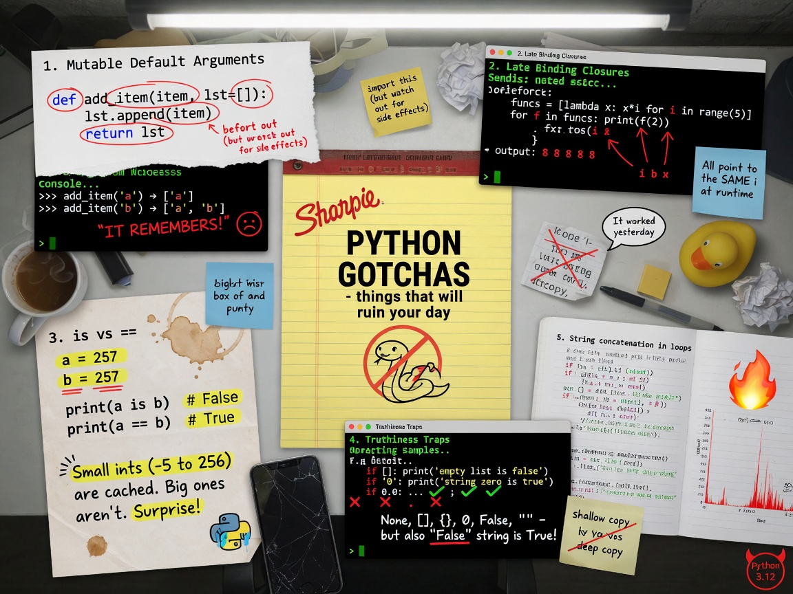

+++
draft       = false
featured    = false
title       = "Stop Memorizing Python Gotchas — Learn the Four Machines That Produce Them"
slug        = "python-gotchas"
description = "The entire zoo of gotchas — the quiz classics, the code-review repeat offenders, the 2 a.m. incidents — reduces to four root causes."
ogImage     = "./python-gotchas.jpg"
pubDatetime = 2026-07-27T16:00:00Z
author      = "Carlos Reyes"
tags        = [
    "Python Gotchas",
    "Mutable Default Arguments",
    "Late Binding",
    "Name Binding",
    "Scoping Rules",
    "Floating-Point Arithmetic",
    "Decimal Arithmetic",
    "Tuple Immutability",
    "Python Dataclasses",
    "CPython Internals",
    "Free-Threaded Python",
    "Pattern Matching",
    "Static Analysis",
    "Ruff",
    "Financial Systems",
    "Game Development",
    "Web Infrastructure",
    "Code Review",
    "Best Practices",
    "Deep Dive"
]
+++



## Table of Contents

---

# Stop Memorizing Python Gotchas — Learn the Four Machines That Produce Them

The most expensive function signature I ever approved in a code review was five words long:

```python
def render_email(template, context={}):
```

It lived in a templating helper behind a fleet of long-lived gunicorn workers. One tenant overrode a key in what they reasonably assumed was a per-request dictionary. Because the workers never restarted, that key quietly persisted into the *next* tenant's invoice email. No traceback. No error log. Nothing "crashed" — the dictionary simply remembered, because in Python that default object is created exactly once. The incident cost us a customer apology and one very quiet afternoon of audit work.

Every Python quiz asks this question. Most candidates recite the answer. It still shipped, because the quiz version never tells you *why* — and "why" is the only version that generalizes.

Here's my claim after two decades of reading other people's Python: the entire zoo of gotchas — the quiz classics, the code-review repeat offenders, the 2 a.m. incidents — reduces to **four root causes**:

1. **Some things are evaluated once, earlier than you think.**
2. **Assignment binds names; it doesn't copy objects.**
3. **Implementation details keep masquerading as language promises.**
4. **Numbers don't behave the way math class taught you.**

Learn the four machines and you stop being surprised by any individual trap. Let's build them.

---

## Machine 1: Some things are evaluated once, earlier than you think

Python executes `def` statements. That's the whole secret. A function definition isn't a blueprint consulted at call time; it's a statement that *runs* — usually at import time — and builds a function object, evaluating its default arguments **once** in the process.

### The mutable default argument

The quiz version:

```python
def f(acc=[]):
    acc.append(len(acc))
    return acc

f()                   # [0]
f()                   # [0, 1]  — not [0]
f.__defaults__        # ([0, 1],)  — the "default" is a real object you can inspect
```

Note that last line. `__defaults__` is a tuple hanging off the function object, and the list inside it is the *same list* on every call. Nothing spooky — just an object you weren't told about. (Keyword-only defaults live in `__kwdefaults__`; same trap, different drawer.)

Here's the bug end-to-end, in the web-infrastructure shape it actually takes in production. This file is self-contained — run it on any CPython 3.x:

```python
"""Mutable default arguments, end to end. Runs on CPython 3.11+ (nothing here is version-specific)."""

PLUGINS = {}


def register_plugin(name, config={}):
    """Register a plugin; missing keys fall back to defaults.

    BUG: `config`'s default is ONE dict, built when this `def` executes
    (import time), and reused by every call that omits it.
    """
    config.setdefault("retries", 3)
    PLUGINS[name] = config


# --- demonstration ---
register_plugin("auth", {"timeout": 5})   # caller-supplied dict; fine
register_plugin("billing")                # uses the shared default
register_plugin("search")                 # uses the SAME shared default

PLUGINS["billing"]["retries"] = 10        # ops tweaks billing's retry policy...
print(PLUGINS["search"]["retries"])       # 10  <- search silently changed too
print(PLUGINS["billing"] is PLUGINS["search"])  # True: one object, two names

# The default isn't magic. It's an attribute, and it's already polluted:
print(register_plugin.__defaults__)       # ({'retries': 10},)


# --- fixed version ---
_UNSET = object()   # a sentinel: a unique object whose only job is identity

def register_plugin_fixed(name, config=_UNSET):
    if config is _UNSET:        # `is`, not `==` — identity is the whole point
        config = {}
    config.setdefault("retries", 3)
    PLUGINS[name] = config
```

Two design notes on the fix. First, `config=None` works when `None` is never a meaningful value; the moment `None` could legitimately mean "explicitly no config," you need a private sentinel — `object()` gives you a value nothing else can equal. Second, notice the buggy version also mutated *caller-supplied* dicts via `setdefault`. Mutating arguments you don't own is the polite cousin of the same disease.

> **Gotcha:** The failure mode is proportional to process lifetime. A shared default is invisible in unit tests (fresh interpreter every run) and poisonous in long-lived workers — gunicorn, Celery, Jupyter kernels. If your test suite passes and production leaks across requests, suspect anything evaluated at import time.

**The strongest counterargument** — and I owe it honesty — is that this "bug" is occasionally exploited on purpose. `def fib(n, _cache={})` is a zero-dependency memoization trick, and it works precisely *because* the dict persists. I've seen it defended as fast and dependency-free. Both true. I still ban it: it fails the "will the next reader flinch" test, and `functools.lru_cache` does the job with an explicit name. (Mind `lru_cache`'s own cousin-gotcha: it pins its argument objects in memory, and on a method that means pinning `self` — a slow leak in long-lived services.)

### Closures bind late

Second trap from the same machine: closures capture **variables, not values**. A closure keeps a reference to a shared *cell* — the box a name lives in — and reads it when *called*, not when *created*.

A game studio team I know of hit the canonical version. Their main menu had a dozen buttons built in a loop over action names. In playtesting, every button — New Game, Load, Settings — quit the game. Every lambda was reading the same loop variable, which after the loop held `"quit"`. One line, found by a tester, fixed by a junior, understood by nobody until a senior drew the cell diagram on a whiteboard.

Here's the whole story, runnable:

```python
"""A toy game-menu dispatcher with the classic capture bug — and two fixes.
Tested on CPython 3.11/3.12; behavior is identical on all Python 3."""
from functools import partial

ACTIONS = ["new_game", "load_game", "quit"]


class Button:
    def __init__(self, label, on_press):
        self.label = label
        self._on_press = on_press

    def press(self):
        return self._on_press()


def dispatch(action):
    return f"do_{action}()"


def build_menu_buggy():
    buttons = []
    for action in ACTIONS:
        # BUG: each lambda captures the VARIABLE `action`, not its current value.
        # After the loop, the shared cell holds "quit" — every button quits.
        buttons.append(Button(action, lambda: dispatch(action)))
    return buttons


def build_menu_fixed():
    buttons = []
    for action in ACTIONS:
        # Default args are evaluated when the lambda is CREATED — this freezes
        # the current value of `action` into a per-lambda local named `a`.
        buttons.append(Button(action, lambda a=action: dispatch(a)))
    return buttons


def build_menu_partial():
    # Best of all: no lambda. partial() captures the value eagerly and reads
    # like what it is — a function with one argument pre-filled.
    return [Button(a, partial(dispatch, a)) for a in ACTIONS]


print([b.press() for b in build_menu_buggy()])
# ['do_quit()', 'do_quit()', 'do_quit()']
print([b.press() for b in build_menu_fixed()])
# ['do_new_game()', 'do_load_game()', 'do_quit()']
```

Two subtleties worth their own paragraph. First: no, comprehensions don't save you. Python 3 gave comprehensions their own scope, so the loop variable no longer leaks out — but `[lambda: i for i in range(3)]` still produces three lambdas that all return `2`, because there's one cell for `i` inside the comprehension and every lambda shares it. Second: the `lambda a=action:` fix and the mutable-default bug are the *same machine* running in opposite directions. Defaults are evaluated once at creation — usually a trap, here the cure.

> **Pro tip:** You don't have to memorize these; your linter does. Ruff (which reimplements flake8-bugbear) flags mutable defaults as `B006`, function calls in defaults as `B008`, and loop-variable capture as `B023`. I teach juniors to run `ruff check --select B .` before their first review — it turns three quiz questions into three squiggly lines.

One more early-evaluation classic, because it bites in config files: adjacent string literals are concatenated **at compile time**. It's a feature for wrapping long strings and a bug farm in lists:

```python
ALLOWED_SCOPES = [
    "users:read",
    "users:write"
    "billing:read",      # missing comma above: silently becomes
                         # "users:writebilling:read"
]
```

No exception, no warning from the interpreter — just an auth system that denies a permission that exists and grants one that doesn't. Ruff's `ISC` rules catch it.

---

## Machine 2: Assignment binds names; it doesn't copy objects

If you're coming from C++, this is the machine that eats you. C++ assignment copies (or moves) values into boxes. Python has no boxes. Python has *objects* floating in space and *names* stuck to them with Post-it notes. `a = b` never copies anything; it moves a Post-it.

### The `UnboundLocalError` surprise

Scope in Python is decided **statically, at compile time**, per function: if a name is assigned *anywhere* in a function body, it's local *everywhere* in that body — including the line before the assignment. That's why this quiz favorite fails:

```python
total = 0

def add(x):
    print(total)   # UnboundLocalError — even though a global `total` exists
    total += x     # <- this assignment made `total` local for the WHOLE function
```

The fix is `global total` (or better, stop using module state), and `nonlocal` for the same problem one nesting level up. The lookup order juniors memorize — LEGB: Local, Enclosing, Global, Built-in — is only half the story; the other half is that the *local* bucket's membership is fixed before the function ever runs.

<details>
<summary><strong>Deep dive: watch the compiler decide (disassembly)</strong></summary>

```python
import dis

def add(x):
    total += x
    return total

dis.dis(add)
```

On CPython 3.12 you'll see (trimmed; opcodes shift slightly between versions):

```text
LOAD_FAST     1 (total)   # local — the compiler saw STORE_FAST below
LOAD_FAST     0 (x)
BINARY_OP     13 (+=)
STORE_FAST    1 (total)
```

`LOAD_FAST`, not `LOAD_GLOBAL`. The symbol-table pass ran when the function was *compiled* and filed `total` as local because of that `STORE_FAST`. At runtime, `LOAD_FAST` hits an unassigned slot and raises. Since 3.11 the message reads "local variable 'total' referenced before assignment"; 3.13 reworded it to "cannot access local variable… where it is not associated with a value." Same machine, new label.

</details>

### Class attributes are not instance attributes

Same Post-it machine, wearing a class. This pair of bugs travels together:

```python
class Player:
    inventory = []                 # class attribute: ONE list, shared by everyone

    def loot(self, item):
        self.inventory.append(item)    # MUTATES the shared class attribute


class Counter:
    hits = 0

    def bump(self):
        self.hits += 1    # READS Counter.hits, then BINDS an instance attribute
                          # that shadows it. Counter.hits stays 0 forever.
```

`self.x += 1` on a class attribute is a perfect trap: the read finds the class attribute, the augmented assignment then *binds an instance attribute* — so each object gets its own copy starting from the shared value, the class counter never moves, and `Counter.hits` and `c.hits` quietly disagree. It looks like it works. That's what makes it expensive.

The modern fix is dataclasses, which also turned this from a runtime ambush into a definition-time error:

```python
from dataclasses import dataclass, field

@dataclass
class Player:
    name: str
    inventory: list[str] = field(default_factory=list)   # fresh list per instance
```

Write `inventory: list = []` instead and CPython raises `ValueError` at class-creation time — it has refused list/dict/set defaults since dataclasses landed in 3.7, and 3.11 extended the check to any unhashable default. Two adjacent traps worth one line each: a plain `@dataclass` sets `__hash__` to `None` (defining `__eq__` kills hashability), so your instances silently become unusable as dict keys until you add `frozen=True` or `eq=False`; and `frozen=True` is shallow — it freezes the Post-its, not the objects.

> **Pro tip:** When I tutor, I teach "class body = shared whiteboard, `self` = personal notebook." One sentence, and students stop writing `inventory = []` in class bodies forever. Then I show them `field(default_factory=...)` as the grown-up spelling.

### The tuple that mutates anyway

My favorite quiz question in all of Python, because *every* candidate answer is half wrong:

```python
t = ([1, 2],)
t[0] += [3]
```

What happens? Both of these:

1. `TypeError: 'tuple' object does not support item assignment`
2. `t` is now `([1, 2, 3],)` — **the mutation succeeded before the exception**

Tuples are shallowly immutable: they freeze the *references*, not the referents. `+=` on a list is an in-place extend, which succeeds — and *then* the interpreter tries to store the result back into the tuple slot, which fails. Mutation first, exception second. This is documented behavior; the official [Python programming FAQ](https://docs.python.org/3/faq/programming.html) has a whole entry for it. The lesson generalizes: immutability in Python is always about binding, never about deep structure. `const`-correctness this is not.

> **Gotcha:** Any operation that both mutates and rebinds — augmented assignment on a mutable value stored in an immutable container — can leave you in a half-applied state. If you catch that `TypeError` and retry, you've now applied the mutation twice. Exception handling doesn't roll back side effects.

### Aliasing: multiplication, shallow copies, and `+=` vs `+`

Three faces of the same Post-it:

```python
grid = [[0] * 3] * 3     # outer * replicates REFERENCES to one inner list
grid[0][0] = 9
print(grid)              # [[9, 0, 0], [9, 0, 0], [9, 0, 0]]

row = [[1], [2]]
shallow = row.copy()     # new outer list, same inner lists
shallow[0].append(99)
print(row[0])            # [1, 99]  — copy() is shallow; use copy.deepcopy for nesting

def grow_rebind(lst):  lst = lst + [1]    # rebinds the local name; caller unaffected
def grow_mutate(lst):  lst += [1]         # in-place extend; caller's list changes
```

`copy.deepcopy` is the correct answer and also a trade-off: it's slow on big graphs and it will happily try to copy things that shouldn't be copied (file handles, sockets, locks) unless your class defines `__deepcopy__`. In game and simulation codebases I've reviewed, the convention is an explicit `.clone()` on entity types — boring, greppable, fast.

---

## Machine 3: Implementation details masquerading as language promises

### `is` is not `==`, and CPython's caching is not a contract

Quiz: does `a is b` below print `True`? Answer: *which Python, and typed where?*

| Code (each pair, then `a is b`) | CPython REPL, line by line | Same lines in one script | Why |
|---|---|---|---|
| `a = 256; b = 256` | `True` | `True` | CPython caches small ints, currently $-5 \le n \le 256$ |
| `a = 257; b = 257` | usually `False` | usually `True` | cache ends at 256, but the compiler folds duplicate constants within one code object |
| `s = "hello"; t = "hello"` | `True` | `True` | identifier-like strings are typically interned |
| `s = "hello!"; t = "hello!"` | usually `False` | usually `True` | `!` blocks interning; folding still shares within one compiled unit |

<details>
<summary><strong>Why "where you type it" changes the answer</strong></summary>

Constant folding is per *code object*. A script (or a single REPL line) is compiled as one unit, so two occurrences of the literal `257` become one constant object. In a classic REPL, each statement is compiled separately, so the second `257` is a fresh allocation. Interning — CPython's habit of keeping one canonical copy of strings that look like identifiers — is a separate, also-unspecified mechanism (there's `sys.intern` if you ever need it deliberately, e.g., deduplicating millions of repeated tag strings in a metrics pipeline). IPython and Jupyter transform and compile cells differently again, so your mileage will vary there too.

</details>

Every row of that table is an *implementation detail*. The small-int cache range has changed before and can change again; PyPy and MicroPython make different choices. The language guarantees none of it. Since Python 3.8, CPython even emits a `SyntaxWarning` when you write `is` against a literal — the interpreter is literally telling you to stop.

The rules I actually follow:

- `is` for singletons: `None`, your own sentinels, enum members, `True`/`False` when you truly mean identity (rare — and remember `1 == True` is `True`, so `if x is True` and `if x == True` *disagree*; usually you want neither, just `if x`).
- `==` for values. Always for strings and numbers.
- `type(x) is SomeClass` when you mean "exactly this class"; `isinstance(x, SomeClass)` when subclassing is fine. It usually is.

> **Pro tip:** When a quiz asks an identity question, the senior answer starts with "On which implementation, and compiled as one unit or two?" That sentence alone separates people who memorized the table from people who understand the machine. It also wins interviews.

### The string-concatenation folklore needs updating

You were told: never build a string with `+=` in a loop, it's $O(n^2)$, always use `''.join`. The asymptotic claim is true in the abstract — strings are immutable, so each concat can copy everything so far. But CPython has special-cased the pattern where the left-hand string has exactly one reference for roughly two decades (the specializing interpreter in 3.11 changed the machinery, not the idea), so the naive loop is often far better than folklore claims *on CPython specifically*. PyPy implements strings differently; MicroPython is minimalist.

My actual advice, and it hasn't changed: **use `join` anyway** — not because the loop is slow, but because `join` states your intent, never depends on an optimization detail, and ports across implementations. Then, if the loop is hot, measure instead of citing folklore from 2009. Measurements over mythology. That's the whole job.

### `bool` is an `int`, and other number-tower pranks

```python
isinstance(True, int)     # True
True + True               # 2
{True: "a", 1: "b"}       # {True: 'b'} — equal hash, equal value: ONE slot.
                          # Key stays the first-inserted True; value gets overwritten.
```

That dict result follows mechanically: `hash(True) == hash(1)` and `True == 1`, so the second item lands in the first's slot and updates the value without replacing the key. Quiz gold, and occasionally a real bug in code that mixes JSON-ish bools and ints as keys.

Then the chained-comparison trap. Python lets you write `1 < x < 10`, which desugars to `1 < x and x < 10` with `x` evaluated once. Elegant — until it produces:

```python
False == False in [False]    # True!
# reads as: (False == False) and (False in [False]) — a CHAIN, not nesting
```

And the NaN corner, which has broken at least one data pipeline I was called into:

```python
nan = float("nan")
nan == nan                 # False  (IEEE 754: NaN is unordered)
nan in [nan]               # True   (!)
nan in [float("nan")]      # False
```

That middle line isn't a bug. Membership tests use identity-*or*-equality — the [data model](https://docs.python.org/3/reference/datamodel.html) documents that containers may short-circuit on identity — so a NaN is "in" a list containing the *same object*, but never equal to a different NaN object. If you dedupe sensor readings with sets, NaNs will each live forever. `math.isnan` exists for a reason.

---

## Machine 4: Numbers don't behave like math class

### Floats, money, and the rounding nobody expects

A trading firm I know of — composite of a few I've worked with — let a junior engineer compute P&L in floats because "doubles have 15 digits, that's plenty." It is plenty, until you sum ten thousand fills priced in tenths of a cent and the ledger drifts by whole cents against the clearinghouse's fixed-point books. Reconciliation flagged it; an auditor did not find it charming. The rewrite moved prices to `Decimal` at the boundaries and integer ticks internally.

```python
"""Money in Python: the float trap and the Decimal fix. Any CPython 3.x."""
from decimal import Decimal, ROUND_HALF_UP

print(0.1 + 0.2 == 0.3)    # False — 0.1 and 0.2 have no exact binary form
print(0.1 + 0.2)           # 0.30000000000000004

CENTS = Decimal("0.01")

def money(text: str) -> Decimal:
    # Build from str, NEVER from float:
    #   Decimal(0.1)    -> 0.1000000000000000055511151231257827... (bakes in the error)
    #   Decimal("0.1")  -> 0.1 exactly
    return Decimal(text).quantize(CENTS, rounding=ROUND_HALF_UP)

price = money("19.99")
total = (price * 3).quantize(CENTS, rounding=ROUND_HALF_UP)
print(total)               # 59.97
```

Two rounding traps ride along. First, Python's built-in `round` does **round-half-to-even** ("banker's rounding"): `round(2.5)` is `2`, `round(3.5)` is `4`. This is deliberate — it kills the systematic upward bias of always rounding halves up — and it's also why your invoice total disagrees with a spreadsheet. Second, `round` can't save you from representation: the official [floating-point tutorial](https://docs.python.org/3/tutorial/floatingpoint.html) uses `round(2.675, 2)` → `2.67`, because the stored value is slightly *less* than 2.675. Pick your rounding mode explicitly, at the boundary, with `quantize`.

> **Pro tip:** The rule I give students: floats are for *measurements* (physics, latency, temperatures), exact types are for *ledgers* (money, inventory counts, anything audited). Inside hot trading paths, skip even `Decimal` and carry integer cents or ticks — fixed-point is what the exchanges use, and it's faster than either.

### Division that floors where C truncates

For my fellow C++ people: Python's `//` **floors** toward negative infinity; C++'s integer `/` **truncates** toward zero — GCC, Clang, and MSVC alike. So `-7 // 2` is `-4` in Python and `-3` in C++, and the remainder follows suit (`-7 % 2 == 1` in Python, `-7 % 2 == -1` in C++). Porting an algorithm with negative indices or wrapped coordinates between the two languages without touching this is a rite of passage. `math.trunc` and `int(a / b)` exist if you truly want C semantics. You rarely do — Python's choice makes `divmod` and grid math come out cleaner — but you need to know the fork is there.

---

## Modern wrinkles: the language is patching its own gotchas

One thing I genuinely like about recent Python: the core team keeps converting runtime ambushes into compile-time errors or explicit options. A running list for your quizzes:

- **`zip` silently truncates** to the shortest input — until Python 3.10 added `strict=True` (PEP 618), which raises on length mismatch. Default to it in reviews; silent truncation in a data join is how rows quietly vanish.
- **Dict order is a promise now**: insertion order became a language guarantee in 3.7 (it was a CPython implementation detail in 3.6). Sets remain unordered and str/bytes hashes are randomized per process, so "it worked on my machine" remains available for sets.
- **`match` has a capture trap** (3.10+): a bare name in a `case` doesn't compare, it *binds*. `case MENU_QUIT:` matches *everything* and overwrites `MENU_QUIT`. Use a literal, a dotted name (`case Menu.QUIT:`), or a guard. No warning, silent behavior — pure quiz material.
- **The GIL never made `+=` atomic** — and now it matters more. `count += 1` is multiple bytecodes, and the GIL can switch threads between them (`sys.getswitchinterval()` defaults to 5 ms), so unsynchronized counters lose updates even on classic builds. Python 3.13 shipped an experimental free-threaded build ([PEP 703](https://peps.python.org/pep-0703/)) that removes the GIL outright, and 3.14 promotes free-threading to officially supported, though still not the default — check the release notes for your exact version. What used to be a rare, hard-to-hit race becomes an everyday race there. Locks and queues were always the right answer; they're now the only answer.

> **Gotcha:** "The GIL protects me" was never true for compound operations — it only made the race window small. If your concurrency plan is "the GIL serializes things," you don't have a plan, and a free-threaded build will eventually demonstrate that in production.

---

## The quiz speed round

Everything above, compressed into the table I wish someone had handed me in 2005:

| Expression | Result | The one-line trap |
|---|---|---|
| `f(); f()` where `def f(a=[])` | `[x], [x, y]` | defaults are built once, at `def` time |
| `[lambda: i for i in range(3)]` called | `[2, 2, 2]` | closures share one cell; bind with `i=i` |
| `print(x); x = 1` inside a function | `UnboundLocalError` | assignment anywhere ⇒ local everywhere |
| `t = ([],); t[0] += [1]` | `TypeError`, but `t == ([1],)` | mutate succeeds, *then* store fails |
| `[[0]*2]*2`, set `[0][0]=9` | both rows change | `*` replicates references, not objects |
| `x = [3,1].sort()` | `x is None` | `sort()` mutates in place; `sorted()` returns |
| `{True: "a", 1: "b"}` | `{True: 'b'}` | `True == 1`, same hash ⇒ same slot |
| `False == False in [False]` | `True` | chained: `(False==False) and (False in …)` |
| `round(2.5)`, `round(3.5)` | `2`, `4` | round-half-to-even |
| `nan == nan` vs `nan in [nan]` | `False`, then `True` | membership checks identity *or* equality |
| `-7 // 2` | `-4` | floor, not truncation (C++ gives `-3`) |
| `g = (x*x for x in range(3)); sum(g); sum(g)` | `5`, then `0` | generators are single-use |
| `case CONST:` in `match` | matches *everything* | bare names bind; use literals or dotted names |

---

## Keeping all of this out of your codebase

Memorizing this article is the anti-goal. The goal is a pipeline where these bugs can't survive:

1. **Lint with teeth.** [Ruff's rule set](https://docs.astral.sh/ruff/rules/) covers the classics — `B006`/`B008` (defaults), `B023` (loop capture), `B012` (`return`/`break` in `finally`, which silently swallows in-flight exceptions), `ISC` (implicit string concat). Put `ruff check --select B,ISC .` in pre-commit and CI.
2. **Make warnings fatal in tests.** `python -W error::SyntaxWarning -m pytest` turns `is`-with-a-literal into a failing build instead of a shrug.
3. **Know your type checker's limits.** mypy and pyright will not save you here — these are *semantic* bugs in perfectly well-typed code. That's what the linter and the tests are for.
4. **Review for the four machines, not the thirty symptoms.** When I review, I ask four questions: What runs at import/def time? Who else holds a reference to this object? Am I relying on an implementation detail? Is this number a measurement or a ledger entry? Four questions catch what thirty flashcards won't.

**The checklist, for Monday morning:**

- [ ] Run `ruff check --select B,ISC .` on your oldest service; fix or `noqa` with comments.
- [ ] `rg 'def \w+\([^)]*=\s*(\[\]|\{\})'` — audit every hit; convert to `None`/sentinel.
- [ ] Search class bodies for mutable attributes; convert to `field(default_factory=...)`.
- [ ] Add `-W error::SyntaxWarning` to your test invocation.
- [ ] Grep currency and ledger code for `float`; quarantine it behind `Decimal("...")` or integer cents with an explicit rounding mode.
- [ ] Add `strict=True` to every `zip` in data-joining code.
- [ ] If free-threaded Python is on your roadmap, audit shared mutable state and counters *now*, and run the suite on the `t`-suffixed build.

Gotchas aren't trivia, and they were never really about Python being quirky. They're the visible seams of four design decisions — early evaluation, name binding, implementation freedom, and honest arithmetic — most of which were the *right* call for the language Python set out to be. Learn the machines and the seams stop surprising you. You'll also start winning the quizzes, but by then you won't care, because you'll be the one writing them.

**Sources:** [Python Programming FAQ](https://docs.python.org/3/faq/programming.html) · [Python Data Model](https://docs.python.org/3/reference/datamodel.html) · [Floating Point Arithmetic: Issues and Limitations](https://docs.python.org/3/tutorial/floatingpoint.html) · [PEP 703 — Making the Global Interpreter Lock Optional](https://peps.python.org/pep-0703/) · [Ruff rules](https://docs.astral.sh/ruff/rules/)
