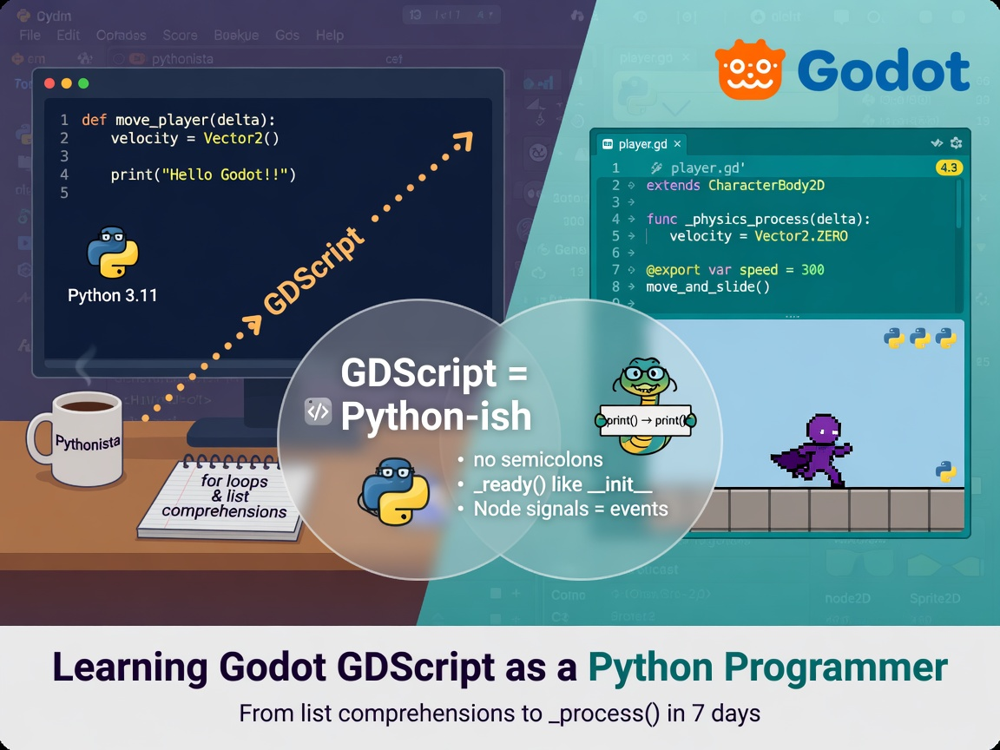

+++
draft       = false
featured    = false
title       = "From Python to GDScript: A Performance Nerd's Field Guide"
slug        = "from-python-to-gdscript"
description = "If you're a Python developer curious about game development, or a Godot beginner wondering how much of your Python brain still applies: most of it does. The parts that don't are *interesting*."
ogImage     = "./from-python-to-gdscript.jpg"
pubDatetime = 2026-08-03T16:00:00Z
author      = "Carlos Reyes"
tags        = [
    "GDScript",
    "Godot Engine",
    "Python",
    "Static Typing",
    "Game Development",
    "Performance Optimization",
    "Performance Profiling",
    "Object Pooling",
    "Event-Driven Programming",
    "Reference Counting",
    "Memory Management",
    "Time Slicing",
    "Multithreading",
    "GDExtension",
    "Error Handling",
    "Composition Over Inheritance",
    "Cross-Platform Development",
    "C++",
    "Language Comparison",
    "Tutorial"
]
+++



## Table of Contents

---

# From Python to GDScript: A Performance Nerd's Field Guide

Last March I did something I'd been putting off for years: I sat down on a rainy Saturday, downloaded Godot 4, and tried to port a little asteroids clone I'd written in Python (pygame, 400 lines, held together with spit) into GDScript. The port took about four hours. Three of those hours were me staring at a spaceship that refused to accelerate at anything resembling the speed I expected, before I finally found the bug:

```gdscript
var thrust := engine_power / mass   # int / int. Truncated. 7 / 10 == 0. My ship had literally zero thrust.
```

Integer division. In Python 3, `7 / 10` is `0.7`. In GDScript — like C, like C++ — dividing two `int`s truncates to `2` (or in my case, `0`). The [official docs](https://docs.godotengine.org/en/stable/tutorials/scripting/gdscript/gdscript_basics.html) call this out explicitly, and I read those docs, and I *still* lost a Saturday afternoon to it. So consider this post the field guide I wish I'd had: what transfers from Python, what quietly doesn't, the gotchas that will bite you, and — because this is FastCodeGuru — how to make GDScript go fast when it matters.

If you're a Python developer curious about game development, or a Godot beginner wondering how much of your Python brain still applies: most of it does. The parts that don't are *interesting*.

---

## Why does GDScript even exist?

Fair question. Godot's creator, Juan Linietsky, has explained that they evaluated existing embeddable languages (Lua and Python among them) before writing their own. The short version of the reasoning, per the [Godot FAQ](https://docs.godotengine.org/en/stable/about/faq.html): they wanted a language with first-class engine integration — node types, signals, vectors — and none of the existing options fit the threading and embedding model they wanted without a fight.

My opinion, after a couple of years of writing both: they made the right call. GDScript is not a toy. It's a small, sharp, purpose-built language that happens to *look* like Python. Which brings me to the part you'll like.

---

## The good news: your Python muscle memory mostly works

Indentation defines blocks. Comments start with `#`. `if`/`elif`/`else`, `while`, `for x in collection`, `break`, `continue`, `pass`, `and`/`or`/`not` — all identical. Duck typing works. Everything is dynamic by default. `print()` works like `print()`.

Here's a side-by-side translation table I keep taped above my desk (metaphorically; it's a text file):

| Concept | Python | GDScript |
|---|---|---|
| Nothing | `None` | `null` |
| Booleans | `True` / `False` | `true` / `false` |
| Function | `def f(a, b=1):` | `func f(a, b = 1):` |
| Declare variable | *(no declaration)* | `var x = 5` |
| Constant | *(convention)* | `const MAX_HP = 100` |
| Class | `class Foo(Bar):` | `class_name Foo extends Bar` |
| Constructor | `__init__(self)` | `_init()` |
| Instance ref | `self` (required in sig) | `self` (usually omitted) |
| Type check | `isinstance(x, Node)` | `x is Node` |
| String format | `f"hp: {hp}"` | `"hp: %d" % hp` |
| Length | `len(xs)` | `xs.size()` (though `len()` exists) |
| Power | `x ** 2` | `x ** 2` (yes, really) |

A real example — health, damage, death — in both languages:

```python
# Python
class Player:
    def __init__(self, name):
        self.name = name
        self.hp = 100
        self.inventory = {"potions": 3}

    def take_damage(self, amount):
        self.hp = max(0, self.hp - amount)
        if self.hp == 0:
            print(f"{self.name} is down!")
```

```gdscript
# GDScript (Godot 4)
class_name Player
extends CharacterBody2D

signal died(player_name: String)

@export var max_hp := 100
var hp := max_hp
var inventory := { "potions": 3 }

func take_damage(amount: int) -> void:
    hp = maxi(0, hp - amount)
    if hp == 0:
        died.emit(name)
```

The shape is identical. The differences in that snippet — `signal`, `@export`, `:=`, `extends` — are exactly the interesting bits, so let's go through them.

---

## Where GDScript stops being "Python with `func`"

### 1. Optional static typing — and it's not just decoration

Python's type hints are documentation that a linter reads. GDScript's type annotations are *real*: they change what the bytecode does, catch errors at parse time, and (this matters to me) make your code measurably faster. Three ways to declare a variable:

```gdscript
var a = 5          # Variant — dynamic, flexible, slowest
var b := 5         # inferred as int — my default
var c: int = 5     # explicit — same thing, more typing (pun intended)
```

Function signatures take types and return types:

```gdscript
func compute_damage(base: int, multiplier: float) -> int:
    return int(base * multiplier)
```

> **Teachable moment:** I teach Python professionally, and the first thing I drill into students is "type hints are worth it even though Python ignores them at runtime." GDScript is my Exhibit A for *why*: when the compiler actually honors the types, you get autocompletion, refactor safety, and speed all at once. Python gives you the first two through mypy/Pyright. Either way, annotating is a habit that pays rent.

### 2. No exceptions. At all.

This is the difference that most reshapes how you write code. Python culture is EAFP — "easier to ask forgiveness than permission":

```python
try:
    config = json.loads(raw)
except json.JSONDecodeError:
    config = DEFAULTS
```

GDScript has no `try`/`except`. Functions return error codes, `null`, or sentinel values, and you check them — LBYL ("look before you leap"), C-style:

```gdscript
var parsed = JSON.parse_string(raw)   # returns null on failure
var config: Dictionary = parsed if parsed != null else DEFAULTS
```

There is `assert()`, but it's a debug-build tool, not control flow. If you come from Python and reach for exceptions to structure logic, you'll need to rewire that instinct. I found it annoying for about a week and then stopped noticing. Systems programmers will feel right at home.

### 3. Signals: the feature I now miss everywhere else

Instead of callbacks, observer registries, or pub-sub libraries, GDScript has signals built into the language:

```gdscript
extends Control

@onready var start_button: Button = %StartButton

func _ready() -> void:
    start_button.pressed.connect(_on_start_pressed)

func _on_start_pressed() -> void:
    get_tree().change_scene_to_file("res://levels/level_1.tscn")
```

You declare `signal health_changed(new_hp: int)`, emit with `health_changed.emit(hp)`, and connect any callable. It's the observer pattern as a language primitive, and it eliminates an entire category of "who calls whom" plumbing.

Here's a cross-industry parallel I like: a friend of mine writes market-data feed handlers in Python for a living — exchanges publish ticks, subscribers react. When I showed him signals, he said "oh, it's a ticker plant." Exactly. The mental model of event-driven fan-out transfers wholesale from finance to game UI. His hard-won rules also transfer, and we'll see them again in the performance section: on a hot event path, you don't allocate, you don't log, and you don't do work the subscriber didn't ask for.

`await` also plays beautifully with signals. This shows a banner for two seconds without blocking anything:

```gdscript
func show_banner() -> void:
    banner.visible = true
    await get_tree().create_timer(2.0).timeout
    if is_instance_valid(banner):   # paranoia pays off; see gotchas
        banner.visible = false
```

### 4. Composition over inheritance, enforced by the engine

Python lets you build any object graph you want. Godot gently pushes you into its scene tree: everything is a `Node`, scenes are trees of nodes, and you build complex behavior by *composing* small nodes rather than writing deep class hierarchies. A player is a `CharacterBody2D` with a `Sprite2D`, an `AnimationPlayer`, a `CollisionShape2D`, and a `Timer` as children — not one 800-line class.

Annotations wire this up declaratively:

- `@export var speed := 200.0` — exposes `speed` in the editor inspector, so designers tune it without touching code.
- `@onready var bar: Range = $UI/HealthBar` — grabs a child node reference once, right before `_ready()` runs. The `$Path` syntax is shorthand for `get_node("Path")`; `%Name` refers to a scene-unique node name.
- `_ready()`, `_process(delta)`, `_physics_process(delta)` — virtual callbacks the engine invokes, like `pygame`'s loop but per-node.

Frame-independent movement, by the way, is just:

```gdscript
func _process(delta: float) -> void:
    position += velocity * delta
```

which is Euler integration, $p_{t+1} = p_t + v\,\Delta t$ — worth teaching explicitly, because beginners always ask why their game runs faster on a 240 Hz monitor, and the answer is *they multiplied by nothing*.

---

## The gotcha list (a.k.a. how I actually spent my Saturdays)

Roughly ordered by how much time each one cost me or people I know.

> **Gotcha 1 — Integer division and truncated modulo.** `5 / 2 == 2`, not `2.5`. Cast with `float(x) / y` or write `x / 2.0`. And `%` is *truncated*: `-5 % 3 == -2` in GDScript, versus Python's floor-modulo `1`. Use `posmod(-5, 3)` for Python semantics. Wrap angles with `wrapf()`. This pair of behaviors has broken more health bars, spawn timers, and color cyclers than any other item on this list.

> **Gotcha 2 — `is` does not mean `is`.** Python's `is` is identity ("same object in memory"). GDScript's `is` is a *type test*: `body is CharacterBody2D`. For identity, use `==` on the references. I had a tutoring student — sharp guy, ten years of Python — burn an entire session on `if a is b:` before we unpicked that one. It's now the first slide in my "GDScript for Pythonistas" lesson.

> **Gotcha 3 — Lambdas capture locals by value, once.** Straight from the [docs](https://docs.godotengine.org/en/stable/tutorials/scripting/gdscript/gdscript_basics.html):

```gdscript
var x := 42
var f := func(): print(x)
f.call()   # 42
x = 99
f.call()   # still 42 — snapshot at creation time
```

Python closures see the *current* value; GDScript lambdas see the value at birth. Worse, a lambda can't reassign an outer local at all (you'll get a `CONFUSABLE_CAPTURE_REASSIGNMENT` warning). The workaround is to capture something mutable-by-reference — an `Array` or `Dictionary` — since those are shared. Why the difference? GDScript has no garbage collector managing closure lifetimes, so capture-by-value keeps locals' lifetimes simple. Trade-off accepted, but wow does it surprise people.

> **Gotcha 4 — `free()` vs `queue_free()`, and the living dead.** Nodes are *not* reference-counted. You destroy them explicitly: `queue_free()` (safe, end-of-frame) or `free()` (immediate, dangerous inside callbacks). A variable can still point at a freed node — it's not `null`, it's a "previously freed instance," and touching it crashes. Guard with `is_instance_valid(node)`. Same rule after any `await`: the world may have changed while you were suspended; re-validate everything.

> **Gotcha 5 — No comprehensions, no `enumerate`, no slicing, no kwargs.** The Python conveniences that didn't make the trip:

```python
names = [e.name for e in enemies if e.hp > 0]     # Python
for i, e in enumerate(enemies): ...               # Python
first_three = enemies[:3]                          # Python
move(x=1, y=2)                                     # Python keyword args
```

```gdscript
# GDScript equivalents
var alive := enemies.filter(func(e): return e.hp > 0)
var names := alive.map(func(e): return e.display_name)

for i in enemies.size():
    var e := enemies[i]

var first_three := enemies.slice(0, 3)   # no a[1:3] syntax

move(1, 2)   # positional only, as of Godot 4.7
```

The `filter`/`map`/`reduce` methods work fine but each lambda call is interpreter work — fine at menu scale, think twice per-frame at horde scale.

> **Gotcha 6 — Reference cycles leak.** Anything extending `RefCounted` (resources, data objects) is reference-counted, like CPython. But unlike CPython, there is **no cyclic garbage collector**. Two RefCounted objects pointing at each other leak forever. Fix: `weakref()`.

> **Gotcha 7 — `duplicate()` is shallow by default.** Arrays and dictionaries are passed by reference (same as Python lists/dicts), and `arr.duplicate()` copies only the top level. Nested arrays still alias. Use `arr.duplicate(true)` for a deep copy. Python devs know this dance from `copy.copy` vs `copy.deepcopy`; it's the same lesson in a new outfit.

> **Gotcha 8 — Typed arrays are picky.** `Array[Node2D]` and a plain `Array` are different types. Passing an untyped array where a typed one is expected fails at runtime even if every element is a `Node2D`. Declare literals as typed (`var xs: Array[Node2D] = []`) and convert deliberately. Related: typed dictionaries (`Dictionary[String, int]`) finally arrived in **Godot 4.4** — a small thing you'll appreciate if you ever typed `Dict[str, int]` in Python and meant it.

> **Gotcha 9 — Setters don't recurse (good) but shadowing is silent (bad).** In Godot 4, assigning to a property *inside its own setter* writes the backing value directly — no infinite recursion:

```gdscript
var health := 100:
    set(value):
        health = clampi(value, 0, max_hp)   # assigns backing field, no recursion
        health_changed.emit(health)
```

But because `self.` is optional, a parameter named `health` shadows the member, and `health = health` in a function body quietly does nothing to your object. Turn on the `SHADOWED_VARIABLE` warnings in Project Settings. I treat warnings as errors in my projects; your future self says thanks.

> **Gotcha 10 — The internet's Godot tutorials are half-rotten.** Godot 3 code used `yield`, `export`, `onready`, `.instance()`, and `PoolVector2Array`. Godot 4 uses `await`, `@export`, `@onready`, `.instantiate()`, and `PackedVector2Array`. Any tutorial older than ~2023 will teach you syntax the current compiler rejects. The [migration guide](https://docs.godotengine.org/en/stable/tutorials/migrating/upgrading_to_godot_4.html) is the canonical decoder ring. Check the engine version before trusting *any* blog post — including, someday, this one.

<details>
<summary><strong>Cheat sheet: Godot 3 → Godot 4 renames (click to expand)</strong></summary>

| Godot 3 | Godot 4 |
|---|---|
| `yield(sig, "done")` | `await sig.done` |
| `export var x` | `@export var x` |
| `onready var x` | `@onready var x` |
| `scene.instance()` | `scene.instantiate()` |
| `Pool*Array` | `Packed*Array` |
| `OS.get_ticks_msec()` | `Time.get_ticks_msec()` |
| `randomize()` required | auto-seeded at startup |
| `KinematicBody2D` | `CharacterBody2D` |

</details>

---

## Performance: making GDScript earn its keep

Let me set expectations honestly. GDScript is an interpreted, dynamically-typed-at-the-edges VM language. In tight numeric loops it is *not* fast — CPython-fast at best, and you wouldn't write your physics integrator in CPython either. The trick, as with Python, is that **the language is the control plane, and the engine is the data plane**. NumPy works because Python orchestrates and C computes. GDScript works the same way: orchestrate in script, and push bulk work into the engine's C++ core.

### First: profile, because you're wrong about where the time goes

Everyone is. I certainly was. Godot ships a solid built-in profiler (Debugger → Profiler) plus performance monitors (`Performance.get_monitor()`). For serious work, the industry has converged on [Tracy](https://github.com/wolfpld/tracy) — the Halls of Torment team at Chasing Carrots integrated Tracy into their custom engine build, with an automated bot player that runs a full game at high speed and captures a five-second trace at the 25-minute mark where frame spikes lived. That's how you find real bottlenecks: reproducible, automated, measured. Fabio Mangiameli's [write-up of that optimization pass](https://www.fabiomangiameli.com/projects/halls-of-torment) is the single best public document on Godot performance work I've read, and I'll be citing it again below.

### The levers, roughly in order of value

| Lever | Effort | Typical impact |
|---|---|---|
| Static typing everywhere | Low | Noticeable speedup in hot code |
| Cache node references (`@onready`) | Low | Kills per-frame lookup cost |
| Don't allocate in `_process` | Low–Med | Removes GC-ish hitches |
| Use `StringName` (`&"idle"`) in hot compares | Low | String compares → pointer-ish compares |
| Object pooling for spawn/despawn churn | Medium | Removes instantiation spikes |
| `PackedFloat32Array` & friends for bulk data | Medium | Slashes per-element Variant overhead |
| Push bulk work to the engine (MultiMesh, PhysicsServer, particles) | Med–High | 10×+ on entity counts |
| `WorkerThreadPool` for parallel jobs | Medium | Uses your cores |
| Time-slice expensive chains | Low | Converts spikes into steady load |
| Rewrite hot 5% in C++/GDExtension or C# | High | Near-native |

A few of these deserve code.

**Cache your lookups.** `$UI/HealthBar` in `_process` walks the tree every frame. `get_children()` allocates a fresh array *every call*. Grab references once:

```gdscript
@onready var _bar: Range = $UI/HealthBar   # looked up exactly once

func _process(_delta: float) -> void:
    _bar.value = hp
```

Better still: don't poll at all — emit a `health_changed` signal and update the bar only when health actually changes. Event-driven beats frame-driven, in games exactly as in feed handlers.

**Pool your projectiles.** Instantiation is expensive; freeing and re-spawning 60 times a second is a great way to ship a slideshow. In my own asteroids port, pooling the bullets took the game from a stuttery mess to a flat frame graph, and the pattern is tiny:

```gdscript
const BulletScene := preload("res://fx/bullet.tscn")
var _idle: Array[Node2D] = []

func spawn_bullet(pos: Vector2) -> Node2D:
    var b: Node2D
    if _idle.is_empty():
        b = BulletScene.instantiate()
        add_child(b)
    else:
        b = _idle.pop_back()
        b.set_process(true)
        b.show()
    b.reset(pos)          # your method: transform, velocity, lifetime
    return b

func despawn_bullet(b: Node2D) -> void:
    b.set_process(false)
    b.hide()
    _idle.push_back(b)
```

This is not a niche indie trick. The Halls of Torment team pooled their gem drops and destructible props for exactly the same reason, and moved instantiation of new props onto worker threads (attaching to the scene tree stays on the main thread — an engine rule, not a preference). When a survivors-like is juggling hundreds of entities, those choices are the difference between "console release" and "release blocker."

**Time-slice chain reactions.** My favorite trick from that same write-up: their "Frost" status effect could cascade — one Frost Wave triggering another, up to ~50 enemies in a single frame. Fix: a wave may not trigger another wave *this frame*; it schedules for the next one. Same total work, spread across frames — spike gone. The generic pattern is a strided round-robin:

```gdscript
const SLICES := 4
var _tick := 0

func _physics_process(_delta: float) -> void:
    _tick += 1
    for i in range(_tick % SLICES, entities.size(), SLICES):
        entities[i].update_status()   # each entity updates every 4th physics tick
```

If you've ever smoothed a matching engine's housekeeping or amortized cache rebuilds in a Python service, you already know this move. It has a name in games and a name in systems ("cooperative scheduling," roughly), and it's the same idea.

**Type your hot code.** Typed GDScript lets the VM emit typed instructions instead of generic Variant juggling. Here's the microbenchmark I give students — run it yourself with `godot --headless -s bench.gd`:

```gdscript
extends SceneTree

func _init() -> void:
    var t0 := Time.get_ticks_usec()
    var sum := 0.0                      # typed float
    for i in 10_000_000:
        sum += i * 1.5
    print("typed:   ", (Time.get_ticks_usec() - t0) / 1000.0, " ms  (", sum, ")")

    t0 = Time.get_ticks_usec()
    var sum2 = 0.0                      # Variant
    for j in 10_000_000:
        sum2 += j * 1.5
    print("untyped: ", (Time.get_ticks_usec() - t0) / 1000.0, " ms  (", sum2, ")")
    quit()
```

I won't quote you my numbers because the gap changes with every engine release and every CPU; measure on your own box. The direction is consistent, though: typed wins, sometimes by a lot.

<details>
<summary><strong>Why there's no cycle collector (and why that's a feature) — expand</strong></summary>

GDScript's designers chose deterministic destruction over a tracing GC. `RefCounted` objects die the microsecond their last reference drops — no GC pause, ever, which is exactly what you want at 144 Hz. The cost is that reference cycles can't be collected automatically, so you break them with `weakref()`. CPython makes the opposite trade: reference counting *plus* a cyclic collector that periodically walks object graphs (and which latency-sensitive Python services sometimes tune or disable). If you write C++, you already know this as the `shared_ptr`/`weak_ptr` rule. Three languages, one lesson: **own your object lifetimes deliberately**.

</details>

### When GDScript isn't enough

Sometimes you genuinely need native speed — pathfinding over huge graphs, procedural generation, tens of thousands of agents. Your options:

1. **Engine-side APIs first.** Before writing any native code, ask whether the engine already has a C++ fast path: `MultiMeshInstance2D/3D` for thousands of sprites, `GPUParticles` for effects, `PhysicsServer2D` for bulk body manipulation, `RenderingServer` for custom drawing. This is the NumPy move, and it solves more problems than people expect.
2. **GDExtension** — C++ or Rust compiled against Godot's ABI, callable from GDScript. Halls of Torment moved their hottest per-frame work (a global-position cache read by thousands of objects) into C++ this way. Caveat: GDExtension binaries are per-platform, like shipping Python wheels with C extensions — you must build and test for every target.
3. **C#** — a fine language with a real JIT, but see the portability caveats below before committing.

---

## What the industry is actually shipping with this "toy" language

I promised mostly other people's experiences, so here's the scoreboard that convinced me to take GDScript seriously:

- **Brotato** — Thomas Gervraud (Blobfish), a solo dev, built one of 2023's biggest indie hits in Godot with GDScript, after switching from GameMaker (his post "[Why I switched from GameMaker to Godot](https://www.blobfish.dev/)" is worth your time). Hundreds of on-screen enemies, a mountain of items with interacting effects, millions of copies sold. Console versions later arrived with help from Evil Empire (of Dead Cells fame).
- **Halls of Torment** — Chasing Carrots hit a performance wall with thousands of moving sprites, then profiled, pooled, time-sliced, threaded, and moved the hottest paths to C++ — all documented in the [FullCleared interview](https://fullcleared.com/features/inside-halls-of-torment-an-interview-with-chasing-carrots/), Mangiameli's write-up linked above, and their [GodotFest talk](https://godotfest.com/talks/a-peek-under-the-hood-technical-learnings-from-halls-of-torment/). A masterclass in doing perf work *in the right order*.
- **Cassette Beasts** and **The Case of the Golden Idol** — two more commercial successes built largely in GDScript, from small teams. Different genres, same conclusion.
- **Sonic Colors: Ultimate** — my favorite trivia: SEGA's remaster used Godot 3 alongside the Hedgehog Engine, and version 1.0.4's patch notes include the line "Godot is now credited," after players noticed the engine's MIT license requires acknowledgment (see [TCRF](https://tcrf.net/Sonic_Colors:_Ultimate)). If Godot is good enough to render parts of a Sonic game on the Switch, it's good enough for your roguelike.

---

## Caveats: compilers, portability, and other fine print

This is FastCodeGuru, so the boring-but-load-bearing section:

- **There is no separate GDScript compiler toolchain.** Your scripts travel with the engine and are interpreted by its VM. Exported games ship compiled `.gdc` bytecode — which, like Python's `.pyc`, is *decompilable*. Tools exist that recover surprisingly readable source. Don't put secrets in client code; you knew this, but now you've been reminded.
- **Platform coverage is GDScript's superpower.** Windows, macOS, Linux, Android, iOS, and Web all run GDScript with zero porting effort. Consoles are the exception: Nintendo/Sony/Microsoft SDKs are under NDA, so console support comes from third parties (W4 Games' W4 Consoles, or porting houses like the ones that brought Brotato over). Budget for it if consoles are in your plan.
- **The Web export has deployment quirks.** It needs WebAssembly + WebGL2, and threaded builds require cross-origin isolation headers (`Cross-Origin-Opener-Policy` / `Cross-Origin-Embedder-Policy`) on your web server; Godot 4.3 added a single-threaded export that relaxes this at a performance cost. Check the [current web export docs](https://docs.godotengine.org/en/stable/tutorials/export/exporting_for_web.html) before promising anyone a browser build.
- **C# portability lags GDScript.** C# projects require the .NET engine build, and as of this writing (Godot 4.7 era) C# still can't export to Web — mobile export landed experimentally in 4.2 and has been improving since (the [platform-state post](https://godotengine.org/article/platform-state-in-csharp-for-godot-4-2/) and issue tracker are the places to watch). If you need one codebase on every platform including the browser, GDScript is the low-friction choice; mixing languages in one project is possible but adds build complexity I'd avoid until you need it.
- **Version churn is real but manageable.** Features arrive in minor versions (typed dictionaries needed 4.4), and Godot 3 vs 4 is a hard syntax break. Pin your engine version per project, read release notes before upgrading, and — as the Halls of Torment folks noted — upgrading is often *worth it* anyway, because engine updates bring real perf fixes.

---

## Where to go from here

If you know Python, you are most of the way to reading GDScript, and a weekend of writing it will get you the rest — provided you internalize the short list of true differences: static typing that matters, signals instead of callbacks, no exceptions, explicit node lifetimes, and an engine that rewards you for pushing bulk work down into its native core. Start with the [GDScript reference](https://docs.godotengine.org/en/stable/tutorials/scripting/gdscript/gdscript_basics.html), the [static typing guide](https://docs.godotengine.org/en/stable/tutorials/scripting/gdscript/static_typing.html), the official [style guide](https://docs.godotengine.org/en/stable/tutorials/scripting/gdscript/gdscript_styleguide.html) (fair warning: it mandates *tabs*, and after years of PEP 8 I have chosen peace), and the [best practices](https://docs.godotengine.org/en/stable/tutorials/best_practices/index.html) and [performance](https://docs.godotengine.org/en/stable/tutorials/performance/index.html) docs. For structured learning, [GDQuest](https://www.gdquest.com/) and [KidsCanCode's recipes](https://kidscancode.org/godot_recipes/4.x/) are excellent; for tests, [GUT](https://github.com/bitwes/Gut) is the pytest-shaped hole filled; for everything else, [awesome-godot](https://github.com/godotengine/awesome-godot).

And if you want a guided tour — I've now taught this material to a handful of Python developers, and the look on their faces when `is` turns out to mean `isinstance` never gets old. That's what the tutoring page is for. Go build the asteroids clone. Watch your integer division.
