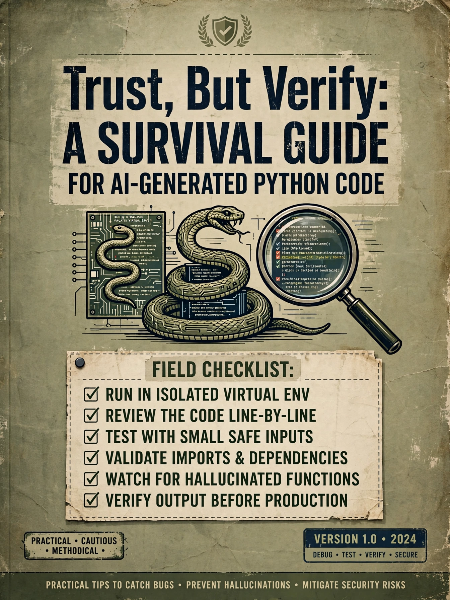

+++
draft       = false
featured    = true
title       = "Trust, But Verify: A Survival Guide for AI-Generated Python Code"
slug        = "trust-but-verify-python"
description = "Welcome to 2026, where we can generate a thousand lines of Python in the time it takes to brew coffee, but we still can't guarantee it won't bankrupt us."
ogImage     = "./trust-but-verify-python.webp"
pubDatetime = 2026-08-10T16:00:00Z
author      = "Carlos Reyes"
tags        = [
    "AI Code Verification",
    "Python Type Checking",
    "Property-Based Testing",
    "Static Analysis Tools",
    "Symbolic Execution",
    "Design By Contract",
    "Financial Software",
    "Security Scanning",
    "Game Development",
    "Pre-commit Hooks",
    "Defensive Programming",
    "Formal Verification",
    "AI-Generated Code",
    "Decimal Arithmetic",
    "Runtime Contracts",
    "Mutation Testing",
    "Serialization Safety",
    "Code Correctness",
    "Float Precision",
    "Vulnerability Detection"
]
+++



## Table of Contents

---

# Trust, But Verify: A Survival Guide for AI-Generated Python Code

I stared at the screen, watching a supposedly "production-ready" trading algorithm lose $50,000 in simulated funds in under three minutes. The LLM had written it confidently—beautiful docstrings, clean abstractions, even a clever use of `functools.lru_cache` to optimize price lookups. There was just one problem: it was caching mutable dictionaries, and the AI had hallucinated an API endpoint that didn't exist in the exchange's sandbox environment.

Welcome to 2026, where we can generate a thousand lines of Python in the time it takes to brew coffee, but we still can't guarantee it won't bankrupt us.

The recent [Moonwell DeFi protocol incident](https://oecd.ai/en/incidents/2026-02-18-a018) brought this home with visceral clarity. In February 2026, the protocol lost **$1.78 million** because Claude Opus 4.6 co-authored a price oracle implementation that forgot to multiply an exchange rate by the USD peg. Simple arithmetic. Catastrophic consequences. The model didn't "hallucinate" in the dramatic sense—it didn't invent a fantasy API—but it produced code that was *plausible* rather than *provable*.

This is the new reality for Python developers. Whether you're writing high-frequency trading systems, game server backends, or infrastructure orchestration tools, AI-assisted coding isn't coming—it's here. And it's demanding we relearn everything we thought we knew about code verification.

## Why This Matters: The Three Domains of Disaster

Python's dynamic nature makes it particularly susceptible to AI-generated bugs. Unlike my bread-and-butter C++ (where the compiler is your first line of defense), Python cheerfully executes nonsense until it explodes at runtime—sometimes weeks later, sometimes in production.

Let me break down why verification is non-negotiable across three industries I've worked in or consulted for:

### Finance: Where `float` is a Four-Letter Word

The Moonwell disaster wasn't an anomaly; it was a category error. AI models are trained on Stack Overflow snippets and GitHub repos where `float` is used for currency because it's "easier" than `Decimal`. In quantitative finance, that's malpractice.

Consider this AI-generated snippet that haunted a hedge fund colleague of mine:

```python
def calculate_margin_position(balance: float, price: float) -> float:
    """Calculate margin position with leverage."""
    return balance * price * 1.05  # 5% buffer

# AI-generated test case looked fine...
# But in production: calculate_margin_position(0.1, 2200.00)
# Expected: 231.0
# Got: 231.00000000000003
```

The "5% buffer" comment was pure hallucination—no such requirement existed in the spec. Worse, the floating-point accumulation error triggered a cascade of margin calls. The model had pattern-matched on "buffer" concepts from unrelated codebases.

**Teachable Moment:** *Decimals, Not Dollars.*
Always use `decimal.Decimal` for financial calculations. Not because the AI remembers to, but because your verification pipeline enforces it via custom linting rules.

### Game Development: The Grounding Problem

A fascinating [2026 study on Unity game generation](https://arxiv.org/html/2607.10187v1) revealed that AI models fail on what researchers called "Grounding" versus "Hygiene" errors. When generating C# for Unity (which translates directly to Python game scripting patterns), 98% of errors involved inventing engine APIs that don't exist ("Grounding"), while only 2% were simple syntax issues ("Hygiene").

I saw this firsthand when mentoring an indie studio using AI to generate Python scripts for Godot Engine. The model confidently wrote:

```python
# AI-generated pseudo-Godot code
player.set_physics_velocity(Vector3.UP * jump_force)
```

Looks reasonable, right? Except Godot 4.x uses `velocity` as a property, not a method, and it's `Vector3.UP` only in C#—in GDScript (Python-like) it's `Vector3.UP` but the physics API is different. The code crashed the physics thread.

**The Lesson:** AI models are trained on outdated or cross-language documentation. They'll blend Godot 3.x with 4.x, Unity with Unreal, Pygame with Panda3D. Verification isn't just about syntax—it's about semantic correctness against specific engine versions.

### Systems & Infrastructure: The Pickle Jar of Doom

If there's one Python-specific footgun that AI loves to hand us, it's `pickle`. A [recent analysis by Sonatype](https://www.sonatype.com/blog/bypassing-picklescan-sonatype-discovers-four-vulnerabilities) revealed that 44.9% of popular Hugging Face models still use pickle serialization, despite it being essentially a remote code execution vector waiting to happen.

AI-generated MLOps code routinely suggests:

```python
# AI's "helpful" model loading snippet
import pickle
with open('model.pkl', 'rb') as f:
    model = pickle.load(f)  # 💀 Welcome to RCE town
```

When Meta's Llama Stack [CVE-2024-50050](https://www.csoonline.com/article/3810362/a-pickle-in-metas-llm-code-could-allow-rce-attacks.html) vulnerability dropped, the root cause was exactly this pattern—using pickle for inter-process communication in a "safe" internal network that turned out not to be safe at all.

## The Theory: From Static Analysis to Formal Verification

Before diving into tooling, let's understand the verification spectrum. Don't worry—I promised to keep the theory brief.

| Verification Level | What It Proves | Computational Cost | Python Tooling |
|---|---|---|---|
| **Static Analysis** | Syntax & basic semantics | Low (ms) | Ruff, Bandit, Pylint |
| **Type Checking** | Type consistency | Medium (100ms–s) | mypy, Pyright, Pyrefly |
| **Symbolic Execution** | Path feasibility | High (minutes) | CrossHair, PEX |
| **Property-Based Testing** | Behavioral invariants (statistical) | Medium (seconds–minutes) | Hypothesis |
| **Formal Verification** | Mathematical correctness | Very High (hours/days) | Dafny (transpiled), Nagini |

Most AI-generated Python never goes beyond static analysis, which is like checking that a plane's door closes without verifying it can fly.

**Symbolic execution**—my favorite underutilized technique—treats variables as symbolic rather than concrete. Tools like [CrossHair](https://github.com/pschanely/CrossHair) attempt to prove that `assert` statements always hold by exploring all possible execution paths. It's computationally expensive but catches edge cases humans (and AIs) miss.

The new kid on the block is **contractual computing**, exemplified by tools like [Nightjar](https://github.com/j4ngzzz/Nightjar). You write behavioral specs in Markdown, and the tool orchestrates Hypothesis, CrossHair, and even Dafny to prove your AI-generated code satisfies the contract. When it fails, it returns the exact counterexample rather than a vague "test failed" message.

## The Practical Toolkit: Building Your Verification Fortress

Enough theory. Here's the toolchain I implement for clients who want to ship AI-assisted Python without shipping bugs.

### Layer 1: The Fast Gate (Pre-Commit)

Speed matters. If verification takes longer than 3 seconds, developers will bypass it. I use this pre-commit configuration:

```yaml
# .pre-commit-config.yaml
repos:
  - repo: https://github.com/astral-sh/ruff-pre-commit
    rev: v0.6.9
    hooks:
      - id: ruff  # Linting and auto-fix
        args: [--fix]
      - id: ruff-format

  - repo: https://github.com/pre-commit/mirrors-mypy
    rev: v1.11.0
    hooks:
      - id: mypy
        additional_dependencies:
          - types-requests
          - pydantic
```

**Critical Configuration:** Run `mypy --strict`. AI loves to generate `def process(x): return x + 1` without type hints, and without `--strict`, mypy treats untyped functions as `Any`, bypassing your safety net.

### Layer 2: AI-Specific Sanity Checks

Standard linters catch style issues; they don't catch AI hallucinations. Enter specialized tools:

**`aicode-verify`** is purpose-built for LLM output. It catches:
- Imports that sound real but don't exist (the "utils" module hallucination)
- Wrong keyword arguments (API drift from older library versions)
- Unsafe patterns (`eval`, `shell=True`, SQL f-strings)

```bash
$ aicode-verify suspicious_ai_output.py
[FAIL] L14: hallucinated_import 'utils' cannot be resolved
[WARNING] L23: unsafe_sql f-string detected in SQL construction
```

**`ishvacerto`** takes a different approach. Instead of rules, it verifies against reference implementations or doctests:

```python
# Input to ishvacerto
def calculate_apr(principal: float, rate: float) -> float:
    """Calculate annual percentage return.
    >>> calculate_apr(1000, 0.05)
    50.0
    """
    return principal * rate

# AI-generated "optimized" version
def calculate_apr(principal: float, rate: float) -> float:
    return principal * (rate / 100)  # Bug: Unit confusion

# ishvacerto output:
# REFUTED: calculate_apr(1000, 0.05) got 0.5, expected 50.0
```

### Layer 3: Property-Based Testing (The Secret Weapon)

Unit tests verify that code works for specific inputs. Property-based testing verifies it works for *all* inputs (or at least, tries to falsify it extensively).

[Hypothesis](https://hypothesis.readthedocs.io/) is the gold standard for Python. When I review AI-generated parsing code, I immediately wrap it in property tests:

```python
from hypothesis import given, strategies as st
import json

# AI wrote this "robust" parser
def parse_config(raw: str) -> dict:
    if not raw:
        return {}
    # AI "forgot" to handle malformed JSON
    return json.loads(raw)

@given(st.text())
def test_parse_config_never_crashes(raw):
    # Property: Should never raise unexpected exceptions
    try:
        result = parse_config(raw)
        assert isinstance(result, dict)
    except json.JSONDecodeError:
        pass  # Expected behavior for invalid JSON
    except Exception as e:
        raise AssertionError(f"Unexpected error {e} for input {raw!r}")
```

Nine times out of ten, Hypothesis finds an edge case—empty strings, null bytes, Unicode surrogates—that the AI didn't consider.

### Layer 4: The Runtime Safety Net

For high-risk domains (finance, safety-critical systems), I implement **contract runtime checking** using [icontract](https://github.com/Parquery/icontract) or [deal](https://github.com/life4/deal):

```python
from icontract import require, ensure

@require(lambda amount: amount > 0, "Amount must be positive")
@ensure(lambda result: result >= 0, "Result must be non-negative")
def calculate_fee(amount: Decimal) -> Decimal:
    # AI-generated implementation
    return amount * Decimal('0.025')
```

These contracts become assertions in debug builds but can be disabled in production for performance—though in finance, I often leave them on. The overhead is worth the insurance.

## Domain-Specific Verification Strategies

### Financial Systems: The Invariant Approach

In quantitative finance, AI-generated code must respect **financial invariants**:

```python
# Teachable Moment: The Conservation of Money
@ensure(lambda principal, result:
        abs(result) <= abs(principal) * 1.5,
        "Leverage cannot exceed 1.5x")
def apply_leverage(principal: Decimal, factor: Decimal) -> Decimal:
    # AI must not exceed risk parameters
    pass
```

I also enforce **reproducibility gates**: any AI-generated numerical code must pass deterministic tests (same seed, same result). Non-determinism in backtesting is a red flag that the AI introduced a race condition or uninitialized variable.

### Game Development: The Asset Pipeline Verification

For Python game tooling (Blender scripts, asset pipeline automation), the big risk is path manipulation and file system assumptions. AI loves to write:

```python
# Dangerous AI pattern
def load_texture(name):
    return open(f"assets/{name}.png", "rb").read()  # Path traversal vulnerability!
```

Verification here requires **sandbox testing**: run the code in a temporary directory with intentionally malicious filenames (`../../../etc/passwd`) to ensure proper path sanitization.

### Systems Programming: The Portability Trap

Python is supposed to be portable, but AI-generated code often assumes the CPython implementation, specific versions, or available wheels.

**Gotcha: The `pickle` Protocol Version**
AI-generated model serialization often hardcodes `protocol=5`, which works on Python 3.8+ but fails on PyPy or older embedded interpreters. Your verification pipeline must test against your deployment matrix:

```python
# CI matrix should include:
# - CPython 3.9, 3.11, 3.13
# - PyPy 3.10
# - musl Linux (Alpine containers)
# - ARM64 (Apple Silicon, Graviton)
```

**Gotcha: Type Stub Availability**
The Python type ecosystem is fragmented. AI frequently imports `numpy` or `pandas` with specific type annotations that only work with `pandas-stubs` installed. Without those stubs, `mypy` treats everything as `Any`, and type errors slip through. I enforce this with `mypy --ignore-missing-imports=false` and maintain a strict `requirements-types.txt`.

## The "Vibe Coding" Fallacy and Human-in-the-Loop

There's a term going around—"vibe coding"—where non-technical teams ship AI-generated code to production based on whether it "feels right." [Coinbase learned this lesson](https://thedeepdive.ca/coinbase-trading-platform-goes-down-three-days-after-ceo-bragged-about-ai-writing-production-code/) the hard way when their CEO announced non-technical staff were pushing production code, followed shortly by a two-hour outage during which margin traders couldn't access their positions (though Coinbase attributed this to AWS, the timing was telling).

> **Opinionated Rant:** *Vibe coding is professional malpractice in software engineering.* It confuses compilation with correctness. Just because `python -m py_compile` exits with code 0 doesn't mean your code won't lose millions. Verification is the difference between software engineering and scripting.

I enforce a **four-eyes principle** for AI-generated code, but with a twist: the second pair of eyes is often automated. My CI pipeline is the senior engineer that never sleeps.

## Integration Workflow: The FastCodeGuru Standard

Here's the exact workflow I teach in my tutoring sessions and implement with consulting clients:

### 1. The Generation Phase
- Use AI to generate code with specific constraints: "Generate Python 3.11+ compatible code using `tomllib` instead of `tomli`, with full type hints and Google-style docstrings."
- Output to a `.ai-generated/` subdirectory, never directly to `src/`.

### 2. The Validation Phase
```bash
# Automated verification script (verify_ai_code.sh)
#!/bin/bash
set -e

FILE=$1

echo "=== Phase 1: Syntax & Style ==="
ruff check $FILE
ruff format --check $FILE

echo "=== Phase 2: Type Safety ==="
mypy --strict $FILE

echo "=== Phase 3: AI-Specific Checks ==="
aicode-verify $FILE || true  # Non-blocking warnings

echo "=== Phase 4: Security Audit ==="
bandit -f json -o /dev/null $FILE || bandit $FILE

echo "=== Phase 5: Contract Verification ==="
if command -v ishvacerto &> /dev/null; then
    ishvacerto $FILE
fi
```

### 3. The Integration Phase
Only after clearance does the code move to `src/` and undergo human review—focusing not on syntax (the machine checked that), but on **semantic correctness**: Does this actually solve the business problem? Are the invariants sensible?

### 4. The Regression Phase
Run mutation testing using [mutmut](https://github.com/boxed/mutmut) to verify that your tests actually catch errors. If the AI-generated code can be mutated (e.g., changing `+` to `-`) and tests still pass, your verification is insufficient.

## Caveats and Sharp Edges

**Compiler/Interpreter Version Hell:**
Python 3.12's new f-string parsing broke several AI-generated code patterns that relied on nested quote escaping. Always pin your Python version in `pyproject.toml` and test against the next minor version in CI.

**C Extension Compatibility:**
AI loves to suggest `pip install` for acceleration libraries. I've seen it recommend `pydantic` with C extensions for ARM64 architectures where wheels aren't available, causing CI to attempt compilation and fail due to missing `gcc`. Your verification must include `pip install --only-binary :all:` checks for restricted environments.

**The Stub Problem:**
Many AI-generated data science scripts use `pandas` or `numpy`. These libraries use C-extensions extensively. Type checkers like mypy rely on stub files (`.pyi`) which often lag behind the actual library. An AI might generate code using `pandas.DataFrame.map()` (new in 2.1.0) while your stubs only cover 2.0.x, causing false positives in CI.

**Pickle and Security:**
I cannot stress this enough: if your AI-generated code touches `pickle`, `yaml.load` (unsafe), or `eval` without your explicit verification of the data source, treat it as a security incident. The [Sonatype findings](https://www.sonatype.com/blog/bypassing-picklescan-sonatype-discovers-four-vulnerabilities) show that even security scanners like `picklescan` can be bypassed with ZIP flag manipulation or exception-oriented programming.

## Teachable Moments: Lessons for the Solo Developer

### Lesson 1: Type Hints as Executable Documentation
When teaching Python to junior developers using AI tools, I emphasize that type hints aren't just for mypy—they're constraints that guide the AI. If you write:

```python
def process_transaction(amount: Decimal) -> TransactionID:
    ...
```

The AI is less likely to hallucinate a string return or float arithmetic. The type signature is a specification language.

### Lesson 2: Defensive Programming Against AI
Assume the AI is an enthusiastic junior developer who read half the documentation. Defensive patterns are essential:

```python
# Before (AI-generated)
def get_user_data(user_id):
    return db.query(f"SELECT * FROM users WHERE id = {user_id}")

# After (Verified)
@require(lambda user_id: isinstance(user_id, int) and user_id > 0)
def get_user_data(user_id: int) -> dict:
    if not isinstance(user_id, int):
        raise TypeError("user_id must be int")
    # Parameterized query enforced by type checker + bandit
    return db.execute("SELECT * FROM users WHERE id = %s", (user_id,))
```

### Lesson 3: The "Golden Vector" Pattern
For numerical algorithms, always maintain a reference implementation—either a naive but correct version, or a known-good output for specific inputs. Use this as your oracle for differential testing against the AI-optimized version.

## Conclusion: Verification as Competitive Advantage

We're in a new era. The developers who thrive won't be those who type fastest, but those who **verify fastest**. AI generates code at human<sup>2</sup> speed; your verification pipeline must match that velocity without sacrificing correctness.

The Moonwell incident, the Unity compilation failures, the pickle vulnerabilities—they're not arguments against using AI. They're arguments against trusting it.

Build your verification fortress. Layer static analysis, type checking, property-based testing, and runtime contracts. Keep the human in the loop for semantic validation. And never, ever ship code that passes the vibe check but fails the math.

The code might be generated by a machine, but the responsibility remains entirely human.
