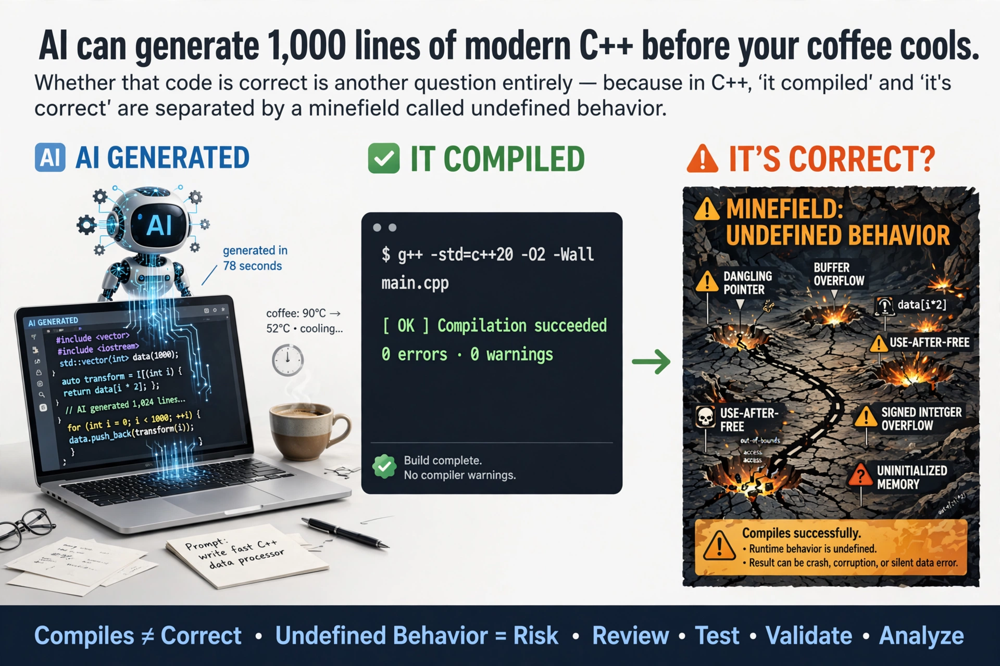

+++
draft       = false
featured    = true
title       = "Trust, But Verify: A Survival Guide for AI-Generated Modern C++"
slug        = "trust-but-verify-cpp"
description = "AI can generate a thousand lines of modern C++ before your coffee cools. Whether that code is correct is another question entirely—because in C++, 'it compiled' and 'it's correct' are separated by a minefield called undefined behavior."
ogImage     = "./trust-but-verify-cpp.webp"
pubDatetime = 2026-08-17T16:00:00Z
author      = "Carlos Reyes"
tags        = [
    "AI Code Verification",
    "Modern C++",
    "Undefined Behavior",
    "AddressSanitizer",
    "ThreadSanitizer",
    "UndefinedBehaviorSanitizer",
    "Fuzz Testing",
    "libFuzzer",
    "clang-tidy",
    "Static Analysis Tools",
    "Compiler Warnings",
    "C++26 Contracts",
    "Property-Based Testing",
    "Mutation Testing",
    "Formal Verification",
    "Memory Safety",
    "Game Development",
    "Financial Software",
    "MISRA C++",
    "Compiler Portability",
    "Defensive Programming",
    "Code Correctness"
]
+++



## Table of Contents

---

# Trust, But Verify: A Survival Guide for AI-Generated Modern C++

Last month I asked an LLM to write me a lock-free SPSC ring buffer for a market data feed handler. What came back was gorgeous. Cache-line padding with `alignas(64)`. A comment citing Dmitry Vyukov. A little ASCII diagram of the head and tail pointers. It passed every unit test I threw at it.

It was also catastrophically wrong. The model had used `volatile std::uint32_t` for the head and tail indices—an idiom from 2009-era blog posts that does absolutely nothing for thread synchronization—and where it *did* use atomics, it used `memory_order_relaxed` on operations that needed acquire/release semantics. The code worked in my single-threaded backtest harness for a week. [ThreadSanitizer](https://clang.llvm.org/docs/ThreadSanitizer.html) found the data race in under four seconds:

```
WARNING: ThreadSanitizer: data race (pid=48231)
  Write of size 4 at 0x7f1c4c00 by thread T1:
    #0 RingBuffer<Trade>::push(Trade const&) ring_buffer.hpp:41
  Previous read of size 4 at 0x7f1c4c00 by main thread:
    #0 RingBuffer<Trade>::pop(Trade&) ring_buffer.hpp:52
```

That's the whole story of AI-generated C++ in one anecdote. The code *looked* like it was written by someone who'd read Sutter's [lock-free series](https://www.drdobbs.com/parallel/lock-free-code-a-false-sense-of-security/210600279). It had absorbed the aesthetics of expertise without the substance. And in C++, the gap between "looks right" and "is right" is where your production system goes to die.

In [last week's Python piece](/posts/trust-but-verify-python/) I argued that Python's dynamic nature makes AI-generated code dangerous because it fails late and loudly. C++ has the opposite problem: it fails *silently*, sometimes for years, and then the compiler—acting perfectly within its rights—deletes your safety checks because you accidentally gave it permission to.

## Why Verification Hits Different in C++

Let's start with the uncomfortable numbers. The classic NYU study [*Asleep at the Keyboard?*](https://arxiv.org/abs/2108.09293) (Pearce et al., IEEE S&P 2022) prompted GitHub Copilot to complete 89 security-sensitive scenarios and found roughly 40% of the 1,689 generated programs were vulnerable. But here's the number that should keep C++ developers up at night: when they broke it down by language, **C was the worst**—50.3% of generated C programs contained a CWE, and over half the scenarios had a vulnerable *top-scoring* suggestion. The closer you get to memory management, the worse the model performs. C++ inherits every one of those failure modes and adds template metaprogramming hallucinations on top.

Meanwhile, the [Stanford study by Perry et al.](https://arxiv.org/abs/2211.03622) (CCS '23) found that developers with AI assistants wrote *significantly less secure code*—and were *more confident* it was secure. That combination is toxic in any language. In C++ it's a liability with a core dump attached.

Why is C++ uniquely exposed?

- **There is no runtime safety net.** Python raises an exception when you index past a list. C++ hands you undefined behavior, and undefined behavior doesn't mean "it crashes." It means "the compiler may now assume this never happens and optimize accordingly." John Regehr's [guide to UB](https://blog.regehr.org/archives/1520) and Chris Lattner's classic [three-part series](https://blog.llvm.org/2011/05/what-every-c-programmer-should-know.html) remain required reading.
- **The blast radius is enormous.** Microsoft's MSRC has said roughly [70% of their CVEs are memory-safety issues](https://msrc.microsoft.com/blog/2019/07/a-proactive-approach-to-more-secure-code/); [Chromium reports the same ~70% figure](https://www.chromium.org/Home/chromium-security/memory-safety/) for its serious security bugs. These are the best-resourced engineering teams on the planet writing human-reviewed C++. Your LLM is not better than them.
- **The failures are spectacular.** On July 19, 2024, a single out-of-bounds read in CrowdStrike's kernel-mode sensor—triggered by a field-count mismatch between a content validator and the content interpreter—[bricked roughly 8.5 million Windows machines](https://www.crowdstrike.com/en-us/blog/falcon-content-update-preliminary-post-incident-report/). That wasn't AI-generated code. It's what human-written C++ does when verification has gaps. Now generate that code at 10x speed.

And the institutional pressure is real. The White House ONCD's 2024 report *Back to the Building Blocks* explicitly called out memory-unsafe languages; CISA's joint guidance pushed memory-safe roadmaps; DARPA launched TRACTOR to machine-translate legacy C to Rust. You don't have to agree with the politics to read the writing on the wall: if you stay in C++ (and for performance work, I am absolutely staying), your verification story *is* your compliance story.

## The Theory, Briefly

Same spectrum as the Python article, different weapons:

| Verification Level | What It Proves | Cost | C++ Tooling |
|---|---|---|---|
| **Compiler diagnostics** | Syntax, suspicious semantics | Free (compile time) | `-Wall -Wextra -Wconversion`, `/W4 /analyze` |
| **Static analysis** | Bug patterns, guideline violations | Seconds–minutes | clang-tidy, Cppcheck, PVS-Studio, CodeQL |
| **Dynamic analysis** | Memory/UB/race errors on executed paths | 2–15x runtime | ASan, UBSan, TSan, MSan |
| **Fuzzing** | Robustness against adversarial input | CPU-hours | libFuzzer, AFL++, OSS-Fuzz |
| **Property-based testing** | Behavioral invariants (statistical) | Seconds–minutes | RapidCheck, Catch2 generators |
| **Formal methods** | Bounded or full correctness proofs | Hours–days | CBMC, KLEE, `constexpr` evaluation, C++26 contracts |

Two things are different from managed languages, and both matter. First, C++ gives you a verification layer nobody else has: **the type system and constant evaluation**. A `static_assert` is a proof that runs at compile time and costs nothing at runtime. Second, C++ *requires* more layers, because no single layer catches UB reliably. Static analysis reasons about all paths but drowns in false positives; sanitizers are precise but only see paths you execute; fuzzing explores paths you didn't think of but never terminates. You need the sandwich.

## Layer 0: The Compiler Is Your First Code Reviewer

The cheapest verification in existence is turning on warnings, and AI-generated code needs them more than most, because LLMs love patterns that trip exactly the warnings people leave off. My baseline, wired up as a CMake interface target:

```cmake
add_library(project_warnings INTERFACE)
target_compile_options(project_warnings INTERFACE
  $<$<CXX_COMPILER_ID:GNU,Clang,AppleClang>:
    -Wall -Wextra -Wpedantic -Wconversion -Wsign-conversion
    -Wshadow -Wnull-dereference -Wdouble-promotion -Wformat=2
    -Wimplicit-fallthrough -Werror>
  $<$<CXX_COMPILER_ID:MSVC>:
    /W4 /WX /permissive- /analyze>)
```

**Teachable Moment:** *Warnings are free static analysis.* In February 2014, Apple shipped an SSL/TLS verification bypass caused by a duplicated `goto fail;` line—the infamous [goto fail bug](https://nakedsecurity.sophos.com/2014/02/24/anatomy-of-a-goto-fail-apples-ssl-bug-explained-plus-an-unofficial-patch/). The second `goto fail` was unreachable code. Clang's `-Wunreachable-code` flags exactly this. A multi-year, planet-scale certificate-validation hole, detectable by a warning that costs zero dollars. (Nuance for your toolchain matrix: GCC's `-Wunreachable-code` is famously unreliable and was effectively abandoned, which is one reason I always build with at least two compilers.)

Two caveats. One: `-Werror` in CI, yes; `-Werror` in code you *ship as source*, no—new compiler versions add new warnings and your users' builds break for reasons that aren't bugs (the [OpenSSF hardening guide](https://github.com/ossf/wg-best-practices-os-developers/blob/main/docs/Compiler-Hardening-Guides/Compiler-Options-Hardening-Guide-for-C-and-C%2B%2B.md) says exactly this). Two: warnings differ between GCC, Clang, and MSVC. A warning-clean Clang build tells you nothing about what MSVC's `/analyze` will say. Carmack was preaching static analysis back in the id Tech days; when the guy who wrote the Doom engine tells you tooling beats discipline, listen.

## Layer 1: clang-tidy, the "Stop Writing 2011" Enforcer

LLMs are trained on the internet's C++, which means their center of mass is somewhere around C++14 with a long tail of raw `new`/`delete`, owning raw pointers, `NULL`, and C-style arrays. [clang-tidy](https://clang.llvm.org/extra/clang-tidy/) is how you mechanically push generated code into the modern era. My `.clang-tidy` for AI-heavy projects:

```yaml
Checks: >
  bugprone-*, concurrency-*, cppcoreguidelines-*, misc-*,
  modernize-*, performance-*, portability-*, readability-*,
  -modernize-use-trailing-return-type,
  -readability-magic-numbers,
  -cppcoreguidelines-avoid-magic-numbers
WarningsAsErrors: 'bugprone-*, concurrency-*'
```

The checks that earn their keep on LLM output specifically: `cppcoreguidelines-owning-memory` (raw owning pointers), `bugprone-suspicious-string-compare`, `bugprone-unused-return-value` (models love ignoring `[[nodiscard]]`-worthy return values), `concurrency-mt-unsafe` (AI reaching for `std::localtime` in threaded code), and the whole `modernize-*` family. Pair it with the [C++ Core Guidelines](https://isocpp.github.io/CppCoreGuidelines/CppCoreGuidelines) as your house style and a good chunk of "AI idiom drift" gets caught in seconds.

## Layer 2: Sanitizers—The Reason I Sleep at Night

If you take one thing from this article: **no AI-generated C++ gets merged without a sanitizer-clean test run.** This is non-negotiable in my consulting engagements. The lineup:

| Sanitizer | Catches | Typical Overhead | Availability | Mutually Exclusive With |
|---|---|---|---|---|
| **ASan** | Heap/stack/global overflow, use-after-free, double-free | ~2x CPU, 2–3x RAM | GCC, Clang, MSVC (`/fsanitize=address`, since VS 2019 16.9) | TSan, MSan |
| **UBSan** | Signed overflow, bad shifts, misalignment, null deref, OOB | Small; some teams ship it | GCC, Clang (not MSVC) | Combines fine with ASan |
| **TSan** | Data races | 5–15x | GCC, Clang on Linux/macOS (not Windows) | ASan, MSan |
| **MSan** | Uninitialized reads | ~3x | Clang, Linux only; needs instrumented libc++ | ASan, TSan |
| **HWASan** | ASan's hardware-assisted cousin | Lower RAM | ARM64/Android | ASan |

CMake plumbing for a target:

```cmake
# One configuration per sanitizer run — they do not all mix
target_compile_options(feed_handler PRIVATE
  -fsanitize=address,undefined -fno-omit-frame-pointer)
target_link_options(feed_handler PRIVATE
  -fsanitize=address,undefined)
```

Don't forget the standard-library hardening layer, which catches AI-generated iterator abuse that sanitizers miss:

- libstdc++: `-D_GLIBCXX_ASSERTIONS` (cheap, ABI-safe). **Gotcha:** its bigger sibling `_GLIBCXX_DEBUG` is *not* ABI-compatible—mix translation units built with and without it and you get ODR violations and corrupt containers. Keep it to whole-program debug builds.
- libc++: `-D_LIBCPP_HARDENING_MODE=_LIBCPP_HARDENING_MODE_EXTENSIVE` (see the [libc++ hardening docs](https://libcxx.llvm.org/Hardening.html)). C++26 formalized this idea as "standard library hardening," turning library precondition violations into contract violations.
- MSVC: debug iterators are on in Debug, but watch for `_ITERATOR_DEBUG_LEVEL` mismatches when linking libraries—linker error LNK2038 exists because everyone hits this eventually.

And that signed-overflow check the AI wrote for you?

```cpp
bool add_would_overflow(int a, int b) {
    return a + b < a;  // UB on overflow; compilers may legally fold this to false
}
```

UBSan flags it at runtime; the fix is `__builtin_add_overflow` on GCC/Clang. **Teachable Moment:** *the optimizer is not your enemy, but it is a literalist.* Signed overflow is UB precisely so the compiler may assume it never happens. A check written in terms of the thing it checks is no check at all.

## Layer 3: Fuzzing, Because Your Imagination Is the Bottleneck

Unit tests check inputs you thought of. Fuzzing checks inputs you didn't. For any AI-generated parser—and LLMs generate an endless supply of parsers—wire up a [libFuzzer](https://llvm.org/docs/LibFuzzer.html) target immediately:

```cpp
extern "C" int LLVMFuzzerTestOneInput(const std::uint8_t* data, std::size_t size) {
    if (size < sizeof(ItchHeader)) return 0;
    auto msg = parse_itch_message(data, size);  // AI-generated
    if (msg) assert(msg->quantity <= kMaxOrderQty);
    return 0;
}
```

Build it with `clang++ -g -O1 -fsanitize=fuzzer,address,undefined fuzz_itch.cpp itch_parser.cpp` and walk away. The last time I did this for an AI-generated ITCH parser, ASan produced this in ninety seconds:

```
==21987==ERROR: AddressSanitizer: heap-buffer-overflow
READ of size 4 at 0x602000002034 thread T0
    #0 parse_itch_message itch_parser.cpp:38
Test unit written to ./crash-9f3a2c
```

The model trusted a length field inside the packet. Of course it did. This is not exotic: [OSS-Fuzz](https://github.com/google/oss-fuzz) has found over **13,000 vulnerabilities and 50,000 bugs** across 1,000+ projects as of May 2025, the majority of them in C/C++ code. Fuzzing at this point is table stakes. For CI, ClusterFuzzLite or `cifuzz` give you short fuzz runs per pull request; keep long runs for nightly infrastructure. Windows note: `-fsanitize=fuzzer` needs clang-cl—MSVC proper only ships ASan.

## Layer 4: Property-Based Testing

Same pitch as the Python article, C++ flavor. [RapidCheck](https://github.com/emil-e/rapidcheck) is the QuickCheck-derived option:

```cpp
rc::check("order serialize/deserialize round-trips",
  [](const Order& o) {
      RC_ASSERT(deserialize(serialize(o)) == o);
  });
```

When it fails, it shrinks to a minimal counterexample instead of burying you in noise. RapidCheck's upstream is quiet these days—forks keep it alive, and Catch2's generators cover simpler cases—but the technique matters more than the tool. **Teachable Moment:** *properties are executable specifications.* "Round-trip is identity," "output is sorted," "no funds are created or destroyed"—when you can state one of these, you've documented intent in a way an LLM (or a new hire) can't misread. Which, honestly, is why property tests are also such a good *prompting* tool: stating the property precisely is half the spec.

## Layer 5: Compile-Time Proofs and Formal-Enough Methods

This is where C++ gets to flex. First, the cheapest trick in the book—**constexpr golden vectors**:

```cpp
constexpr std::uint32_t crc32(std::string_view data);  // AI's "optimized" CRC32
static_assert(crc32("123456789") == 0xCBF43926);        // the standard check vector
```

If the model's CRC is wrong, the *build* breaks. It can never regress silently. And here's the part I drill into my tutoring students: **constant evaluation is a UB detector.** Anything undefined—overflow, out-of-bounds, type-punning through `reinterpret_cast`—is a hard error at compile time during constant evaluation. Running your algorithm through `static_assert` on representative inputs is a poor man's formal verification, and it's free at runtime.

Second, the big news: **contracts are in C++26**. P2900 survived a genuinely contentious process—the final poll was 114–12–3—and with C++26 technically wrapped in March 2026 (see [Herb Sutter's trip report](https://herbsutter.com/2026/03/29/c26-is-done-trip-report-march-2026-iso-c-standards-meeting-london-croydon-uk/)), [contracts](https://wg21.link/p2900) are real:

```cpp
double position_value(double qty, double price)
  pre(qty >= 0.0)
  pre(price > 0.0)
  post(r : r >= 0.0);
```

Preconditions, postconditions, and `contract_assert` in the body, with build-selectable semantics: `ignore`, `observe`, `enforce`, `quick_enforce`. Enforce in CI, observe in staging, quick-enforce in production. GCC 16 has it merged (check `__cpp_contracts`); Clang's implementation is working through upstreaming per the [compiler support matrix](https://en.cppreference.com/w/cpp/compiler_support/26). This is the verification story of the decade for our language—finally, machine-checkable intent in the source itself.

Third, for the genuinely paranoid: [CBMC](https://github.com/diffblue/cbmc) does bounded model checking on C and a C++ subset—it's been battle-tested on AWS infrastructure code. And a cultural note: the compiler-writer community verifies GCC and Clang with [Csmith](https://github.com/csmith-project/csmith), a random program generator that's found hundreds of bugs in both. If the people who *write the compilers* verify them with differential and random testing, your AI-generated hot path deserves the same respect.

## Domain Playbooks

### Finance: Overflow, Determinism, and the Ghost of Knight Capital

The canonical C++-adjacent finance disaster predates LLMs: Knight Capital, August 1, 2012, [$440 million gone in about 45 minutes](https://www.sec.gov/newsroom/press-releases/2013-222) because a repurposed flag reactivated dead code and one of eight servers didn't get the deployment. The lesson transfers directly: verification must cover *configuration and deployment state*, not just source. My finance rules for AI code:

- **UBSan in CI, always.** A former colleague at a prop shop told me their AI-generated order book passed every unit test—until UBSan flagged signed overflow in a P&L accumulation path that only triggered on a 27-fill partial-execution sequence. Their backtests had never hit it because the backtest harness clipped fills. The sanitizer didn't care about their assumptions.
- **TSan with a threaded stress harness.** Same shop, same story as my ring buffer: their backtest was single-threaded, so the race was invisible until paper trading. Test concurrency *as* concurrency.
- **Golden vectors and differential testing.** Keep a naive, obviously-correct reference implementation. Diff the AI-optimized version against it on exchange conformance feeds and recorded production traffic. Exchanges hand you certification suites for a reason.
- **Reproducibility gates.** Same feed, same seeds, bitwise-same decisions. Nondeterminism in a backtest is a race condition until proven otherwise.

### Game Development: Hallucinated APIs and Save-Game Landmines

A friend who runs a mid-size studio gave me my favorite C++ grounding-error example. Their AI assistant, asked for component lookup code in a UE5 project, confidently produced:

```cpp
// AI-generated for a UE5 project
TArray<UActorComponent*> Comps =
    Actor->GetComponentsByClass(UStaticMeshComponent::StaticClass());
```

That's an API from the UE4 era, long gone in UE5—the model blended engine versions because its training data blended them. Worse, AI-generated Unreal code routinely stores raw `UObject*` pointers without `UPROPERTY()`, which works until the garbage collector eats the referenced object three levels deep into a boss fight. Unreal's reflection system means static analyzers only see half the semantics; your real verification is building against the exact engine version, on the exact toolchain, per target.

The good news: Epic officially documents Clang sanitizers in Unreal—[`-EnableASan`, `-EnableTSan`, `-EnableUBSan`, `-EnableMSan`](https://dev.epicgames.com/documentation/unreal-engine/using-clang-sanitizers-in-unreal-engine-projects) through UnrealBuildTool. The honest gotcha, confirmed by Epic staff in their forums: on Windows, ASan is a supported workflow for **game/client targets, not the Editor**. Plan your CI accordingly.

One more landmine, because AI reaches for it constantly:

```cpp
struct SaveHeader { std::uint32_t magic; std::uint16_t version; /* ... */ };
std::fwrite(&header, sizeof(header), 1, f);  // padding, endianness, ABI: pick your poison
```

**Teachable Moment:** *structs are not file formats.* `sizeof` includes padding, padding contents are indeterminate, and layout isn't guaranteed across compilers or `-m32`/`-m64`. Serialize field by field, or use a real serialization library. And if you work on console titles: SDKs are under NDA, which means near-zero training data, which means the hallucination rate there is the highest in the industry. Compile against the real SDK and lean on vendor certification suites. Full stop.

### Systems & Embedded: Where C++ Verification Was Born

Embedded folks have lived this movie. The Toyota unintended-acceleration litigation made public what Michael Barr's analysis called [spaghetti firmware riddled with MISRA violations](https://www.edn.com/toyotas-killer-firmware-bad-design-and-its-consequences/)—including a stack overflow from recursion and global-state chaos. That case is why we have [MISRA C++:2023](https://misra.org.uk/) (which folded in AUTOSAR C++14) and [CERT C++](https://wiki.sei.cmu.edu/confluence/pages/viewpage.action?pageId=88046682). If an LLM generates firmware code, run it through a MISRA checker before a human even reads it; AI output is spectacularly non-compliant by default.

Bare-metal gotchas I enforce mechanically: the build must link with `-fno-exceptions -fno-rtti` if that's your house rule (AI loves exceptions); `new` and `malloc` are CI errors if you're static-allocation-only; and then there's my favorite portability trap:

```cpp
char c;
while ((c = port.read()) != -1) { /* ... */ }  // works on x86, loops forever on ARM
```

**Teachable Moment:** *`char` signedness is implementation-defined.* Signed on x86, unsigned on ARM by default. The AI learned this code from x86 tutorials. Your STM32 build doesn't care what the AI learned.

## Compiler Support and Portability: The Fine Print

AI models generate code for an idealized "modern C++" that no single compiler fully implements. Rough minimums as of mid-2026 (always verify against [cppreference](https://en.cppreference.com/w/cpp/compiler_support/26) before committing):

| Feature | GCC | Clang | MSVC |
|---|---|---|---|
| Concepts (C++20) | 10 | 10 | 19.23 |
| Ranges | 10 | 13, mostly by 16 | 19.29 |
| `std::format` | 13 | 14 (libc++; solid by 17) | 19.29 |
| `std::expected` | 12 | 16 | 19.33 |
| `std::print` | 14 | 18 (libc++) | 19.39 |
| Contracts (C++26) | 16 | upstreaming | not yet |

Note the asterisk that ruins roadmaps: Clang's library features depend on which standard library you pair it with—libstdc++, libc++, or MSVC STL—and they differ in SSO sizes, container growth strategies, debug checks, and header dependency graphs. Guard speculative features with feature-test macros (`__cpp_lib_format`, `__has_include(<print>)`), and make your CI matrix match your deployment reality: GCC and Clang on Linux, MSVC on Windows, Apple Clang on macOS, plus an ARM64 lane if you ship to Graviton, Apple Silicon, or mobile. `-Werror` portability cuts both ways—one compiler's new warning is another team's broken build—so pin toolchains and upgrade deliberately, not accidentally.

## Letting AI Verify AI (Carefully)

The most interesting development since my Python article: AI is getting genuinely good at *finding* bugs, which means the sanitizer-and-fuzzer stack above can be partially AI-built. Google's LLM-driven fuzz-target generation [found 26 vulnerabilities in OSS-Fuzz projects](https://security.googleblog.com/2024/11/leveling-up-fuzzing-finding-more.html), including an OpenSSL out-of-bounds bug ([CVE-2024-9143](https://openssl-library.org/news/secadv/20241016.txt)) that had likely sat there for two decades beyond the reach of human-written harnesses. Project Zero's Big Sleep [caught a real SQLite vulnerability](https://googleprojectzero.blogspot.com/2024/10/from-naptime-to-big-sleep.html) before release.

But watch the full arc, because Daniel Stenberg lived it in public on the curl project: first came the [flood of AI-slop vulnerability reports](https://daniel.haxx.se/blog/2025/07/14/death-by-a-thousand-slops/) that nearly broke his security team and contributed to curl shutting down its bug bounty in February 2026—and then, months later, [a new breed of AI-powered analyzers](https://daniel.haxx.se/blog/2025/10/10/a-new-breed-of-analyzers/) started filing real, high-quality reports, curl's confirmed-vulnerability rate is now back above pre-AI levels. Same technology, opposite outcomes, difference entirely in the verification rigor behind it. My rules: AI may draft fuzz harnesses and property tests, but the harness must compile, must actually kill mutants (see below), and a *different* model plus deterministic tooling reviews the output. The model that wrote the bug shares blind spots with the model reviewing it.

## The FastCodeGuru Pipeline

1. **Generate into quarantine.** AI output lands in `ai-drafts/`, never `src/`. Prompt with constraints: "C++20, no owning raw pointers, `std::span` for buffer views, exceptions for errors, no C arrays."
2. **Seconds gate:** warnings-as-errors + clang-tidy. Failure here costs nothing and catches the 2011-isms.
3. **Minutes gate:** unit tests under ASan+UBSan; a TSan job for anything touching threads.
4. **Nightly:** fuzz runs, property tests, an MSan job if you're on Clang/Linux, `_GLIBCXX_DEBUG` full-program build.
5. **Weekly:** CodeQL or PVS-Studio deep pass; mutation testing with [Mull](https://github.com/mull-project/mull) to verify your tests actually detect sabotage; `llvm-cov` coverage as a test-quality signal.
6. **Human review, on semantics.** The machine checked the syntax. You check intent: are the invariants right? Is this the correct algorithm? Does the error-handling policy match the system?

```yaml
# The matrix is the message
strategy:
  matrix:
    include:
      - { os: ubuntu-latest, cxx: g++-14,    build: Debug,   sanitizers: "address,undefined" }
      - { os: ubuntu-latest, cxx: clang++-19, build: Debug,  sanitizers: "thread" }
      - { os: ubuntu-latest, cxx: clang++-19, build: Release, sanitizers: "address,undefined" }
      - { os: windows-latest, cxx: cl,        build: Debug,   sanitizers: "address" }
      - { os: macos-latest,  cxx: clang++,    build: Debug,   sanitizers: "address,undefined" }  # ARM64 lane
```

> **Opinionated Rant:** "It compiles" in C++ is not the finish line—it's the *handshake*. The language hands the optimizer a license to exploit every assumption you didn't write down, and LLMs write down almost nothing. If your verification pipeline isn't faster than your generation pipeline, you're not engineering; you're typesetting.

## Conclusion

The compilers get better every year—C++26 contracts, hardened standard libraries, sanitizers on every major platform—and the models get better every quarter. Neither trend removes the gap between plausible and provable; if anything, faster generation widens it. The C++ developers who thrive in this era will be the ones whose verification stack runs at machine speed: warnings and clang-tidy in seconds, sanitizers in minutes, fuzzers overnight, contracts and `static_assert` proofs baked into the source itself. Trust the output. Verify everything. And when an AI hands you a lock-free queue with a nice ASCII diagram, reach for ThreadSanitizer before you reach for the merge button.

*I teach this exact pipeline—sanitizers, fuzzing, and property-based testing for C++ teams—in my tutoring and consulting practice. If your team is adopting AI-assisted C++ and wants the guardrails built in from day one, get in touch.*
