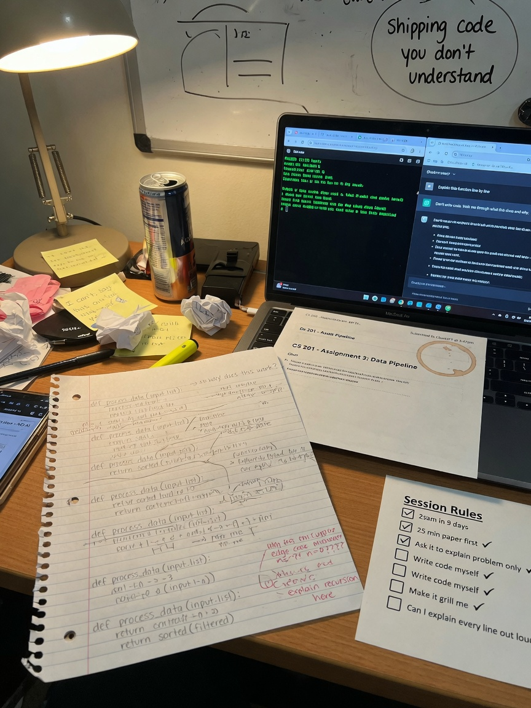

+++
draft       = false
featured    = true
title       = "How to Use ChatGPT on a CS Assignment Without Cheating — or Staying Lost"
slug        = "ai-without-cheating"
description = "Pasting the homework PDF into ChatGPT gets you working code in four minutes — and a student who cannot explain a single function in office hours."
ogImage     = "./ai-without-cheating.jpg"
pubDatetime = 2026-08-24T16:00:00Z
author      = "Carlos Reyes"
tags        = [

]
+++



## Table of Contents

---

# How to Use ChatGPT on a CS Assignment Without Cheating — or Staying Lost

Four minutes. That’s how long it took ChatGPT to return a complete program from a homework PDF. The code compiled. The sample tests went green. Two days later, in office hours, the student could not explain a single function. Not the loop bound. Not the swap. Not why the index was `n - i` instead of `n - 1 - i`. They were more lost than before they pasted anything.

I use ChatGPT and Claude every day. I am not going to tell you to throw them out. I *am* going to tell you that pasting the PDF is how you become a tourist in your own repository: you can point at the buildings, you cannot say who lives there.

There are two failure modes.

The first is getting caught. Honor codes, plagiarism scanners, a TA who asks one question. Real, and enough on its own.

The second is worse, and it does not need a detector. You ship code you cannot explain. The autograder is still green. Then the exam puts a blank editor in front of you, or a tracing question, or “what happens if the input is empty,” and the model is not in the room. That is not a close call. That is the whole course, compressed into one afternoon.

If you are a parent reading this because a semester of green checkmarks turned into a midterm crater: this is usually why. The homework was never the product. The homework was practice for a closed-book hour.

The rest of this article is the workflow I actually want students to use. It is the same shape as a tutoring session. Attempt first. Ask the model to explain the *problem*. Build a mental model. Write the code yourself. Then make the model grill *you*. If you cannot say every line out loud, you do not submit it.

Python, Java, C++ — the prompts transfer. The code below is C++17, the dialect a lot of CS 2 courses still live in. Compile line at the bottom of each snippet.

## The mistake is not “using AI.” It is skipping the part that builds the map

People argue this as a moral binary: virtuous struggle versus cheating machine. That argument is mostly folklore.

The useful split is different.

- Using a model to understand a problem, check an invariant, or interrogate *your* code is how working programmers already operate.
- Submitting model output you cannot reconstruct from a blank page is cheating under almost every honor code I have seen, and it is also a terrible study method.

Those two sentences are doing different jobs. Integrity is the first. The exam is the second. You can lose on either one independently.

The counterargument I take seriously: “If the tool exists, refusing it is theater. Professionals paste specs all day.”

Partly true. Professionals also get called into a room to explain why the system did what it did, and “the model said so” is not an architecture review. Your exam is that room, with worse snacks.

A second counterargument: “My professor banned it, so this article does not apply.” If the syllabus bans it, follow the syllabus. I am not going to help you launder output. What follows is for the common case — tool allowed, tool unenforced, or tool used in the gray zone — and for the exam that does not care what the syllabus said.

> **Pro tip:** Treat the autograder as a compiler with opinions, not as a teacher. Green on the sample does not mean you could write it again Thursday morning. The exam is Thursday morning.

## The session workflow (do this in order)

This is not a vibe. It is a sequence. Skip a step and the later prompts turn back into “write my homework.”

### 1. Attempt the problem for 20–25 minutes first

Paper or editor. Timer on. Phone down.

You are not trying to finish. You are trying to *load the problem into your head* so that the next questions you ask are yours, not the model’s.

In that window, produce four artifacts. Write them down, even if they are ugly.

1. **Contract.** Input type, output type, does it mutate, what “empty” means.
2. **Two examples.** One happy path, one annoying case (empty, one element, already sorted, negatives, duplicates — pick what the problem could break on).
3. **A failed attempt.** A loop that almost works, a drawing of an array with two index arrows, a recursion tree with one call too many. Failed is useful. Blank is not.
4. **A question list.** “I don’t know if I should sort first.” “I don’t know what to return when there is no answer.” Those become prompts later.

Why 20–25 minutes, not “until you’re stuck” and not “five minutes so I can be honest with myself”? Because five minutes is not enough to find the real confusion, and “until you’re stuck” is how people sit for three hours in a fog and then paste the PDF anyway. A short, honest attempt creates the questions. An unbounded spiral does not.

If at minute 25 you already have working code you can explain, stop. Do not open the model. You won. Go write a test for the empty case.

> **Gotcha:** “I looked at it for 25 minutes” is not an attempt. Opening the PDF and waiting for inspiration is how you spend 25 minutes. Tracing one example by hand is an attempt.

### 2. Ask the model to explain the problem, not write the solution

This is the step almost nobody does, and it is the one that separates “study tool” from “ghostwriter.”

You have a contract draft from step 1. Now you want the model to argue with it.

Paste the *problem statement* if your course allows that. Do not paste “write the function.” Ask for a restatement in input/output/invariants. Then compare it to what you wrote.

A typical CS 2 prompt (legal, useful):

```text
Restate this problem as a contract. Do not write code, and do not describe an algorithm yet.

- Input types and any constraints (sorted? unique? size limits?)
- Output type and meaning of each special case (empty, not found, already done)
- Does the function mutate its input, or must it leave it unchanged?
- What would count as violating the spec even if the happy-path answer looks right?

Problem:
[paste the problem text only]
```

What you are listening for: disagreements with *your* notes. If the model says “the input is sorted” and you missed that, that sentence is worth more than 40 lines of C++. If the model invents a constraint that is not in the handout, that is also information — the model hallucinates specs the same way it hallucinates APIs. Check the PDF. The PDF wins.

Do not let it “helpfully” continue into a solution. If it starts writing code, stop it.

```text
Stop. No code. I will ask for an algorithm later if I need one. Finish the contract only.
```

### 3. Ask for a mental model, invariants, and edge cases

An invariant is a fact that stays true while the code runs. “Everything left of `i` is already the answer.” “`lo` is the first index that might still be the insertion point.” CS 1 does not always use the word. The exam still tests the idea, usually by asking you to trace.

Ask for the model of the *data*, not a tour of syntax.

```text
I am not ready for code.

Give me:
1. A mental model of the data (array with two pointers, stack of pending calls, running total — pick one and justify it).
2. The invariant I should be able to point at on a whiteboard after each iteration / each recursive call.
3. Edge cases that would violate a sloppy implementation: empty, size 1, already sorted, reverse sorted, duplicates, negatives, min/max int, “not found.”
4. For each edge case, the correct output according to the spec — still no code.

If the spec is silent on a case, say “unspecified” and tell me what I should ask the instructor.
```

This is the step that prevents the office-hours collapse. Students who cannot explain a function usually never had an invariant. They had a loop that happened to work on `[1, 2, 3]`.

Work a tiny analog on paper before you touch the assignment. Cousin problem, not the homework itself. If the homework is “merge two sorted vectors without duplicates,” the cousin might be “merge two sorted lists of three elements each, by hand, and write the invariant.” If you cannot do the cousin with a pencil, the model’s merge code is a costume.

> **Pro tip:** If you cannot draw the array (or the call stack) after iteration `k` and say what is already correct, you do not understand the algorithm yet. More code will not fix that. A picture might.

### 4. Write the code yourself

Yes, yourself. In the editor. With the names your course uses.

This is the step people try to skip because it is slow. It is slow because it is the learning.

Rules I use in session:

- No tab-complete from the model. No “continue this function.”
- Match the course dialect. If the class has not done `auto`, do not use `auto`. If they want a `for` loop, a Python one-liner is the wrong answer even when it is right.
- Compile with warnings on. For the C++ below: `g++ -std=c++17 -Wall -Wextra`. If you have sanitizers, turn them on too: `-fsanitize=address,undefined`. GCC 13+ and Clang 17+ handle those flags without drama. MSVC 19.4x / Visual Studio 2022 has `/fsanitize=address`. A lot of student labs still ship an older `g++`; ASan/UBSan have been around for years, so if the flag is rejected it is an install problem, not a “maybe some compilers” mystery.
- Run the edge cases from step 3 *before* you congratulate yourself.

You are allowed to look at your notes from steps 2 and 3. That is the point of those steps. You are not allowed to look at a solution dump and retype it. Retyping is how you get to office hours with a working file and an empty head.

If you stall on syntax — “how do I take a `const vector<int>&`” — ask *that* question, isolated. Syntax lookup is what documentation is for. “Write the function” is not syntax lookup.

### 5. Paste *your* code and ask the model to grill you

Not “review this.” Reviewing is how the model politely rewrites your homework. Grilling is a viva. You want questions, not a patch.

```text
Here is MY code for this contract:
[paste contract in 4 bullets]
[paste YOUR code]

Do not rewrite it. Do not give me a corrected version.

Grill me:
- What breaks if the input is empty? size 1? already sorted? reverse sorted? all duplicates?
- What breaks if a value is negative? INT_MIN? INT_MAX?
- Does this mutate the input? Is that allowed?
- Point at the invariant. Ask me to state it. Wait for my answer before you comment.
- Ask me to trace one failing case out loud, line by line.

If my code is wrong, tell me which test would catch it and stop. I will fix it myself.
```

The last two sentences matter. Models love to “just fix it.” If you let them, you are back in the four-minute PDF loop, only with extra ceremony.

A shorter grill you can reuse on any function:

```text
Quiz me on this function. Ask one question at a time. Wait for my answer.
Start with: “What is true after each iteration of the loop?”
Then: “What breaks if the input is empty / negative / already sorted?”
Do not supply answers unless I ask.
```

If the model’s first “failing case” is something the spec allows, argue. That argument is practice for office hours.

### 6. If you cannot explain every line out loud, you do not submit it

I mean this literally. Stand up. Talk. Finger on the line.

“This index is `n - 1 - i` because the last element of the prefix lives at `n - 1`, not at `n`.” If you cannot say that, you do not know it. Shipping it anyway is how you walk into office hours and discover you never learned the function.

“Every line” does not mean reciting syntax. `int i = 0;` does not need a speech. Every line that encodes a decision does: bounds, mutation, what you return on failure, why this is `<` and not `<=`.

If you get stuck on a line, that line is the next 20-minute attempt. Not a paste.

> **Gotcha:** “I could explain it if I looked at it” is the same as not being able to explain it. The exam does not let you look at ChatGPT’s version. Out loud, from memory, or it does not count.

## Copy-paste prompts that are legal and useful

Keep these in a note. Change the bracketed parts. Do not add “now write the solution” at the bottom. That one sentence flips the category.

**1. Explain the failing test, not the assignment**

```text
My function is supposed to: [one-sentence contract].
Here is MY code:
[paste]

This test fails:
input:  [exact input]
expected: [exact expected]
got:      [exact output]

Explain why THIS code produces that output. Do not rewrite the function. Do not suggest a full solution. Point at the line where the state goes wrong.
```

**2. Quiz me on this function**

```text
Quiz me on the function below. One question at a time. Wait for my reply.
Questions I want covered: purpose of each index, the loop invariant, empty input, size 1, already sorted, negatives.
Do not show me a better implementation unless I say I am done and I ask for a review of MY reasoning.
[paste YOUR function]
```

**3. Compare two approaches without writing my code**

```text
For this problem: [paste problem text].
Compare a two-pointer approach vs a hash-set approach.
I want: time, extra memory, whether the input must be sorted, and which edge cases each one handles badly.
Do not write code for either approach. Do not pick which one I should submit. I will implement one myself.
```

**4. Mental model only**

```text
Give me a whiteboard-level mental model for this problem. No code.
- What data am I moving?
- What is true after each step?
- Where do people usually put the off-by-one?
Problem: [paste]
```

**5. Constraint check**

```text
Here is the spec’s constraint list: [paste constraints].
Here is MY function: [paste].
For each constraint, answer: respected, violated, or cannot tell from this snippet.
If violated, name the constraint and the line. Do not patch the code.
```

Those five are study tools. They assume you already tried, and they refuse to become the author of record.

## Prompts that are cheating — do not use them

I am labeling these so you can recognize them, including when a friend forwards them as “the trick.”

**Cheating 1**

```text
Here is the assignment PDF / full writeup. Write a complete solution I can submit.
```

That is ghostwriting. If your course allows AI, they still usually require that the work is yours. If they do not allow it, this is the whole violation in one sentence.

**Cheating 2**

```text
Rewrite this so it doesn’t look like AI. Change variable names and add comments in my style so the plagiarism checker / my professor won’t catch it.
```

That is not studying, and it is not “using a tool professionally.” It is concealment. I will not help you do it, and a model that agrees to do it is not your friend.

**Cheating 3**

```text
Generate a full solution in my class’s style, matching my previous homework, using only features we have covered.
```

Style matching is how people talk themselves into “it’s basically mine.” It is not yours. You could not produce it from a blank page. That is the test that matters, in the course and on the exam.

If you already pasted one of those: do not submit the output. Close the tab. Go back to step 1 with a timer. The sunk cost is 4 minutes. The exam is not.

## AI code that compiles and is still wrong

Models are good at the shape of a function. They are sloppy about contracts. The disaster case is not red squiggles. It is a clean compile, a happy-path pass, and a lie.

Here is a cousin of a hundred CS 2 loops: reverse the prefix `a[0..n)` in place, leave the rest of the vector alone. `n` is in `[0, a.size()]`.

This is the sort of thing a model emits when you say “write reverse_prefix” and do not nail the bound.

```cpp
// C++17
// g++ -std=c++17 -Wall -Wextra -fsanitize=address,undefined
#include <iostream>
#include <vector>

// Contract: reverse a[0..n) in place. Leave a[n..size) unchanged.
// n is in [0, a.size()].

void reverse_prefix(std::vector<int>& a, int n) {
    for (int i = 0; i < n / 2; ++i)
        std::swap(a[i], a[n - i]);  // off-by-one: last prefix index is n-1, not n
}

int main() {
    std::vector<int> a{10, 20, 30, 40, 50};
    reverse_prefix(a, 4);
    for (int x : a) std::cout << x << ' ';
    std::cout << '\n';
}
```

It compiles. On some sizes it even looks plausible. Run it.

Input: `{10, 20, 30, 40, 50}`, `n = 4` — so the prefix is `10, 20, 30, 40` and `50` must not move.

| `i` | swap | vector after swap |
|---|---|---|
| 0 | `a[0]` ↔ `a[4]` | `{50, 20, 30, 40, 10}` |
| 1 | `a[1]` ↔ `a[3]` | `{50, 40, 30, 20, 10}` |

Two failures at once. The prefix is wrong, and we mutated `a[4]`, which the contract said not to touch. A student who only ran `n == a.size()` might never see it. `n` equal to the size is the happy path this bug can hide on, depending on luck and the last swap.

How a student who did steps 1–3 catches it, without any model:

- The last index of a prefix of length `n` is `n - 1`. Always. They would have written that on paper in minute ten.
- They would have traced `n = 4` by hand *before* coding, because “already the full array” is a lousy first example.
- They would have asked, out loud: “Am I allowed to write `a[n]`?” For `n == a.size()`, `a[n]` is out of bounds. Undefined behavior. The sanitizer build is the one that turns that from a vibes discussion into a stack trace.

The fix is one expression, and I want you to derive it, not memorize it: swap `a[i]` with `a[n - 1 - i]`. Then trace `{10, 20, 30, 40, 50}` / `n = 4` again. `50` stays. The prefix becomes `{40, 30, 20, 10}`.

A Python CS 1 version of the same class of bug — compiles (runs), happy path looks fine, contract is broken:

```python
# Contract: return a NEW list with each temp clamped to [lo, hi].
# Do not mutate the input list.

def clamp_temps(temps, lo, hi):
    for i in range(len(temps)):
        if temps[i] < lo:
            temps[i] = lo
        elif temps[i] > hi:
            temps[i] = hi
    return temps  # same object, mutated
```

If the hidden test later asserts `original == [3, 15, 9]` after the call, this fails. A student who wrote down “must not mutate” in step 1 sees the `temps[i] = ...` on sight. A student who asked the model to “just write clamp_temps” never had that sentence in their head.

> **Gotcha:** Mutation bugs and off-by-ones both love to pass the sample. Samples are almost always non-empty, already in the “normal” shape, and printed by eyeballing. Write the empty case and the “do not touch the rest” case yourself.

## What this looks like on a real analog: pair-sum on a sorted array

I am not going to do your homework. Here is a cousin you can actually run, and the workflow around it.

**Contract we would have written in step 1**

- Input: `const std::vector<int>& a` (read-only), `int target`.
- Precondition: `a` is sorted ascending. May contain duplicates. May be empty.
- Output: `true` if two *different indices* sum to `target`, else `false`.
- Must not mutate `a`.
- Watch overflow: `a[i] + a[j]` may not fit in `int`.

**Edge cases from step 3:** empty; one element; pair at the ends; pair adjacent; negatives; `INT_MAX` + something; no pair; duplicates like `{2, 2}` with target `4`.

A model asked to “write it” will often take `vector<int>` by value and `sort` it, or use `int` for the sum, or use `i <= j` and count `2 * a[i]` when `i == j`. All of those can compile. Some pass weak tests.

Here is a version a student might write after doing the work — still C++17, still something you should be able to explain line by line:

```cpp
// C++17
// g++ -std=c++17 -Wall -Wextra -fsanitize=address,undefined
#include <iostream>
#include <limits>
#include <vector>

bool has_pair_sum(const std::vector<int>& a, int target) {
    int i = 0;
    int j = static_cast<int>(a.size()) - 1;
    while (i < j) {  // different indices; empty and size 1 never enter
        const long long sum =
            static_cast<long long>(a[i]) + static_cast<long long>(a[j]);
        if (sum == target) return true;
        if (sum < target) ++i;
        else --j;
    }
    return false;
}

int main() {
    const std::vector<int> a{1, 2, 4, 7, 11};
    std::cout << std::boolalpha;
    std::cout << has_pair_sum(a, 11) << '\n';  // 4+7
    std::cout << has_pair_sum(a, 3) << '\n';   // 1+2
    std::cout << has_pair_sum({}, 0) << '\n';  // empty -> false
    std::cout << has_pair_sum({5}, 5) << '\n'; // size 1 -> false
    const std::vector<int> ends{std::numeric_limits<int>::max(),
                                std::numeric_limits<int>::max()};
    std::cout << has_pair_sum(ends, -2) << '\n';  // must not overflow into a lie
}
```

What the grill should force you to say out loud:

- Why `i < j` and not `i <= j`. Because the same index twice is not two indices. `{5}` and target `10` is false.
- Why `const vector<int>&`. Because the contract said do not mutate, and a copy would hide a `sort` if you later panic.
- Why `long long` for the sum. Because `INT_MAX + INT_MAX` in `int` is undefined behavior, not “a big number.” Sanitizers are how you see it when you forget.
- Why this requires sorted input. If the vector is not sorted, moving `i` right because `sum < target` is a lie. The model may forget to mention that. Your step-2 contract should not.

If you cannot give those four answers without looking, you are not ready to submit a pair-sum, and you are not ready to submit the homework this is a cousin of.

The usual CS 2 pattern I see is the reverse: green tests, then a tracing question on the exam that is exactly `i <= j` versus `i < j`, and half the room writes the version they never said out loud.

## What the autograder, the model, and the exam each optimize for

These three systems do not score the same thing. If you only satisfy the first two, the third will still flatten you.

| Question the course is actually asking | Autograder | ChatGPT (naive paste) | Exam / office hours |
|---|---|---|---|
| Does the happy path work on the sample? | Yes, that is most of the points it can see | Yes, that is what it is best at | Maybe one part of one question |
| Empty, size 1, already sorted, negatives | If the hidden tests exist | Often missed unless you demand them | Extremely popular |
| Must not mutate the input | Only if they check identity / old copy | Frequently ignored (`&` vs copy vs `const`) | “What does this call do to `v`?” |
| Off-by-one on the last index | Sometimes | Classic failure mode | Tracing question |
| Can you state the invariant? | Never | Will recite one if asked — *for you* | You have to speak |
| Can you write it from a blank page? | Never | The whole point of a naive paste is skipping this | The whole point of the exam |
| Dialect the course taught | Sometimes style-checked | Will happily use `auto`, Python tricks, libraries you have not seen | Using untaught toys can score zero |

Read the last two rows again. The model is optimizing for a finished artifact. The exam is optimizing for whether the artifact is inside your head. Those goals only line up if you write the code.

> **Pro tip:** Hidden tests are not magic. They are the edge-case list from step 3. If you generate that list *before* coding, you are writing the hidden tests yourself. That is the whole trick.

## Academic integrity, without the sermon

I am not your honor board. Policies differ: some courses ban generative tools outright, some allow them with citation, some say nothing and still mean “the work must be yours.” Read the PDF that came with the course. If it is unclear, one email to the instructor is cheaper than a meeting with the dean.

What does not differ much:

- Submitting work you could not produce yourself is the thing they are trying to forbid, whatever words they use.
- “The model wrote it, I read it once” is not authorship.
- Asking a model to explain a concept, generate extra practice, or grill your own function is the same *family* of behavior as using the textbook’s solution sketch after you attempted the problem — which many courses already have rules for. Follow those rules.

I will not pretend detection is imaginary. I also will not pretend detection is the interesting part. The interesting part is that the exam is a detector that does not need Turnitin. It hands you a related problem and a pen.

If you need a practical rule that survives most syllabi: **attempt, understand, write, grill, explain out loud.** If a step would look embarrassing forwarded to the instructor, that is information.

## Traps that still get people who think they are being careful

**The model is confidently wrong.** It will invent a `std::vector` method that does not exist, or claim a loop is `O(n)` when you `erase` from the front of a vector on every hit (`erase` in the middle of `std::vector` is linear in the tail, so the nested version is quadratic). Check [cppreference](https://en.cppreference.com/) for the API, not the chat window. If you need complexity, reason about what each line does to the container; do not accept a Big-O from a paragraph of vibes.

**You stop generating examples.** Once the model is in the loop, students quit drawing arrays. Then nobody ever notices `n - i`. The 20-minute attempt is there to make the drawing happen *before* the fluent paragraph appears.

**Dialect drift.** The model writes C++20 ranges, or Python slicing, or a Java `HashMap` in a course that is testing whether you can walk a linked list. Even when the tool is allowed, untaught features can score zero. Ask:

```text
List every language feature in my code that a CS 2 course doing C++17 vectors/loops/functions might not have taught yet. Do not rewrite the code.
```

**It matches your previous homework.** That is Cheating Prompt 3 wearing a hat. Do not ask for it. Do not paste three old files “for style.” Your style is the thing you are supposed to be forming.

**Office hours become a reading of the model’s comments.** If you need the comments to explain the function, the comments are a confession. Delete the comments and try again. If it falls apart, you found the line you do not own.

**The PDF dump includes other people’s solutions.** Course PDFs sometimes contain starter code, later a solution sketch, later a classmate’s paste in the same chat. Models will blend all of it. You now have a novelty problem *and* an integrity problem. New chat. Problem text only. Your code only.

> **Pro tip:** One chat per assignment, and the first message is your contract, not the PDF. If the thread starts with a solution request, the rest of the thread is contaminated. Start over.

> **Gotcha:** “I used AI but I understand it now” is a claim. The test is: close the laptop, write the function on paper, trace the empty case. If you cannot, you do not understand it now. You understand it *while looking at it*, which is the office-hours failure mode from the first paragraph.

## What to do this week

Do this on the next assignment, not after the midterm.

1. Set a 25-minute timer. Produce a contract, two examples, a failed attempt, and a question list. If you finish early and can explain it, you are done with the model.
2. Ask for a contract restatement and a mental model. Cut the thread if code appears.
3. Write the function yourself in the course dialect. `g++ -std=c++17 -Wall -Wextra -fsanitize=address,undefined` (or the Python equivalent: run the empty list, run a case that must not mutate).
4. Paste *your* code into the grill prompt. Answer out loud. Fix *yourself*.
5. Stand up and explain every decision line. If you cannot, it does not ship.
6. Save the five legal prompts in a note. Delete the three cheating prompts if they are already in your history. They are not a shortcut. They are how you arrive in office hours unable to name your own functions.
