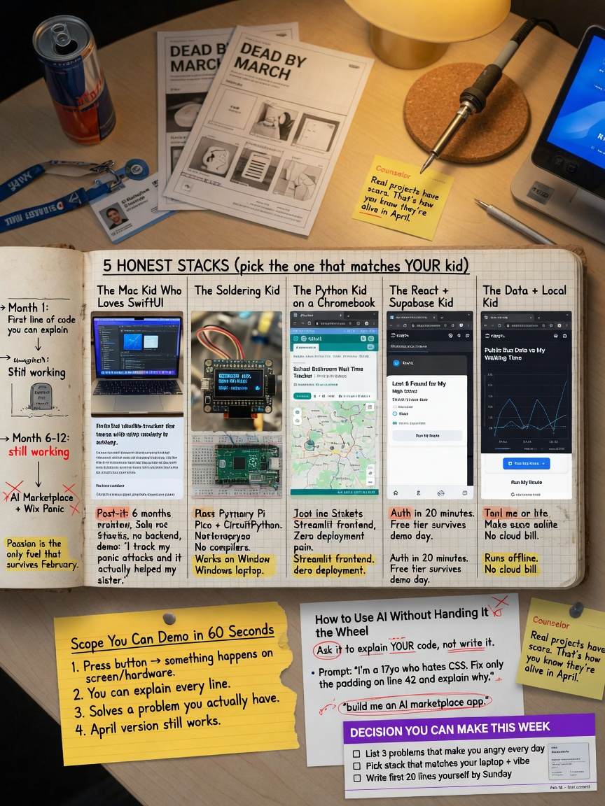

+++
draft       = false
featured    = false
title       = "What Makes a High School CS Capstone Topic Survive Month Three"
slug        = "hs-cs-capstone-topic"
description = "A high school CS capstone dies in month three when the topic was chosen to impress someone who will never read the code—not when the student was obsessed with a real problem they could actually finish."
ogImage     = "./hs-cs-capstone-topic.jpg"
pubDatetime = 2026-08-31T16:00:00Z
author      = "Carlos Reyes"
tags        = [
    "CS Capstone Projects",
    "High School CS",
    "Topic Selection",
    "Scope Control",
    "Project Management",
    "Tech Stack Selection",
    "Hardware Constraints",
    "Python Desktop Apps",
    "Swift iOS Development",
    "Flutter Development",
    "Arduino Programming",
    "Raspberry Pi",
    "Vanilla JavaScript",
    "AI Assisted Coding",
    "Version Control",
    "Computer Science Education",
    "Mobile Development",
    "Embedded Systems",
    "Web Development",
    "Mentoring Guide"
]
+++



## Table of Contents

---

# What Makes a High School CS Capstone Topic Survive Month Three

The usual death spiral looks the same every year.

A junior has a slide deck. The title has the word “AI” in it, plus “social,” plus a marketplace, plus a mobile app. The mockups are pretty. The repo is empty. By February they want to switch to a Wix site about recycling because “the original idea was too hard.”

It was not too hard. It was not an idea. It was a poster of a product company.

A real high school computer science capstone takes **6 to 12 months from scratch**. Not from Figma. From the first line of code the student can explain. The point is not a flashy demo. The point is technical skill, project management, and the habit of making hard decisions when two features both sound good and there is only one Saturday left.

I have sat through enough one-on-one sessions that the failure mode is boring. The topic was chosen to impress someone who will never read the code. The student was not curious about the problem. Month three arrived. Soccer, APUSH, and a compiler error that had been sitting there since Thanksgiving finished the job.

This is a field guide for students, parents, and counselors who want the project to still exist in April.

## A capstone is a year, not a weekend

Hackathon energy is a trap. A weekend project can be charming. A capstone that is a pile of weekend projects glued together with screenshots is a mess.

From scratch, a serious student project eats calendar time in three layers:

**Learning the tools.** Not “I watched a tutorial.” Being able to create a window, save a file, draw a pixel, flash a board, or deploy a static page without Discord open.

**Building the thing.** The boring middle. Data that does not fit. A library that changed. A sensor that lies. A layout that works on your laptop and nowhere else.

**Making it presentable.** README, a demo that does not require you hovering over the interviewer’s shoulder, and the ability to answer “why did you store it that way?”

Those three layers do not happen in four Sundays. Plan on **most of a school year**, with real weekly hours, or pick a smaller artifact and call it what it is: a class project, not a capstone.

> **Personal Note:** I shipped a commercial game in high school. About 10,000 lines of 6502 assembly, one instruction at a time. Nobody who bought it cared that the graphics were crude. They cared that it ran, that I finished it, and that I could talk about every byte I had fought with. That is still the bar. Finish something real.

Parents hear “capstone” and picture a product. Counselors hear “impact.” College interviews, if they happen, hear “did this person make decisions under uncertainty and own the result.” Those are three different assignments. Write down which one you are actually doing, or you will optimize for the loudest adult in the room.

## If you are not obsessed, stop

This is the only criterion that is not negotiable.

Not “interested.” Not “it would look good for computer science.” Obsessed enough that when the bug is still there at 10 p.m., the student is annoyed at the bug, not at the project.

Without that, the project dies in month three. I am not being poetic. Month three is when the novelty is gone, the tutorial ends, and the remaining work is design decisions with no answer key. Passion is the only fuel that survives that stretch.

Passion has to attach to **the problem**, not the costume.

- “I want to build an iPhone app” is a costume.
- “I keep missing practice slots on the piano and I want the phone to bully me with a timer I designed” is a problem.

- “I want to do AI” is a costume.
- “I have three seasons of club robotics match logs in a folder and I want to see which autonomous routines actually scored” is a problem.

- “I want to help the community” is a costume unless there is a specific person who will use the thing next week.

If the student cannot talk for five minutes about the problem with their phone face-down, pick a different problem. Do not pick a different stack. Stack is downstream.

> **Pro tip:** Ask the student what they already open for fun when nobody is grading them. Music production. Taking apart a broken drone. Competitive programming. Fan wikis. Minecraft mods. Photography dumps that never get sorted. The capstone is hiding in that answer, not in a list titled “hot CS topics.”

A future CS major and a career-curious teen should not be forced into the same shape of project. The major needs something that will survive a college interview: code they wrote, tradeoffs they can defend, a Git history that is not three commits named “final” and “final2.” The career-curious teen may need something they can finish and show a person: a working physical object, a phone app on a device, a site a coach can click. Both are legitimate. Mixing them produces a half-broken everything.

## Match the student, not the brochure

I will be blunt, because adults get this wrong constantly.

A student who loves hardware and tinkering should not be pushed into a Wix site because it “looks professional.”

A student who hates debugging compilers should not start with Swift and Xcode.

A student with a Windows laptop and no budget should not be sold an iPhone app.

A student who freezes when the next step is not in a tutorial should not start with a research-flavored embedded project where the datasheet is the documentation.

Match the topic to constraints that actually exist:

| Constraint | Why it kills projects | What to do with it |
|---|---|---|
| Prior skill | A first-ever program and a networked multiplayer game are not adjacent | Stay within one big new idea. Not five. |
| Weekly hours | Four hours a week is a real project. Forty-five minutes after homework is a poster. | Scope to the honest number, not the hopeful one. |
| Hardware | Boards arrive late. Cables are wrong. Pins get fried. Phones need a Mac. | If the part is not in the house by week two, it is not in the project. |
| Mac or not | iOS development without a Mac is masochism | No Mac, no native iPhone app. Full stop. |
| Tolerance for ambiguity | Some students thrive when the API is undocumented. Some shut down. | High ambiguity needs extra time or a smaller surface. |
| What they want to show | App Store, GitHub, a thing on a table, a live URL | Pick one primary artifact. The rest is bonus. |

Read that table twice. The “innovative” topic that ignores a row is how you get a May panic.

> **Gotcha:** “We’ll buy a Mac Mini if they need it” is not a plan unless it is purchased, unboxed, and updated before the project starts. Xcode is not something you install the night before a milestone.

## The five stacks I actually see

These are the high-school stacks that show up again and again. I am not ranking them by prestige. I am ranking them by whether a specific human will still be compiling in March.

### 1. Python desktop apps

**Who it is for.** Students who already wrote Python in class, or who can stand to learn one language thoroughly. People who want a tool they use on their own computer: renaming photos, logging practice, scraping a schedule they already look at, graphing something they measured.

**Learning curve.** Shallowest of the five if Python is not new. `tkinter` is ugly and in the standard library. That combination is a feature. PyQt and customtkinter look nicer and add a dependency you will debug instead of your idea. Start ugly.

**What colleges and interviewers notice.** Not the GUI toolkit. They notice whether the program has a data model, whether files are saved in a format a human can open, whether errors produce a message instead of a freeze, and whether the student can walk through a function without reciting a tutorial.

**Failure modes.** GUI spaghetti: all the logic living in button callbacks. “It works on my laptop” with `C:\Users\alex\Desktop` hard-coded. A pandas tutorial pasted over a 40-row CSV that should have been the `csv` module. An “AI chatbot desktop app” that is a thin window over an API key.

**Scope sketch.**

- Too small: a calculator, tic-tac-toe with no saved games, a unit converter.
- Too huge: a Photoshop clone, a full DAW, “a Python IDE.”
- Good: one job the student already does by hand. Read a folder or a CSV. Transform it. Show a result. Save it. That is a complete product.

Here is a working slice in that last category. A study log. No accounts. No cloud. No machine learning. It writes JSON to a file in the home directory and can be demoed in thirty seconds.

```python
# Python 3.11+. Standard library only.
# Run: python study_log.py
import json
from pathlib import Path
import tkinter as tk
from tkinter import ttk, messagebox

DATA = Path.home() / ".study_log.json"

def load_entries() -> list[dict]:
    if not DATA.exists():
        return []
    with DATA.open(encoding="utf-8") as f:
        return json.load(f)

def save_entries(entries: list[dict]) -> None:
    with DATA.open("w", encoding="utf-8") as f:
        json.dump(entries, f, indent=2)

def main() -> None:
    root = tk.Tk()
    root.title("Study log")

    subject = tk.StringVar()
    minutes = tk.StringVar()
    status = tk.StringVar(value="No sessions yet")

    def refresh_status() -> None:
        entries = load_entries()
        total = sum(int(e["minutes"]) for e in entries)
        status.set(f"{len(entries)} sessions, {total} minutes logged")

    def add() -> None:
        try:
            m = int(minutes.get())
        except ValueError:
            messagebox.showerror("Bad input", "Minutes must be a whole number.")
            return
        name = subject.get().strip()
        if m <= 0 or not name:
            messagebox.showerror("Bad input", "Need a subject and minutes > 0.")
            return
        entries = load_entries()
        entries.append({"subject": name, "minutes": m})
        save_entries(entries)
        subject.set("")
        minutes.set("")
        refresh_status()

    ttk.Label(root, text="Subject").grid(row=0, column=0, padx=8, pady=8, sticky="e")
    ttk.Entry(root, textvariable=subject, width=28).grid(row=0, column=1, padx=8, pady=8)
    ttk.Label(root, text="Minutes").grid(row=1, column=0, padx=8, pady=8, sticky="e")
    ttk.Entry(root, textvariable=minutes, width=8).grid(row=1, column=1, padx=8, pady=8, sticky="w")
    ttk.Button(root, text="Add session", command=add).grid(row=2, column=1, padx=8, pady=8, sticky="w")
    ttk.Label(root, textvariable=status).grid(row=3, column=0, columnspan=2, padx=8, pady=8)
    refresh_status()
    root.mainloop()

if __name__ == "__main__":
    main()
```

That is not a startup. It is a finished object. You can add a weekly chart later. You cannot add a weekly chart if the save/load path does not exist.

> **Pro tip:** If the first milestone is not “a window, a button, a file on disk,” the first milestone is wrong. Pretty comes after true.

### 2. Xcode / Swift iPhone apps

**Who it is for.** Students who have a Mac that can run current Xcode, who will put the app on a phone they own, and who actually want a thing in their pocket. Music practice. A simple habit tracker. A coach’s whistle-counter. A flashcard deck for a class they are taking, stored locally.

**Learning curve.** Steep. Swift optionals, SwiftUI state, preview canvases that lie, signing, simulators that are not devices, and Apple’s documentation, which assumes you already live in their world. This is a second language even if the student “knows Java from AP CS A.” AP Java does not prepare you for `Binding` or for the signing screen.

**What they notice.** A running app on a physical phone is still rare in high school. That gets attention. A simulator recording does less. An App Store listing is impressive only if the app does one thing well. Interviewers will still ask about the data model. “I used SwiftData” is not an answer. “I stored sessions as a list of dates and minutes, and I rejected the cloud because the user is me” is an answer.

**Failure modes.** No Mac. Provisioning profiles. An Xcode update in March that refuses to open the project. Storyboard-and-SwiftUI hybrids copied from two blog posts. “We’ll add login with Sign in with Apple” in week two. Targeting iOS plus iPad plus Watch plus widgets because the template offered checkboxes.

**Scope sketch.**

- Too small: a button that says Hello, a flashlight clone, a tip calculator with no memory.
- Too huge: a social network, a rideshare clone, anything with user accounts and a backend the student does not run.
- Good: one screen, local persistence, one notification or one sensor (mic, GPS, camera) if that sensor is the point of the app. Ship on a device.

If they do not have a Mac, this stack is not a personality test. It is a hardware requirement. Skip it.

### 3. Flutter / Dart

**Who it is for.** Students on Windows or Linux who still want a mobile-shaped artifact, or students who genuinely need Android and iOS from one codebase *and* will treat one of those as the real target. Also: students who can tolerate learning Dart, which they have never seen in class.

**Learning curve.** Medium-steep. Dart is readable. The widget tree is not. State management is a holy war (setState, Provider, Riverpod, Bloc) that will eat a month if you let it. Start with `setState` on one screen. You can graduate. You cannot un-waste November.

**What they notice.** Cross-platform is not, by itself, interesting. A Flutter app that clearly works on one device is interesting. Interviewers who know mobile will ask why Flutter instead of native. “So I didn’t need a Mac” is an honest answer. “It’s what the tutorial used” is a weak one.

**Failure modes.** Chasing pixel-perfect iOS and Android at the same time. Never putting the app on a phone. Using Firebase for everything on day one, then spending the capstone on console configuration. Generating 40 files of architecture before a button increments a number.

**Scope sketch.**

- Too small: the default counter app with a new color.
- Too huge: both stores, accounts, payments, chat, and a web admin.
- Good: Android first (or iOS first if a Mac exists), one feature, local storage, then *maybe* a second platform if the first one is boringly solid.

> **Gotcha:** “Cross-platform” is often used as a way to delay the moment of putting software on a real device. Pick a device. Put a build on it in month one. If that sentence makes someone nervous, Flutter is not saving them. They are hiding.

### 4. Arduino and Raspberry Pi 5

I am grouping these because counselors do. They are not the same machine.

An **Arduino** (or a Pico treated like one) is a microcontroller. Tiny, cheap, close to the pins, no real operating system. You write a loop. You think about milliseconds and voltage.

A **Raspberry Pi 5** is a Linux computer that happens to have GPIO. You can browse the web on it. Students treat it like an Arduino and then drown in OS updates, SD cards that corrupt, and Python environments.

**Who it is for.** Students who already take things apart. Who do not mind that the first two boards might die. Who want a physical object on the table at the fair, not a URL.

**Learning curve.** The blink example is easy. Everything after blink is electrical engineering plus software. Datasheets. Pull-up resistors. Debouncing. The moment `delay()` makes the rest of the program unusable. On the Pi, add Linux permissions and “why is my Python not the Python I think it is.”

**What they notice.** Systems thinking. Constraints. A log of sensor data with timestamps. A photo of a breadboard that matches the schematic in the README. This is some of the best capstone work I see, when it is real. It is also some of the worst, when the box is hot glue and the software is `print(sensor.value)` in a loop.

**Failure modes.** The sensor ships in April. The wrong voltage cooks a pin. The project is “a smart home” with five subsystems, none finished. The student can wire LEDs and cannot write a state machine. The Pi becomes a dusty Chromebook.

**Scope sketch.**

- Too small: blink, a buzzer on a button, “LED that listens to a sound sensor” with no calibration and no log.
- Too huge: whole-house automation, an autonomous drone, a 3D-printed robot with computer vision, SLAM, and an app. That is a lab, not a teenager’s evenings.
- Good: one sensor, one actuator, data recorded somewhere you can graph, a clear physical demo. Temperature to a fan. Light to a motor. A plant that emails you only if you already understand SMTP and would rather it just blinked.

Hardware not in the house by week two is not in the project. Write that on the fridge.

> **Personal Note:** Physical projects fail in ways software does not. Shipping. Static. A cat. A parent who needs the dining table back. Budget time for the universe to interfere, or pick Python.

### 5. Hand-written HTML/CSS/JS vs Wix

These get treated as the same because both produce a URL. They are opposites.

**Hand-written HTML/CSS/JS** teaches the actual web: the document, the box model, the event loop, `fetch`, what a 404 is. Vanilla JS is enough for a capstone. React is optional and often a stalling tactic.

**Wix / Squarespace / no-code** teaches a CMS. Useful if the assignment is “make a club a website.” It is not computer science. There is almost nothing to interview on except the copy.

**Who each is for.** Hand-written: students who will be CS majors, or who want to understand the browser. No-code: students whose actual goal is a brochure, and who should not be told they completed a CS capstone.

**Learning curve.** HTML is friendly. CSS is a swamp. JavaScript is a real language that will punish you for treating it like Python. A no-code tool is easy until you need behavior it does not offer, at which point you are stuck with no skills to fall back on.

**What they notice.** A GitHub repo of HTML you wrote, with commits over months, beats a pretty Wix URL. A live site that does something (filter a schedule, compute a total, draw on a canvas, run a small game) beats a five-page “About / Mission / Contact.” If the backend is “I pasted an API key into client-side JavaScript,” they will notice that too, for the wrong reasons.

**Failure modes.** Wix dressed up as CS. A full-stack fantasy: React, a Node API, Postgres, Auth0, Stripe, and an admin dashboard. None of it deployed. A “dynamic site” that is five static pages and a Google Form.

**Scope sketch.**

- Too small: a personal landing page with no behavior. That is a homework theme.
- Too huge: accounts, payments, mobile app, and a custom CMS.
- Good: static hosting (GitHub Pages is enough), HTML/CSS you wrote, a JS feature that would be annoying to do by hand. A filterable list of the student’s own data. A canvas visualization. A client-side tool. Add a tiny backend only if the student can explain HTTP without a diagram from ChatGPT.

If a counselor is pushing Wix because last year’s student “had a beautiful site,” ask whether last year’s student can change the layout without the builder. If the answer is no, it was not a CS project. It was a poster with a nicer font.

## Scope: too small, too huge, just enough

Scope is the skill the capstone is supposed to teach. The topic is just the excuse.

Too small means the student is done in two weeks and then either pads with animations or pretends a rewrite is “phase two.” Too huge means every week adds a dependency and nothing ever runs.

Just enough means: **a stranger can see a result in one minute, and the student can explain every line that produced it.**

Kill features on purpose. Write a “not in v1” list the first week. Put the coolest idea on that list. If it is actually essential, it will fight its way back. Most cool ideas will not.

A useful test: can you demo a vertical slice in week three? Not a color palette. A slice. Input, logic, output. For the study log, that is type minutes, click, see a total, close the app, open it, total is still there. For a plant monitor, that is read the sensor, show a number, log a line to a file. For a website, that is one page that filters a list.

If week three is still “setting up the architecture,” the architecture is the project, and it is a bad project.

## Using AI without handing it the steering wheel

I use ChatGPT and Claude every day. I teach people to direct them, review them, and catch them when they are confidently wrong. I will not tell a student to pretend these tools do not exist. I will tell them that shipping code they cannot defend is how you fail a college interview in four minutes.

**What the tools are good at**

- Unblocking: “this compiler error, in this file, what is it actually saying.”
- Boilerplate you already understand: a `main` window, a JSON load/save pair, a CSS reset.
- Exploring APIs: “show me the three functions in the `pathlib` docs I need to list files by mtime.” Then go read the docs.
- Explaining a stack trace in English.

**What they are bad at**

- Being the author.
- Knowing what is on your machine.
- Knowing which APIs exist in the version you installed.
- Caring whether you can answer “why this data structure?”

The failure I see is not “the student typed a question into a chatbot.” It is that the repo contains a module they have never read, using types they cannot sketch, calling functions that do not exist, glued together until the demo path is green.

That code looks adult. Then someone asks why a list of sessions is a dictionary keyed by formatted date strings, and the room gets quiet.

Here is a bad prompt. Do not use it.

```text
Write me a complete Python app that manages log files. Include rotation,
cleanup, a GUI, and unit tests. Make it production quality. Comment
every line. Use best practices and design patterns.
```

You will get a pile of files, two invented methods, and a false sense of being done.

Here is a good prompt.

```text
I am writing Python 3.11, standard library only. I have a folder of
*.log files. I want to keep the newest N files by modification time
and delete the rest.

Do not write the function yet. Ask me:
1. what to do if two files have the same mtime
2. whether N=0 should be an error
3. whether I want dry-run output

Then describe the algorithm in numbered steps I can implement myself.
```

Notice who is driving. The student is specifying the contract. The model is a rubber duck with a documentation fetish.

Now the part that burns people. Models emit code that **looks right and is wrong**. This compiles until you call it. Then it dies. Or worse, a slightly different hallucination would have deleted the wrong files if the names had been real.

```python
# Looks tidy. Two APIs are invented. Do not run this on real files.
from pathlib import Path

def rotate_logs(directory: str, keep: int = 5) -> list[Path]:
    """Keep the newest `keep` log files, delete the rest."""
    logs = sorted(
        Path(directory).glob("*.log"),
        key=lambda p: p.created_at,  # Path has no created_at
        reverse=True,
    )
    dropped = logs[keep:]
    for path in dropped:
        path.unlink_silent()  # Path.unlink exists. unlink_silent does not.
    return logs[:keep]
```

A student who pastes that, sees the crash, and asks the model to “fix it” will get a third invention. A student who reads `pathlib` will write this:

```python
# Python 3.11+. Standard library only.
from pathlib import Path

def rotate_logs(directory: str, keep: int = 5) -> list[Path]:
    """Keep the newest `keep` log files by mtime; delete the rest.

    Ties break by path name so the result is stable.
    keep == 0 deletes every matching file.
    """
    folder = Path(directory)
    if keep < 0:
        raise ValueError("keep must be >= 0")
    logs = sorted(
        folder.glob("*.log"),
        key=lambda p: (p.stat().st_mtime, p.name),
        reverse=True,
    )
    kept, dropped = logs[:keep], logs[keep:]
    for path in dropped:
        path.unlink()
    return kept
```

Same job. Real attributes. A contract at the top. That is authorship.

> **Pro tip:** The rule I teach working engineers is the same rule I teach teenagers. You may ask the model for a sketch. You read every line. You run it. You change it until it is yours. If you cannot write the function on a whiteboard the next morning, you are not the author. You are the courier.

Academic honesty is not a separate topic. Submitting a capstone you cannot explain is cheating, and it is also self-sabotage. The interview is an oral exam on your own repo. The model will not be in the chair next to you.

Good pattern, if you want it on a sticky note:

1. Attempt the function.
2. Ask the model to explain the *problem*, not to fill the file.
3. Write the code yourself.
4. Have the model grill *your* code: edge cases, bad paths, missing errors.
5. Keep or reject each suggestion the way you would from a lab partner who is sometimes high.

## Hygiene that keeps the project alive

Passion picks the problem. Hygiene keeps the repo from rotting.

**Version control from day one.** GitHub (or equivalent) with the student logged into their own account. Commits should say what changed in English: `save sessions to json`, not `updates` and not `asdf`. A history of weekly commits is evidence of work. A single upload in April is evidence of a panic.

**Weekly milestones that run.** Not documents. Not architecture diagrams. Software that does one more true thing than last week. If a week is “research,” the output is still a tiny prototype, or the research did not happen.

**Kill features in writing.** A markdown file named `not-in-v1.md` is more valuable than a mood board. When a parent says “could it also,” the student has a place to put the idea besides the critical path.

**One environment, written down.** Python version. Where the virtualenv lives. Which board. Which Xcode. A `README` that a forgetful future-self can follow on a Monday after a long weekend. If setup takes more than fifteen minutes, the next milestone is fixing setup.

**Demo data.** A tiny file that always works. Capstones die in presentations because the only data was live, flaky, or sitting on a laptop that updated overnight.

None of this is bureaucracy. This is how you still have a project after midterms.

## A working slice beats a broken everything

Present the slice.

A study log that saves and reloads will beat an “AI-powered learning platform” that is five empty screens and an API key. A plant monitor that graphs three days of temperature will beat a smart home that controls nothing. A vanilla JS filter of real club data will beat a React app that does not build.

Interviewers and fair judges can smell unfinished surface area. They relax when they see a small machine that works, then they ask what you would add next. That question is a gift. Answer it from the `not-in-v1.md` list. You look like someone who makes decisions.

The broken-everything demo forces you to narrate around crashes. Do not put yourself there.

> **Gotcha:** Adding a login screen to make the project “feel real” is how you spend six weeks on password reset and never finish the thing the project was about. If the user is the student, a local file is more honest than fake authentication.

## Decide this week

Do this as a conversation. Student talks. Adult writes. No stack is chosen until the problem is named.

**1. Problem in one sentence.**
“I need ___ because I actually ___.” If “I” is not in the sentence, it is probably a costume.

**2. Honest hours.**
Number per week, in a normal week with sports and the hard class, not a fantasy week. Multiply by 24. That is your real budget in hours. A sprawling mobile+backend+ML idea does not fit in 40 hours. A local tool does.

**3. Hardware that already exists.**
Mac or not. Phone or not. Board or not. Budget if something must be bought this week. If it is not ordered, it does not exist.

**4. Ambiguity.**
Does this student keep going when the next command is not in the video? If no, pick a stack with boring documentation and a small, closed world. Python desktop. Vanilla JS. Arduino blink-then-sensor. Not “we’ll figure out Bluetooth mesh.”

**5. Primary artifact.**
Circle one: GitHub repo a CS interviewer can clone, app on a device, physical object, live URL. You may get a second. You do not start with four.

**6. Stack from the table, not from a ranking.**

| If this is true | Start here |
|---|---|
| Python is familiar, no special hardware, wants a tool | Python desktop |
| Mac + iPhone + wants it in a pocket | Swift / Xcode |
| Windows laptop + wants mobile-shaped | Flutter, Android device in month one |
| Loves soldering / tinkering, parts in house | Arduino or Pi 5, one sensor |
| Wants to understand the web, CS major track | Hand-written HTML/CSS/JS |
| Needs a club brochure and is not claiming CS depth | Wix, and do not call it a CS capstone |

**7. Week-three slice.**
Write it now. One paragraph. If you cannot, the topic is still a poster.

Then stop shopping for ideas. Start the slice.

## What to do in the next seven days

- Write the problem sentence and the `not-in-v1.md` list.
- Create the GitHub repo. Put a README with setup steps. Make the first commit something that runs.
- Confirm hardware. Unbox it. Install Xcode or Python or the Arduino IDE until a sample program runs on the real target.
- Build the thinnest slice: input, logic, output, persist if persistence is in scope.
- Read every line you did not type. Delete anything you cannot explain.
- Show a parent or a friend the slice, not the pitch deck. If they do not understand the result in one minute, the slice is not thin enough.

### References

- Python standard library (`pathlib`, `json`, `tkinter`): [https://docs.python.org/3/](https://docs.python.org/3/)
- SwiftUI documentation: [https://developer.apple.com/documentation/swiftui/](https://developer.apple.com/documentation/swiftui/)
- Flutter docs: [https://docs.flutter.dev/](https://docs.flutter.dev/)
- Arduino docs: [https://docs.arduino.cc/](https://docs.arduino.cc/)
- Raspberry Pi documentation: [https://www.raspberrypi.com/documentation/](https://www.raspberrypi.com/documentation/)
- Git documentation: [https://git-scm.com/doc](https://git-scm.com/doc)
